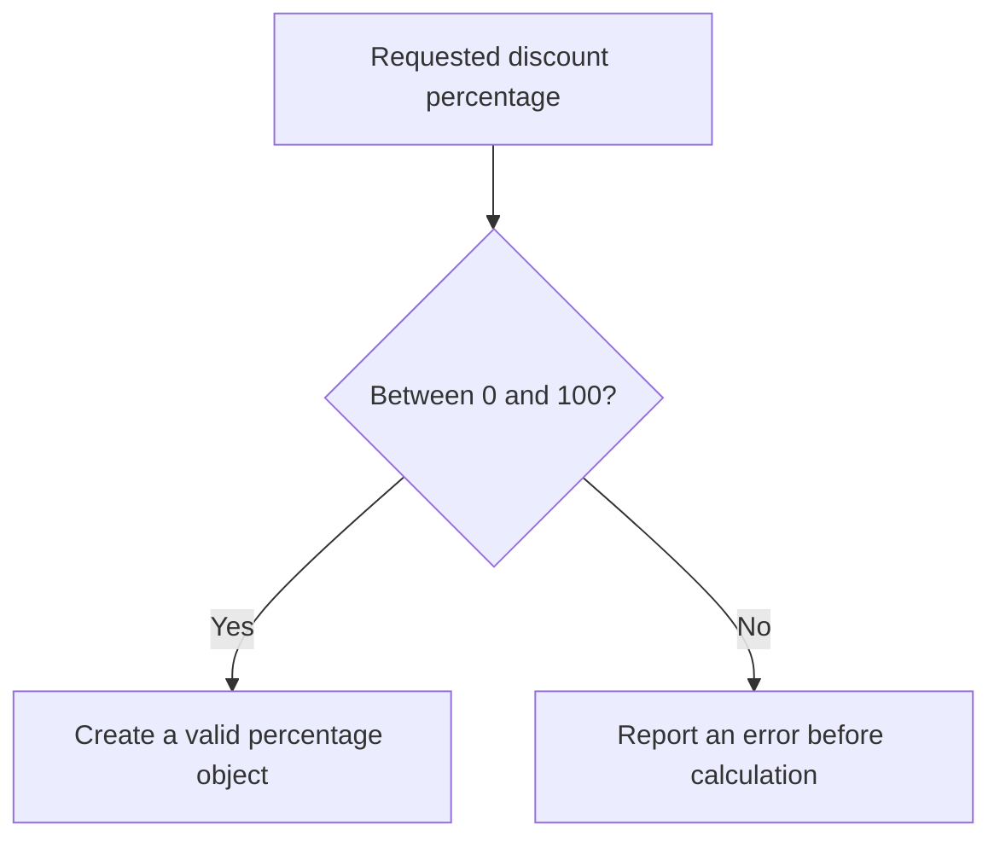
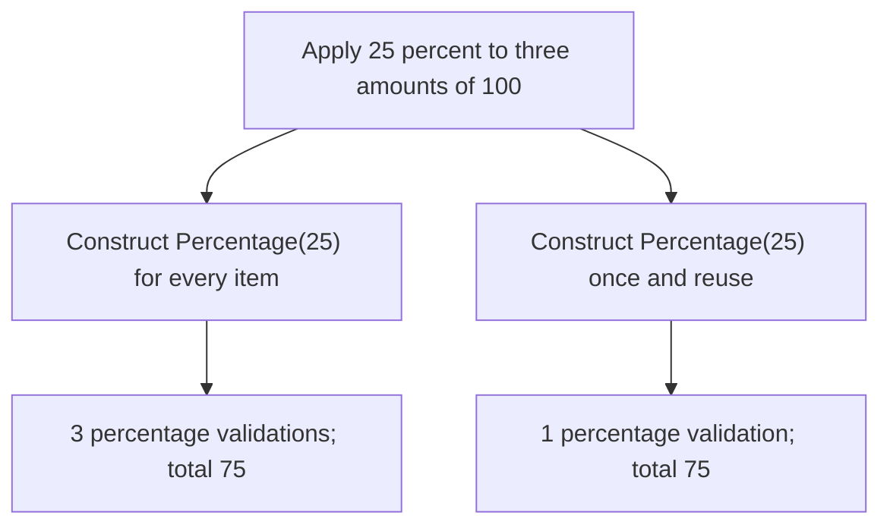
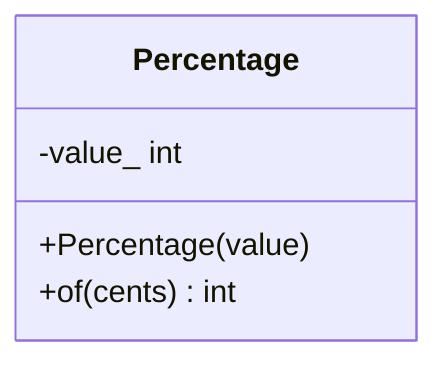
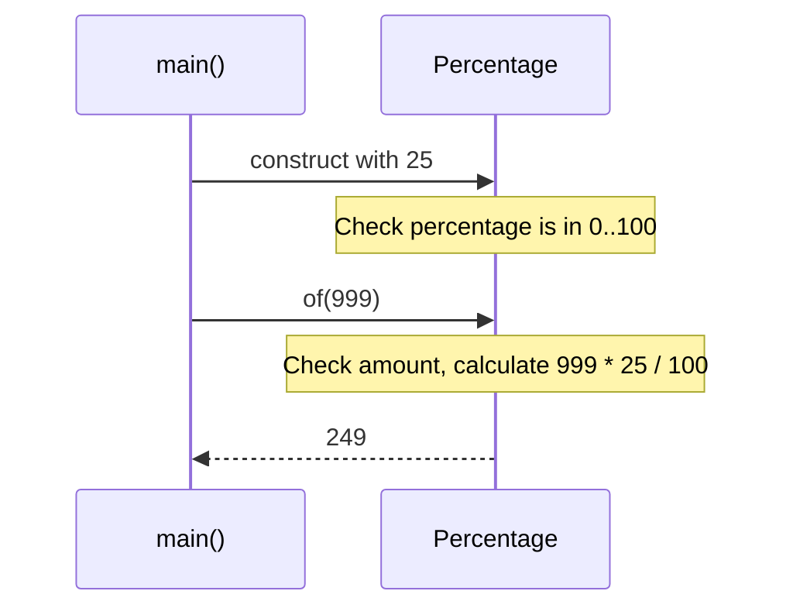

# Design by Contract, Fail Fast, and Strong Types

## 1. Definition

**A contract says what callers must provide and what an operation promises in return.**
It makes valid inputs, results, and failures clear instead of leaving callers to guess.

**Fail fast** means reject bad input near where it arrives, before it causes a
confusing later problem. **Strong types** give different meanings distinct types,
such as `Percentage` and `Money`, instead of treating all numbers as interchangeable.

## 2. The Problem It Solves

Suppose billing receives the number 150. As an amount in cents, it may be fine.
As a discount percentage in this application, it is invalid. A plain integer does
not tell the calculation which meaning was intended or whether anyone checked it.

Create a `Percentage` from the supplied rate. Its constructor accepts only 0 through
100. Once it exists, later code can use it knowing that the rate passed that check.
Bad input is rejected before it turns into a confusing bill.

## 3. Understand the Idea Step by Step

1. Decide which percentage values are allowed: 0 through 100.
2. Check that range when constructing a percentage object.
3. Keep the stored value inside that range during normal use.
4. State any additional rules for operations, such as allowed money amounts and rounding.
5. Report failures in a consistent way.

| Term | Meaning | Example |
| --- | --- | --- |
| Precondition | What must hold before an operation | Input amount is in the supported range |
| Postcondition | What success promises | Result follows the stated percentage and rounding rule |
| Invariant | A rule the object keeps during normal use | Stored percentage remains between 0 and 100 |

### Picture: Reject Invalid Percentages at the Entrance

Read downward. Only the yes branch allows a usable percentage object to be created.

**Read it as a sentence:** a valid percentage enters the calculation; 101 does not
silently become a normal discount value.

Fail fast means rejecting the bad request promptly, not crashing the whole service.
The caller can catch the error and explain it to the user. An **assertion** checks
a programmer's assumption, but may be disabled in a release build. Required input
validation must still run when assertions do not.

## 4. Real-World Scenario

A billing service receives a discount from a request. Creating a checked percentage
prevents negative or 150% discounts from reaching arithmetic. A separate money type
can also prevent accidentally passing a percentage where an amount is expected.

A valid rate does not answer every billing question. For example, 25% of 999 cents
is 249.75 cents. The program must say what to do with that fraction. The sample
discards it; another business rule might require different rounding.

## 5. Understand the C++ Example

Open [contracts.cpp](../../principles/contracts.cpp).

`Percentage` checks its integer at construction. Its `of()` operation also checks
the input amount and uses `long long`, a larger integer type, for multiplication.

1. Zero percent of 1000 is 0.
2. One hundred percent of 1000 is 1000.
3. Twenty-five percent of 999 computes `24975 / 100`, giving integer 249.
4. The fractional part is discarded; this is **truncation**, the sample's rounding rule.
5. Constructing 101% throws an exception, reporting the invalid value.
6. Checks verify the range endpoints and the worked arithmetic.

**Overflow** means a result exceeds a number type's range. Converting to the larger
type must happen before multiplication; doing it after overflow is too late.
The supported amount limit is part of this teaching example, not a universal money model.

### C++ Flow Diagram

Follow the repeated and reused percentage paths in the drawback function. Each
amount is still checked by `of()`; only construction validations are counted here.

Keeping a validated type avoids needless repeated work. It does not permit
skipping validation of other inputs, such as each new money amount.

### C++ Class Diagram

Plus means public; minus means private. The constructor is the entry point that
prevents out-of-range percentages from becoming usable objects.

`value_` must stay between 0 and 100. `of()` separately accepts amounts from 0
through 1000000, multiplies using `long long`, and truncates the integer result.

### C++ Sequence Diagram

Time runs downward; solid arrows call, dashed arrows return. The constructor note
shows the first validation, followed by the operation's separate amount check.

Integer division drops the fractional part; this is not rounding to the nearest
cent. Constructing with 101 throws before an operation can use an invalid rate.

## 6. Benefits, Drawbacks, and Alternatives

**Benefits:** `Percentage` says what the number means and prevents 101 from becoming
a usable rate. The allowed endpoints and rounding rule give tests clear expectations.

**Drawbacks:** repeatedly rebuilding an already validated value repeats work. The
drawback example constructs 25% three times, then shows the same calculation using
one reused percentage. Each new amount still needs its own check. Extra types should
clarify real meanings, and failure reporting must fit the project; exceptions are
one choice, not a requirement of contracts.

**Use checks where meaning enters:** then preserve the rules through valid operations.
Silently changing bad input is only appropriate when that behavior is explicitly promised.

## 7. Check Your Understanding

**Question:** Why not quietly change 101% into 100%?

**Answer:** That hides the invalid request and changes its meaning. This behavior,
called clamping, is reasonable only if agreed in advance. Otherwise rejection helps
the caller find and fix the mistake.

Optional detail: [principles technical notes](../../principles/README.md).