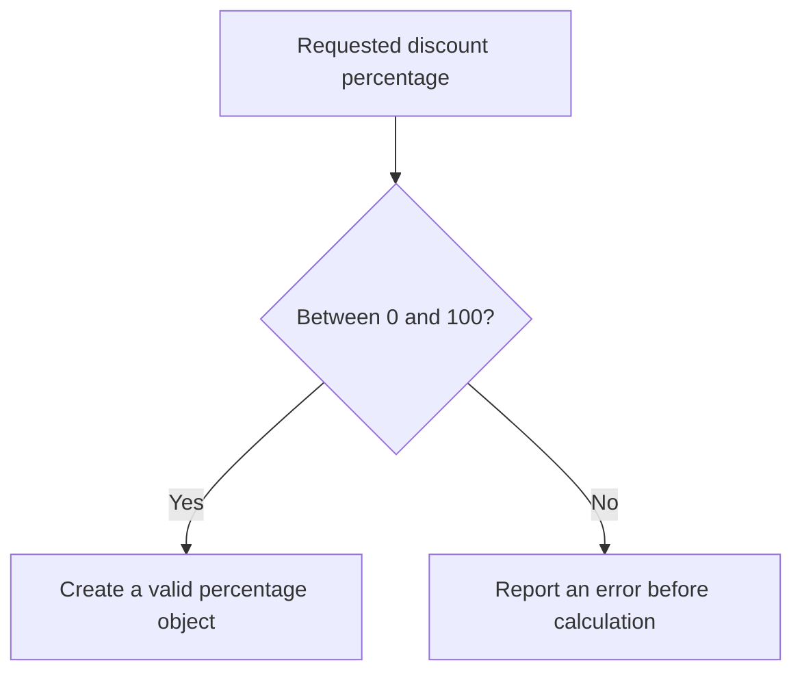

# Design by Contract, Fail Fast, and Strong Types

## 1. Definition

**State what an operation expects, what it promises, and which values are valid.**
That agreement is a **contract**. It lets callers and implementations understand
their responsibilities instead of guessing.

**Fail fast** means reject bad input near where it arrives, before it causes a
confusing later problem. **Strong types** give different meanings distinct types,
such as `Percentage` and `Money`, instead of treating all numbers as interchangeable.

## 2. The Problem It Solves

The number 150 might be a valid amount in cents but an invalid discount percentage.
If everything is an unchecked integer, code can accept meaningless values or mix units.
The mistake may appear much later as a believable but incorrect bill.

Check values at meaningful entry points and store them in types that communicate
their meaning. Later code should not have to repeatedly rediscover the same rules.

## 3. Understand the Idea Step by Step

1. Decide which percentage values are allowed: 0 through 100.
2. Check that range when constructing a percentage object.
3. Keep the stored value inside that range during normal use.
4. State any additional rules for operations, such as allowed money amounts and rounding.
5. Report failures in a consistent way.

| Term | Meaning | Example |
| --- | --- | --- |
| Precondition | What must hold before an operation | Input amount is in the supported range |
| Postcondition | What success promises | Result follows the stated percentage and rounding rule |
| Invariant | A rule the object keeps during normal use | Stored percentage remains between 0 and 100 |

### Picture: Reject Invalid Percentages at the Entrance

Read downward. Only the yes branch allows a usable percentage object to be created.

**Read it as a sentence:** a valid percentage enters the calculation; 101 does not
silently become a normal discount value.

Fail fast does not mean crash the whole service. Reject the bad operation and handle
its error at the appropriate level. **Assertions**, checks intended to detect
programmer mistakes, may be disabled in release builds; do not rely on them alone
for required checks on untrusted input.

## 4. Real-World Scenario

A billing service receives a discount from a request. Creating a checked percentage
prevents negative or 150% discounts from reaching arithmetic. A separate money type
can also prevent accidentally passing a percentage where an amount is expected.

Types do not automatically decide rounding or prevent every numeric overflow.
Those rules still need explicit definitions and tests appropriate to the business.

## 5. Understand the C++ Example

Open [contracts.cpp](../../principles/contracts.cpp).

`Percentage` checks its integer at construction. Its `of()` operation also checks
the input amount and uses `long long`, a larger integer type, for multiplication.

1. Zero percent of 1000 is 0.
2. One hundred percent of 1000 is 1000.
3. Twenty-five percent of 999 computes `24975 / 100`, giving integer 249.
4. The fractional part is discarded; this is **truncation**, the sample's rounding rule.
5. Constructing 101% throws an exception, reporting the invalid value.
6. Checks verify the range endpoints and the worked arithmetic.

**Overflow** means a result exceeds a number type's range. Converting to the larger
type must happen before multiplication; doing it after overflow is too late.
The supported amount limit is part of this teaching example, not a universal money model.

## 6. Benefits, Drawbacks, and Alternatives

**Benefits:** clearer units, errors nearer their causes, fewer invalid stored values,
and precise boundaries to test.

**Drawbacks:** unnecessary repeated checks add noise or cost. Too many poorly chosen
types can make simple work awkward. Exceptions are not suitable for every runtime;
some projects use explicit error results instead.

**Use checks where meaning enters:** then preserve the rules through valid operations.
Silently changing bad input is only appropriate when that behavior is explicitly promised.

## 7. Check Your Understanding

**Question:** Why not quietly change 101% into 100%?

**Answer:** That hides the invalid request and changes its meaning. This behavior,
called clamping, is reasonable only if agreed in advance. Otherwise rejection helps
the caller find and fix the mistake.

Optional detail: [principles technical notes](../../principles/README.md).