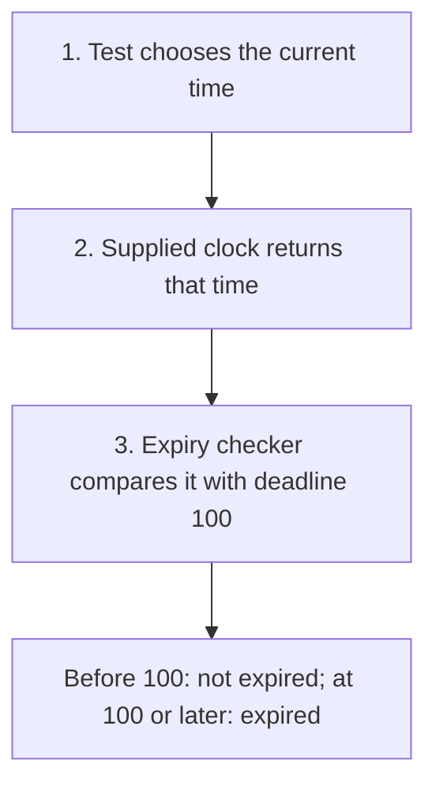
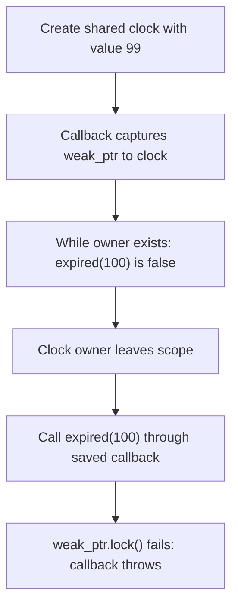
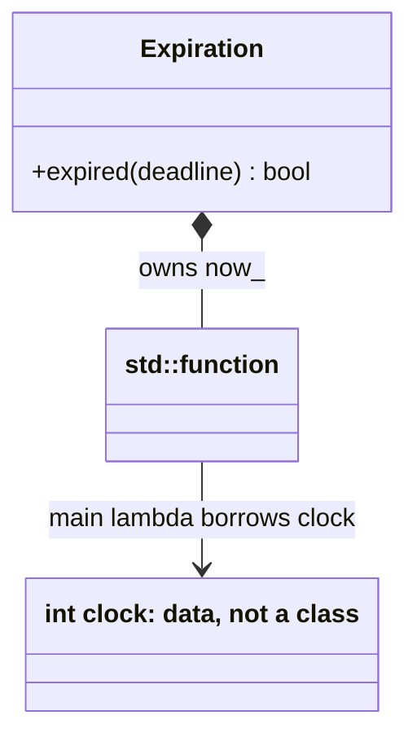
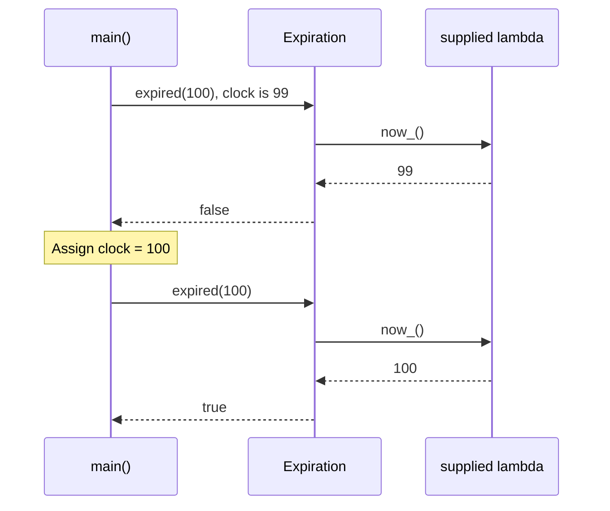

# Dependency Injection (DI)

## 1. Definition

**Dependency Injection means giving an object its helper instead of making it
choose that helper itself.** It is commonly shortened to DI.

A **dependency** is something needed to do a job. A session-expiry checker needs
a clock. "Injection" simply means supplying that clock, usually as a constructor argument.

## 2. The Problem It Solves

Suppose a session expires at time 100. We want to test time 99, exactly 100, and 101.
If the checker always reads the real clock, arranging those tests becomes awkward:
we may have to wait, and the clock can move before the check runs.

Give the checker a function that supplies the time. The application can supply a
real clock; the test supplies a function returning a controlled variable. The
expiry comparison stays the same, but the test can choose each time directly.

## 3. Understand the Idea Step by Step

1. Identify the helper needed by the object.
2. Accept that helper from the caller.
3. Use the supplied helper when doing the object's job.
4. Make clear who owns the helper and how long it must remain alive.

Here we supply the clock when creating `Expiration`, called **constructor injection**.
Supplying a helper to a single operation is **method injection**. Supplying it later
through a setter is **setter injection**, but then the object may need to reject use
until the helper has been set. Passing an argument is enough; no framework is required.

### Picture: Give the Checker a Controllable Clock

Read downward. The test supplies the source of time instead of waiting for real time.

**Read it as a sentence:** the checker keeps its comparison rule, but the test
controls the clock value used by that rule.

Supplying a helper does not settle ownership. An object can own a helper, share it,
or borrow it. Borrowing means using an existing helper without becoming responsible
for keeping it alive or destroying it.

## 4. Real-World Scenario

A login service checks whether a session has expired. Supplying the clock lets tests
check the moment before the deadline, exactly at it, and after it without sleeping.

The test changes its clock value and checks immediately. Production setup still
has to choose the right kind of clock. For measuring elapsed time, a clock that
does not jump with calendar adjustments is usually the useful choice.

## 5. Understand the C++ Example

Open [dependency_injection.cpp](../../principles/dependency_injection.cpp).

`Expiration` receives a `std::function<int()>`: an object that can be called with
no arguments to return an integer time. An empty function is rejected.

1. The test creates a time variable containing 99.
2. A **lambda**, a small function written where it is needed, reads that variable.
3. Supply the lambda to `Expiration`, then call `expired(100)` to check deadline 100.
4. At 99, expired is false.
5. Change the variable to 100, then 101; both produce true.
6. The checks test the exact deadline rule without waiting.

The lambda captures the time variable **by reference**, meaning it reads the original
variable rather than storing its own copy. `Expiration` owns the function object,
but not that referenced variable. The variable must remain alive whenever the clock is called.

### C++ Flow Diagram

Arrows trace the weakly captured clock in `demonstrate_drawback()`. The callback
object survives, but the integer it observes does not.

The example detects expiration safely. The alternative callback captures a
`shared_ptr`, intentionally keeping its clock alive for later calls.

### C++ Class Diagram

The filled diamond means the `std::function` wrapper is owned as a field. The
ordinary arrow describes the main lambda's borrowed reference to an integer.

There is no custom Clock class in the source. A callback's capture policy determines
whether it borrows, weakly observes, or owns the underlying data.

### C++ Sequence Diagram

Read downward; solid arrows call, dashed arrows return. `main()` changes the
integer between checks, so no sleeping or real clock is required.

The comparison is greater-than-or-equal, so the deadline itself is expired.
Injection makes testing controllable, but setup still controls the dependency's lifetime.

## 6. Benefits, Drawbacks, and Alternatives

**Benefits:** the same checker tests times 99, 100, and 101 without waiting. Its
need for a clock is visible, and application setup can supply a different time source.

**Drawbacks:** supplying a callback does not keep everything it uses alive. The
drawback example saves a clock callback whose observed value later disappears;
the callback detects that and throws. A second version deliberately keeps the value
alive through shared ownership. Setup must choose the intended lifetime, and too
many tiny supplied helpers can make a simple task difficult to follow.

**Use manual setup first:** passing an argument is already DI; no framework is needed.
Dependency Inversion is related but different: it asks that business code depend on
a suitable service interface rather than a particular tool's details.

## 7. Check Your Understanding

**Question:** Does owning a lambda keep everything it refers to alive?

**Answer:** No. A reference capture is still borrowed access. The referenced time
variable must continue to exist, even though the function object itself has been stored safely.

Optional detail: [principles technical notes](../../principles/README.md).