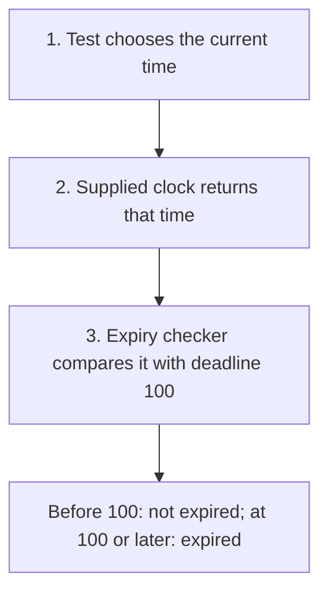

# Dependency Injection (DI)

## 1. Definition

**Dependency Injection means giving an object the helper it needs from outside,
instead of making it create or find that helper itself.** It is commonly shortened to DI.

A **dependency** is something needed to do a job. A session-expiry checker needs
a clock. "Injection" simply means supplying that clock, usually as a constructor argument.

## 2. The Problem It Solves

If expiry code always reads the real clock internally, testing the exact expiry
moment may require waiting and hoping the timing lines up. Similar direct dependencies
on a database or network can make small tests slow and unreliable.

Pass in the time source. The application can use a real clock, while a test uses
one whose returned value the test controls.

## 3. Understand the Idea Step by Step

1. Identify the helper needed by the object.
2. Accept that helper from the caller.
3. Use the supplied helper when doing the object's job.
4. Make clear who owns the helper and how long it must remain alive.

**Constructor injection** supplies a helper when the object is created. **Method
injection** supplies it for one call. **Setter injection** supplies or replaces it
later, but may leave a period when the object is not ready to use.

### Picture: Give the Checker a Controllable Clock

Read downward. The test supplies the source of time instead of waiting for real time.

**Read it as a sentence:** the checker keeps its comparison rule, but the test
controls the clock value used by that rule.

Supplying a helper does not settle ownership. An object can own a helper, share it,
or borrow it. Borrowing means using an existing helper without becoming responsible
for keeping it alive or destroying it.

## 4. Real-World Scenario

A login service checks whether a session has expired. Supplying the clock lets tests
check the moment before the deadline, exactly at it, and after it without sleeping.

Production code must still choose an appropriate clock. Measuring an elapsed duration
usually needs a clock that does not jump backward when the system's calendar time changes.
DI makes that choice visible; it does not make the choice automatically correct.

## 5. Understand the C++ Example

Open [dependency_injection.cpp](../../principles/dependency_injection.cpp).

`Expiration` receives a `std::function<int()>`: an object that can be called with
no arguments to return an integer time. An empty function is rejected.

1. The test creates a time variable containing 99.
2. A **lambda**, a small function written where it is needed, reads that variable.
3. Supply the lambda and deadline 100 to `Expiration`.
4. At 99, expired is false.
5. Change the variable to 100, then 101; both produce true.
6. The checks test the exact deadline rule without waiting.

The lambda captures the time variable **by reference**, meaning it reads the original
variable rather than storing its own copy. `Expiration` owns the function object,
but not that referenced variable. The variable must remain alive whenever the clock is called.

## 6. Benefits, Drawbacks, and Alternatives

**Benefits:** predictable tests, visible requirements, and different helpers for
different environments without changing the main decision code.

**Drawbacks:** setup must connect objects correctly and respect their lifetimes.
Too many tiny injected helpers can make simple work hard to follow. Test helpers
must still represent the real helper's important behavior.

**Use manual setup first:** passing an argument is already DI; no framework is needed.
Dependency Inversion is related but different: it asks that business code depend on
a suitable service interface rather than a particular tool's details.

## 7. Check Your Understanding

**Question:** Does owning a lambda keep everything it refers to alive?

**Answer:** No. A reference capture is still borrowed access. The referenced time
variable must continue to exist, even though the function object itself has been stored safely.

Optional detail: [principles technical notes](../../principles/README.md).