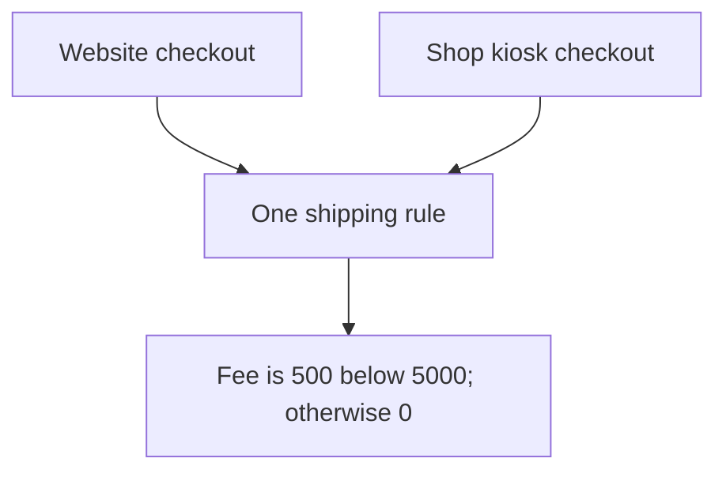

# DRY: Don't Repeat Yourself

## 1. Definition

**Keep each rule in one clear place instead of maintaining separate copies of that rule.**
DRY stands for Don't Repeat Yourself. It is about repeated knowledge, not banning
every repeated line of code.

For example, a website and a shop kiosk should ask the same shipping rule for a fee.
They should not separately remember what order amount qualifies for free shipping.

## 2. The Problem It Solves

Suppose both checkout programs copy the rule "shipping is free at 5000 cents."
Later, someone changes only the website's copy. Customers now get different prices
depending on how they order.

Share the real rule so that changing it in one place changes both callers consistently.
The shared place is sometimes called the **source of truth**: the authoritative
definition other code uses instead of guessing or copying.

## 3. Understand the Idea Step by Step

1. Find repeated decisions, such as a fee or eligibility rule.
2. Ask whether they must change together for the same reason.
3. If yes, name the shared rule and put it in a function or object.
4. Have callers use that rule rather than reproducing its details.

Do not merge unrelated rules simply because today's arithmetic matches. Two regions
may currently use the same tax percentage but change it independently. The multiplication
helper can be shared while each region keeps its own policy.

### Picture: Two Callers Ask One Rule

Read each arrow as "asks for the shipping fee." Both callers reach the same rule box.

**Read it as a sentence:** the website and kiosk do not each decide shipping; they
both ask the shared rule. Updating that rule updates the decision for both.

A shared rule does not need a huge utility class. A small named function often
expresses it more clearly than a generic helper full of switches for unrelated cases.

## 4. Real-World Scenario

A subscription offer appears in web checkout, a support tool, and a renewal job.
All three should use the same eligibility rule. Otherwise a customer could qualify
through one path and be rejected through another.

Separate offers that only happen to have the same discount today should stay separate
when they have different owners or reasons to change.

## 5. Understand the C++ Example

Open [dry.cpp](../../principles/dry.cpp).

`ShippingRules` contains the fee decision. The web and kiosk functions ask it for
the fee and add that fee to the order subtotal.

1. A subtotal below 5000 cents receives a fee of 500.
2. At 4999, the total is `4999 + 500 = 5499`.
3. At 5000, the fee is zero, so the total remains 5000.
4. Both checkout functions give the same result for a subtotal of 2000.
5. Negative subtotals are rejected instead of producing an invented price.

The web and kiosk functions remain separate. Their surrounding work may later differ;
only the rule that must stay the same is shared. Checks at 4999 and 5000 test the
**boundary**, the exact point where the decision changes.

## 6. Benefits, Drawbacks, and Alternatives

**Benefits:** consistent answers, one place to change a rule, and focused checks
around the important decision points.

**Drawbacks:** sharing unrelated logic ties changes together unnecessarily. One
overly general function can become harder to understand than a little repetition.

**Use it by asking:** "Are these the same rule, or only similar-looking code?"
Some duplication is reasonable while the relationship is still unclear.

## 7. Check Your Understanding

**Question:** Must two functions containing `amount * 2` be merged?

**Answer:** No. One may calculate loyalty points while the other prices a two-person
booking. Matching arithmetic does not prove that they represent the same rule.

Optional detail: [principles technical notes](../../principles/README.md).