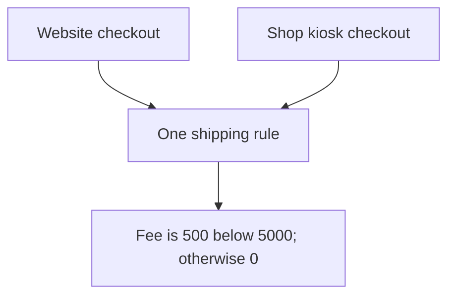
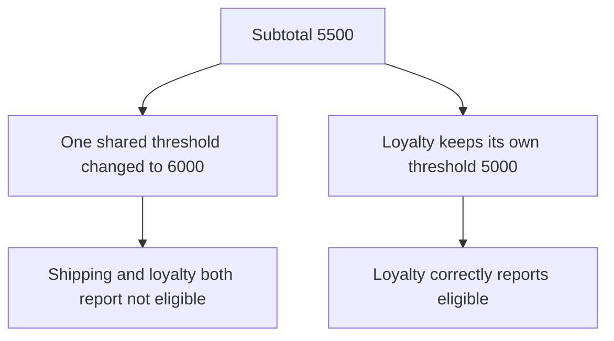
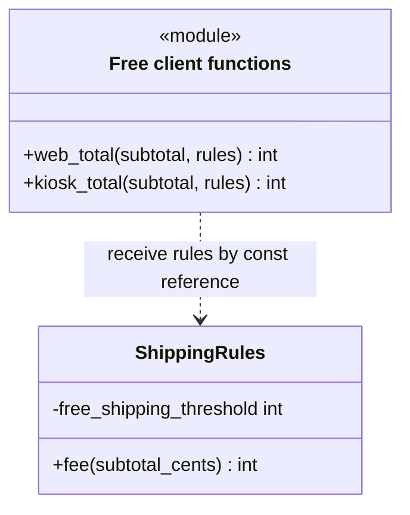
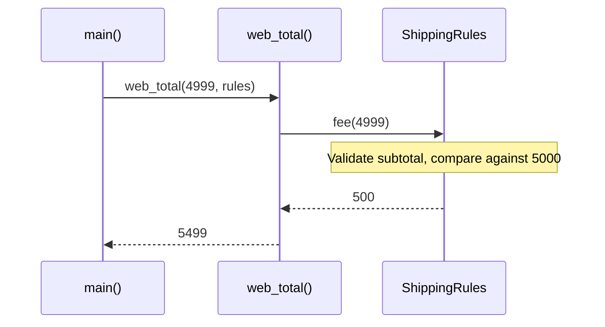

# DRY: Don't Repeat Yourself

## 1. Definition

**DRY means giving a shared rule one home instead of keeping several copies of it.**
It stands for Don't Repeat Yourself. The goal is consistent decisions, not removing
every pair of similar-looking lines.

For example, a website and a shop kiosk should ask the same shipping rule for a fee.
They should not separately remember what order amount qualifies for free shipping.

## 2. The Problem It Solves

Suppose the website and kiosk each contain "shipping is free at 5000 cents."
The shop raises the threshold, but someone updates only the website. Now the same
order gets different shipping fees depending on where the customer places it.

Both callers should ask `ShippingRules` for the fee. The threshold and calculation
live there once, so a change reaches both callers. That shared definition is the
**source of truth**: the place that decides what the rule actually is.

## 3. Understand the Idea Step by Step

1. Find repeated decisions, such as a fee or eligibility rule.
2. Ask whether they must change together for the same reason.
3. If yes, name the shared rule and put it in a function or object.
4. Have callers use that rule rather than reproducing its details.

Ask why the code matches before combining it. Two regions might use the same tax
percentage today but change it on different dates. They can share arithmetic
without being forced to share one tax policy.

### Picture: Two Callers Ask One Rule

Read each arrow as "asks for the shipping fee." Both callers reach the same rule box.

**Read it as a sentence:** the website and kiosk do not each decide shipping; they
both ask the shared rule. Updating that rule updates the decision for both.

A shared rule does not need a huge utility class. A small named function often
expresses it more clearly than a generic helper full of switches for unrelated cases.

## 4. Real-World Scenario

A subscription offer appears in web checkout, a support tool, and a renewal job.
All three should use the same eligibility rule. Otherwise a customer could qualify
through one path and be rejected through another.

Changing that offer's eligibility should change all three paths. A different offer
does not have to use the same rule just because its discount currently matches.

## 5. Understand the C++ Example

Open [dry.cpp](../../principles/dry.cpp).

`ShippingRules` contains the fee decision. The web and kiosk functions ask it for
the fee and add that fee to the order subtotal.

1. A subtotal below 5000 cents receives a fee of 500.
2. At 4999, the total is `4999 + 500 = 5499`.
3. At 5000, the fee is zero, so the total remains 5000.
4. Both checkout functions give the same result for a subtotal of 2000.
5. Negative subtotals are rejected instead of producing an invented price.

The web and kiosk functions remain separate. Their surrounding work may later differ;
only the rule that must stay the same is shared. Checks at 4999 and 5000 test the
**boundary**, the exact point where the decision changes.

### C++ Flow Diagram

Follow the two interpretations of a 5500-cent subtotal in the drawback function.

The shipping and loyalty rules only happened to use the same number. Sharing their
implementation couples changes that should be independent. This is separate from
the real web and kiosk clients, which intentionally share the same shipping rule.

### C++ Class Diagram

The class box shows the real rule object. The `module` box groups free functions;
it is not an additional C++ class. A dotted arrow means temporary use.

Both clients ask for the fee rather than copying its threshold. Neither client
function owns the supplied rule object.

### C++ Sequence Diagram

Solid arrows call; dashed arrows return. Read downward through the below-threshold
case checked in `main()`.

The kiosk uses the same fee method. At the threshold, the fee becomes zero,
which is why the separate 5000-cent check matters.

## 6. Benefits, Drawbacks, and Alternatives

**Benefits:** website and kiosk give the same fee for the same subtotal. A threshold
change has one home, and tests can check the exact point where shipping becomes free.

**Drawbacks:** sharing the wrong thing couples unrelated decisions. In the drawback
example, shipping and loyalty both started with a threshold of 5000. Raising their
shared threshold to 6000 wrongly changes loyalty too. Keep separate rules separate,
even when their current numbers happen to match.

**Use it by asking:** "Are these the same rule, or only similar-looking code?"
Some duplication is reasonable while the relationship is still unclear.

## 7. Check Your Understanding

**Question:** Must two functions containing `amount * 2` be merged?

**Answer:** No. One may calculate loyalty points while the other prices a two-person
booking. Matching arithmetic does not prove that they represent the same rule.

Optional detail: [principles technical notes](../../principles/README.md).