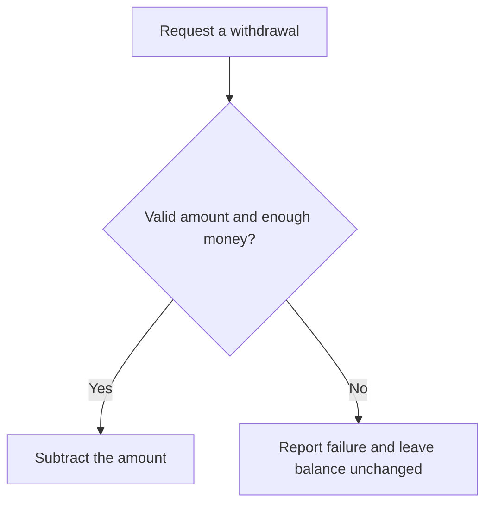
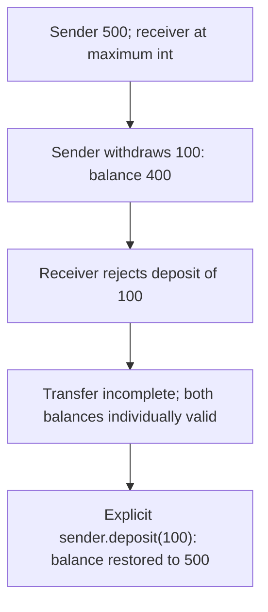
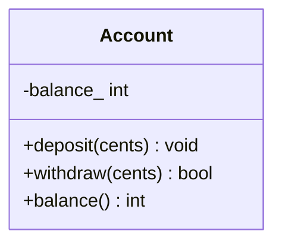
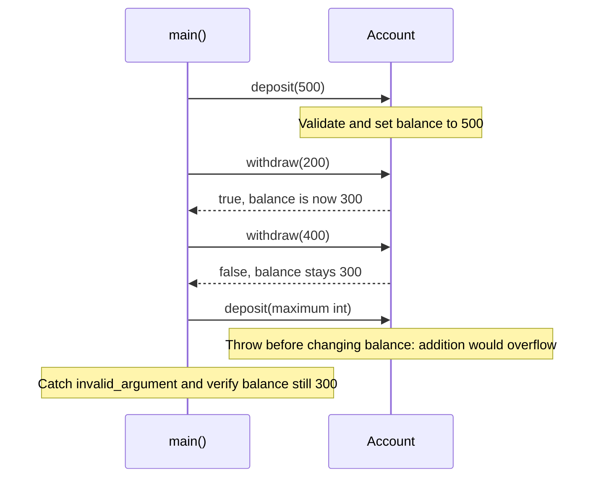

# Encapsulation and Information Hiding

## 1. Definition

**Encapsulation lets an object control how its data is used and changed.** Callers
ask for an action instead of editing the stored values themselves.

For example, ask an account to withdraw money rather than directly subtracting from
its balance. The account can check whether the amount is valid and funds are sufficient.

## 2. The Problem It Solves

Suppose the balance is public. A caller can subtract 400 from an account holding
300, leaving a negative balance even though overdrafts are forbidden. Every caller
would have to remember the account's checks.

Make the balance private and offer `withdraw(400)` instead. The account checks the
request and refuses it without changing the balance. The rule has one home.
An unrestricted `set_balance()` would reopen the same problem, so private storage
alone is not enough.

## 3. Understand the Idea Step by Step

1. Identify the rules the object must keep.
2. Stop outside code from changing the stored fields directly.
3. Offer meaningful actions, such as deposit or withdraw.
4. Validate each action before changing the data.
5. Allow safe questions, such as returning a copy of the current balance.

"The balance never becomes negative" is an **invariant**, a rule the account keeps
true. Deposit, withdraw, and balance queries form its **API**, the operations callers
can use. **Information hiding** means callers do not need to know how that balance
is stored internally.

### Picture: One Withdrawal Request

Read downward. Only the yes path is allowed to change the stored balance.

**Read it as a sentence:** the account checks the request before allowing a change.
The caller does not get direct editing access to the balance.

This protects program structure, not against every hostile action. C++ `private`
helps cooperating code use a class correctly; it is not a security barrier against
malicious machine code running in the same process.

## 4. Real-World Scenario

A ticket service offers `reserve(quantity)` instead of an unrestricted seat-count
setter. It checks that enough seats remain and changes the count only for a valid request.

The caller asks for seats; the service decides whether it can provide them. If
several customers book at once, the service must also protect that check and update
from conflicting requests. The method is a place to enforce the rule, not automatic protection.

## 5. Understand the C++ Example

Open [encapsulation.cpp](../../principles/encapsulation.cpp).

`Account` keeps a private balance and exposes deposit, withdrawal, and a balance query.

1. Start at zero and deposit 500, giving 500.
2. Withdraw 200 successfully, leaving 300.
3. Attempt to withdraw 400; it returns false and leaves 300 unchanged.
4. A deposit that would exceed the integer type's maximum is rejected before addition.
5. Checks verify the successful changes and unchanged balance after rejection.

Exceeding a number type's range is called **overflow**. The code compares the amount
with `max - balance_` first instead of overflowing and checking afterward.
`balance()` returns a copy, so editing that returned number cannot edit the account.
Invalid amounts report errors differently from an ordinary insufficient-funds result.

### C++ Flow Diagram

Arrows follow the attempted transfer in the drawback function. Each account keeps
its own balance valid, but the pair of operations is not atomic.

Private fields do not supply a complete transfer operation. The explicit refund
is safe for this local example, not a distributed-payment recovery design.

### C++ Class Diagram

Plus means public operations; minus means private data. There is one account
type, used to create separate sender and receiver objects.

Callers cannot directly assign `balance_`. They must use methods that validate
before changing it. There is no `transfer()` method in this sample.

### C++ Sequence Diagram

Read downward through the main example. Solid arrows call, dashed arrows return.

Insufficient funds returns false; an invalid amount or overflowing deposit throws.
The caller needs to know both kinds of failure, not just the method names.

## 6. Benefits, Drawbacks, and Alternatives

**Benefits:** every withdrawal uses the same checks, and a rejected request leaves
the account unchanged. Callers do not need to know how the balance is represented.

**Drawbacks:** protecting each object does not make a larger operation all-or-nothing.
The transfer example withdraws from the sender, then fails to deposit into the
receiver. Both accounts remain individually valid, but the sender needs a refund.
The application still needs a complete transfer rule. Also, a plain data record
without such rules may not need account-style methods around every field.

**Use it to protect actual rules:** do not add private fields and unrestricted
setters merely to make code look object-oriented.

## 7. Check Your Understanding

**Question:** Does `set_balance(-100)` become safe merely because the field is private?

**Answer:** No. It still allows an invalid balance if negative balances are forbidden.
The useful protection comes from the allowed operations and their checks, not the
field's visibility alone.

Optional detail: [principles technical notes](../../principles/README.md).