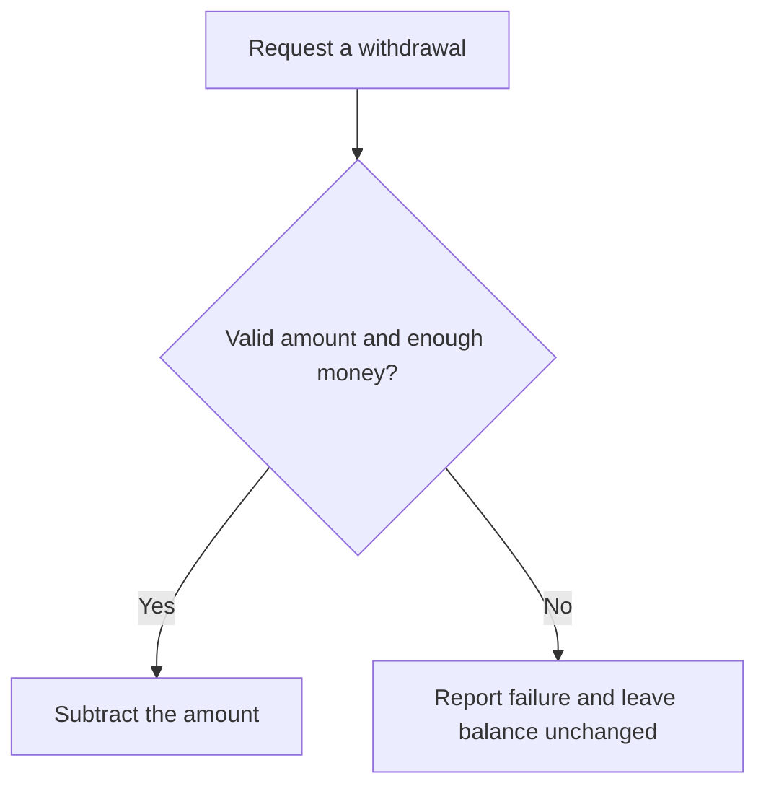

# Encapsulation and Information Hiding

## 1. Definition

**Encapsulation keeps an object's data together with the operations that safely
use and change it. Outside code asks for those operations instead of freely editing
the data.**

For example, ask an account to withdraw money rather than directly subtracting from
its balance. The account can check whether the amount is valid and funds are sufficient.

## 2. The Problem It Solves

If any caller can assign any balance, every caller must remember every account rule.
One might accidentally create a negative balance or overwrite an earlier update.

Making the field private helps only if the public functions also protect it. A
`set_balance(any_number)` function that accepts everything still bypasses the rules.

## 3. Understand the Idea Step by Step

1. Identify the rules the object must keep.
2. Stop outside code from changing the stored fields directly.
3. Offer meaningful actions, such as deposit or withdraw.
4. Validate each action before changing the data.
5. Allow safe questions, such as returning a copy of the current balance.

An **invariant** is a rule that stays true during normal use, such as a nonnegative
balance. An **API** is the set of operations available to callers. **Information
hiding** means callers need not know changeable internal details, such as how the balance is stored.

### Picture: One Withdrawal Request

Read downward. Only the yes path is allowed to change the stored balance.

**Read it as a sentence:** the account checks the request before allowing a change.
The caller does not get direct editing access to the balance.

This protects program structure, not against every hostile action. C++ `private`
helps cooperating code use a class correctly; it is not a security barrier against
malicious machine code running in the same process.

## 4. Real-World Scenario

A ticket service offers `reserve(quantity)` instead of an unrestricted seat-count
setter. It checks that enough seats remain and changes the count only for a valid request.

When several customers reserve simultaneously, the service also needs protection
against conflicting updates. The operation is the right place for that protection,
but simply naming it `reserve` does not implement it.

## 5. Understand the C++ Example

Open [encapsulation.cpp](../../principles/encapsulation.cpp).

`Account` keeps a private balance and exposes deposit, withdrawal, and a balance query.

1. Start at zero and deposit 500, giving 500.
2. Withdraw 200 successfully, leaving 300.
3. Attempt to withdraw 400; it returns false and leaves 300 unchanged.
4. A deposit that would exceed the integer type's maximum is rejected before addition.
5. Checks verify the successful changes and unchanged balance after rejection.

Exceeding a number type's range is called **overflow**. The code compares the amount
with `max - balance_` first instead of overflowing and checking afterward.
`balance()` returns a copy, so editing that returned number cannot edit the account.
Invalid amounts report errors differently from an ordinary insufficient-funds result.

## 6. Benefits, Drawbacks, and Alternatives

**Benefits:** rules are checked in one place; callers need fewer assumptions; internal
storage can change without rewriting every caller.

**Drawbacks:** too few useful operations make a class awkward. Excessive layers of
forwarding can hide simple data. Plain records used only to carry data may not need
the same protection as an account with strict rules.

**Use it to protect actual rules:** do not add private fields and unrestricted
setters merely to make code look object-oriented.

## 7. Check Your Understanding

**Question:** Does `set_balance(-100)` become safe merely because the field is private?

**Answer:** No. It still allows an invalid balance if negative balances are forbidden.
The useful protection comes from the allowed operations and their checks, not the
field's visibility alone.

Optional detail: [principles technical notes](../../principles/README.md).