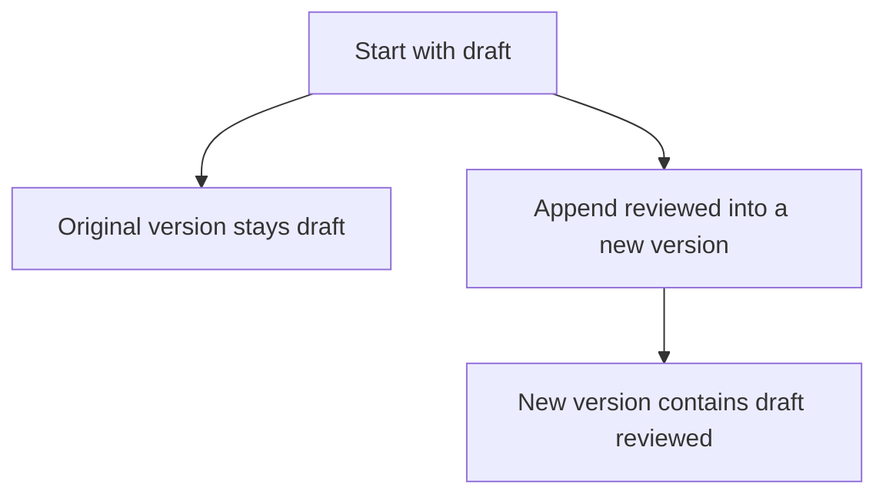

# Immutability and Functional Core

## 1. Definition

**An immutable value is not changed after it is created. An operation that would
edit it produces a new value instead.** Existing users can keep seeing the old value.

For example, adding ` reviewed` to a document version creates a new version containing
`draft reviewed`, while the original still contains `draft`.

A **functional core** is the part of a program that calculates results from supplied
inputs without changing outside data or performing input/output. Other code handles
necessary actions such as reading files and saving the chosen result.

## 2. The Problem It Solves

If several parts share editable data, one part can change what another is reading.
Understanding an answer then requires knowing who changed the value and when.
Tests may even affect each other through shared changes.

Keeping old values unchanged makes results easier to follow. The new result is
separate from the input instead of silently replacing its contents.

## 3. Understand the Idea Step by Step

1. Create a value with valid contents.
2. Expose ways to read it, not unrestricted ways to edit it.
3. Make transformations return new values.
4. Let the caller decide whether to keep the old value, the new one, or both.

An **alias** is another way to reach the same object, such as a second pointer.
An **external side effect** is an observable change outside a calculation, such as
editing a shared variable or writing a file. Avoiding those effects in the calculation
makes it easier to check using only inputs and expected outputs.

### Picture: Keep the Old Version and Produce a New One

Read the branches as two values that can exist together, not a change to the old object.

**Read it as a sentence:** appending returns a second version; readers of the first
version do not suddenly see different text.

A variable may still be assigned an entirely new value. That differs from editing
an existing version through `append()`. Also, `const` at one place does not prevent
another pointer from changing shared data. All editable access must be considered.

## 4. Real-World Scenario

A service builds a complete new configuration and makes it available to new requests.
Requests already running keep their old version, so none sees half an update.

Switching which version is current and keeping old versions alive still require safe
coordination. Read-only values help readers, but do not automatically make every
operation involving their pointers safe across threads.

## 5. Understand the C++ Example

Open [immutability.cpp](../../principles/immutability.cpp).

`DocumentVersion` offers text for reading and an `append()` function returning a new version.

1. Create a version containing `draft`.
2. Call `append(" reviewed")` to create another version.
3. A check confirms the original still contains `draft`.
4. Another confirms the new text is `draft reviewed`.
5. Appending an empty string also leaves the original unchanged and gives equal text.

The public operations do not offer an in-place text edit. A nonconst variable can
still be assigned a different whole `DocumentVersion`. The text-reading function
returns a reference to existing text, so that reference cannot safely outlive its version.

## 6. Benefits, Drawbacks, and Alternatives

**Benefits:** predictable versions, simple snapshots, fewer surprises for shared
readers, and calculations that are easier to test.

**Drawbacks:** copying data and retaining old versions can consume time and memory.
Sharing unchanged portions can reduce copying but introduces more complex storage rules.

**Use it where helpful:** especially for shared values and calculations. Changing
data privately inside one clear owner can be simpler and faster for some workloads.
Immutability is not a demand to copy every large buffer after every small operation.

## 7. Check Your Understanding

**Question:** Does `shared_ptr<string>` make a string immutable?

**Answer:** No. It shares ownership, not read-only behavior. Another owner can change
the same string. Safe shared immutable data requires a promise that no remaining
editable access will change it.

Optional detail: [principles technical notes](../../principles/README.md).