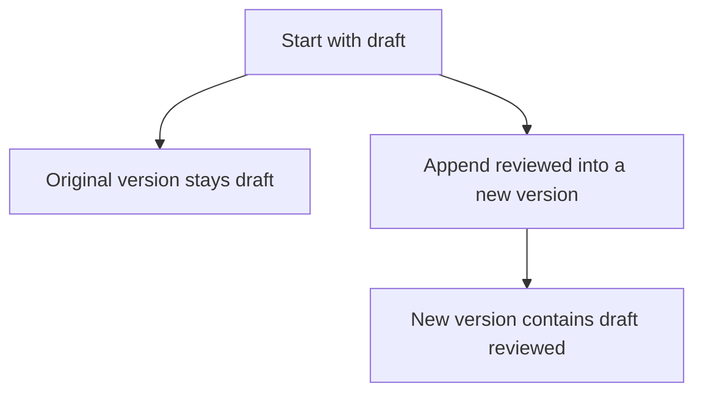
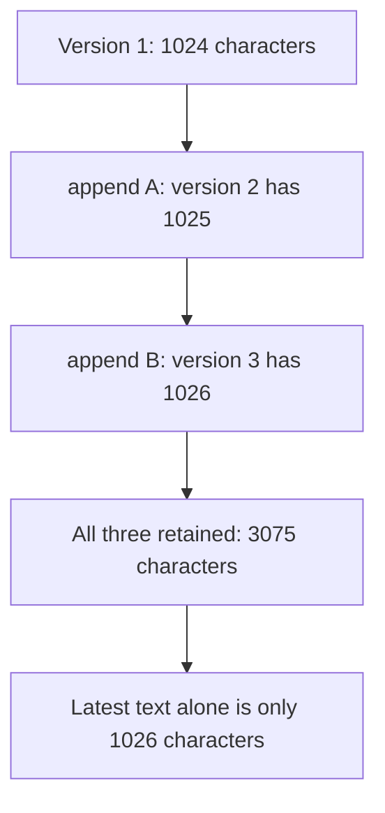
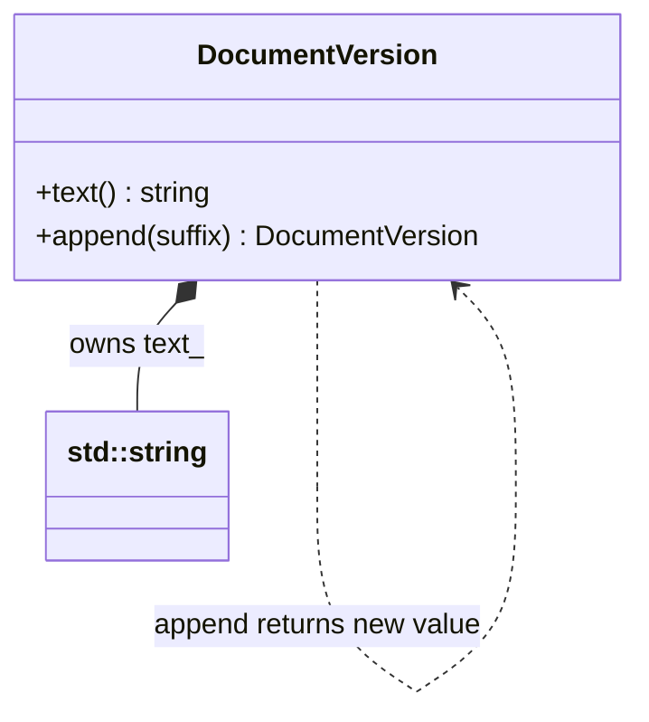
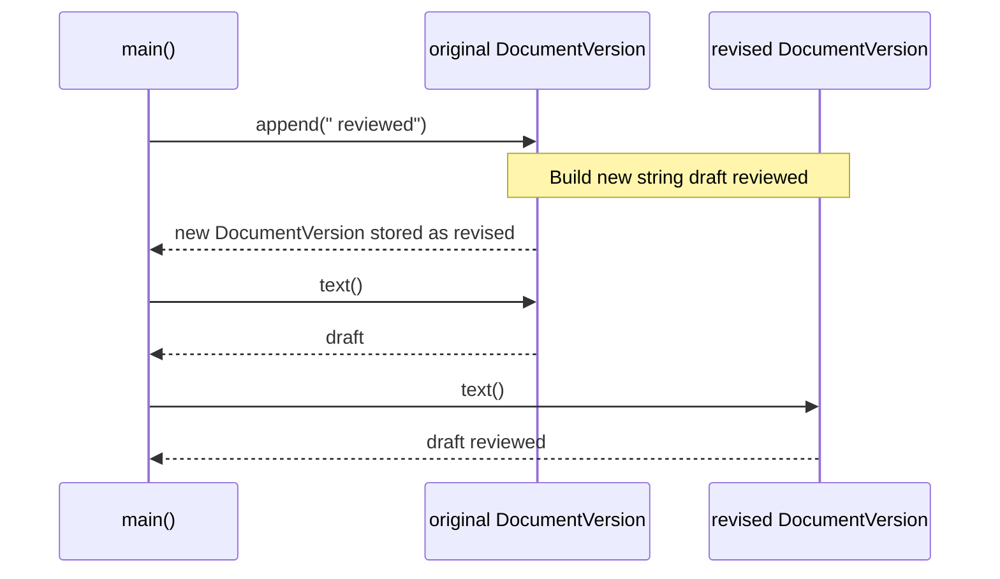

# Immutability and Functional Core

## 1. Definition

**Immutability means keeping an existing value unchanged and returning a new value
when a change is needed.** Readers of the old value still see the old contents.

For example, adding ` reviewed` to a document version creates a new version containing
`draft reviewed`, while the original still contains `draft`.

A **functional core** calculates results from the inputs it receives, without
editing outside data or reading and writing files. Other code handles those outside
actions. For the document example, producing revised text can be a calculation;
saving that text to disk is a separate job.

## 2. The Problem It Solves

Suppose a preview and an editing tool share the same document text. The tool appends
` reviewed`, and the preview suddenly sees new text too. To understand what the
preview shows, we now have to know who last changed the shared document.

Have `append()` return a new version instead. The original still says `draft`,
and the revised version says `draft reviewed`. The caller chooses which to show or
save. Nothing reading the original has its input changed behind its back.

## 3. Understand the Idea Step by Step

1. Create a value with valid contents.
2. Expose ways to read it, not unrestricted ways to edit it.
3. Make transformations return new values.
4. Let the caller decide whether to keep the old value, the new one, or both.

A second pointer to the same object is an **alias**. If either pointer can edit
the shared text, both see the change. Such an outside change is a **side effect**,
as is writing a file. Keeping those effects out of the calculation makes a test
straightforward: supply an input and check the returned value.

### Picture: Keep the Old Version and Produce a New One

Read the branches as two values that can exist together, not a change to the old object.

**Read it as a sentence:** appending returns a second version; readers of the first
version do not suddenly see different text.

A variable may still be assigned an entirely new value. That differs from editing
an existing version through `append()`. Also, `const` at one place does not prevent
another pointer from changing shared data. All editable access must be considered.

## 4. Real-World Scenario

A service builds a complete new configuration and makes it available to new requests.
Requests already running keep their old version, so none sees half an update.

Each request keeps a complete version rather than seeing settings halfway through
an update. The service must still safely publish the new version and keep old
versions alive while requests use them. Read-only data does not do that work by itself.

## 5. Understand the C++ Example

Open [immutability.cpp](../../principles/immutability.cpp).

`DocumentVersion` offers text for reading and an `append()` function returning a new version.

1. Create a version containing `draft`.
2. Call `append(" reviewed")` to create another version.
3. A check confirms the original still contains `draft`.
4. Another confirms the new text is `draft reviewed`.
5. Appending an empty string also leaves the original unchanged and gives equal text.

The public operations do not offer an in-place text edit. A nonconst variable can
still be assigned a different whole `DocumentVersion`. The text-reading function
returns a reference to existing text, so that reference cannot safely outlive its version.

### C++ Flow Diagram

Arrows show new values retained by the drawback function. Earlier versions are
kept in the vector, not overwritten by later edits.

This implementation builds full strings. Structural sharing could reduce duplicate
data, but it is not present here and would require a different storage design.

### C++ Class Diagram

The filled diamond means the object owns its string value. The dotted arrow means
`append()` creates a new value of the same type, not a stored link to another version.

`text()` actually returns a const reference, and `append()` is a const method.
The public operations do not edit an existing version's stored text.

### C++ Sequence Diagram

Solid arrows call; dashed arrows return results. The new value and original are
different objects, and the old value is not changed by the append.

The result can be assigned to a variable, but the transformation itself leaves
its input unchanged. Retaining every prior result has a storage cost.

## 6. Benefits, Drawbacks, and Alternatives

**Benefits:** a reader can keep the original document while another uses the revised
one. Tests check both values directly, without tracking hidden edits to shared text.

**Drawbacks:** keeping every version can keep many copies of the same data. The
example retains strings of 1024, 1025, and 1026 characters, using 3075 characters
for a latest version of only 1026. Sharing unchanged portions can reduce copying,
but this simple implementation does not do that and such storage adds complexity.

**Use it where helpful:** especially for shared values and calculations. Changing
data privately inside one clear owner can be simpler and faster for some workloads.
Immutability is not a demand to copy every large buffer after every small operation.

## 7. Check Your Understanding

**Question:** Does `shared_ptr<string>` make a string immutable?

**Answer:** No. It shares ownership, not read-only behavior. Another owner can change
the same string. Safe shared immutable data requires a promise that no remaining
editable access will change it.

Optional detail: [principles technical notes](../../principles/README.md).