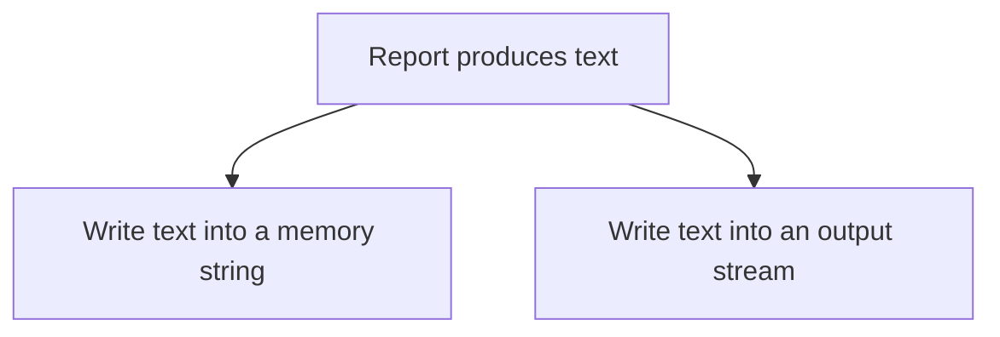

# Program to Interfaces, Not Implementations

## 1. Definition

**Write code around what a helper promises to do, not around the details of how
that helper does it.** The promise is its interface; the working code behind it
is its implementation.

For example, a report needs somewhere to write text. It should not require a disk
file if a memory buffer or another output destination can do the same job.

## 2. The Problem It Solves

If report code opens a specific file and depends on that file's details, testing
the report may require filesystem setup. Sending it somewhere else requires changing
the report even though the text-generation job has not changed.

Ask only for the useful ability, "write this text," and let setup choose the destination.

## 3. Understand the Idea Step by Step

1. Identify the operation the caller actually needs.
2. State the input, result, and failure rules for that operation.
3. Have the caller use only that promise.
4. Supply a helper that fulfills it.

A **contract** includes more than a function name: it explains what successful work
means and what happens on failure. A **sink** is a destination that accepts output.
Two sinks are not interchangeable if one safely consumes text immediately while
the other secretly keeps access to temporary text after it disappears.

### Picture: One Report, Two Possible Destinations

Read each arrow as "can write to." One call uses one supplied destination.

**Read it as a sentence:** report generation stays the same; the supplied destination
decides where the text goes. The report does not need the destination's storage details.

In C++, an interface does not always mean a virtual base class. A **template** is
a function or type recipe the compiler can build for different suitable types.
It can require an operation such as `write()` without those types sharing a base class.

## 4. Real-World Scenario

A report generator writes into memory during a test, allowing the test to compare
the exact text. The application can give it a file or network writer later, provided
those writers honor the required behavior.

Real output can fail. Decide whether a write reports an error immediately or completes
later, and how long supplied text must remain alive. Those rules belong in the promise.

## 5. Understand the C++ Example

Open [interfaces.cpp](../../principles/interfaces.cpp).

`emit_report()` is a template expecting a sink with `write(string_view)`.
`string_view` refers to existing characters without owning a copy of them.

1. Create a `StringSink`, which appends text to its own string.
2. Emit `status: ready\n`, where `\n` means a line break.
3. Create an `ostringstream`, an output stream that stores text in memory.
4. Wrap that stream in `StreamSink` and emit the same report.
5. Checks confirm both destinations receive the same expected text.

There is no common base class: the compiler builds suitable code for each sink type.
Both sinks consume the view during the call rather than saving it for later.
The stream sink borrows its stream, so the stream must remain alive. Real stream
failures need additional handling beyond this successful in-memory test.

## 6. Benefits, Drawbacks, and Alternatives

**Benefits:** reusable callers, easy test destinations, and fewer changes when the
underlying output or storage tool changes.

**Drawbacks:** a badly chosen interface can still expose too many details. Templates
can produce difficult compiler errors; virtual interfaces introduce indirect calls.
Neither mechanism excuses unclear promises.

**Use a suitable mechanism:** templates for choices made when compiling, virtual
interfaces or callables when useful for runtime selection. A concrete type is fine
when there is no meaningful need for alternative helpers.

## 7. Check Your Understanding

**Question:** Does following this principle require adding `virtual` everywhere?

**Answer:** No. This example depends on the promised `write()` operation through a
template. The important decision is what behavior the caller relies on, not which
C++ feature expresses it.

Optional detail: [principles technical notes](../../principles/README.md).