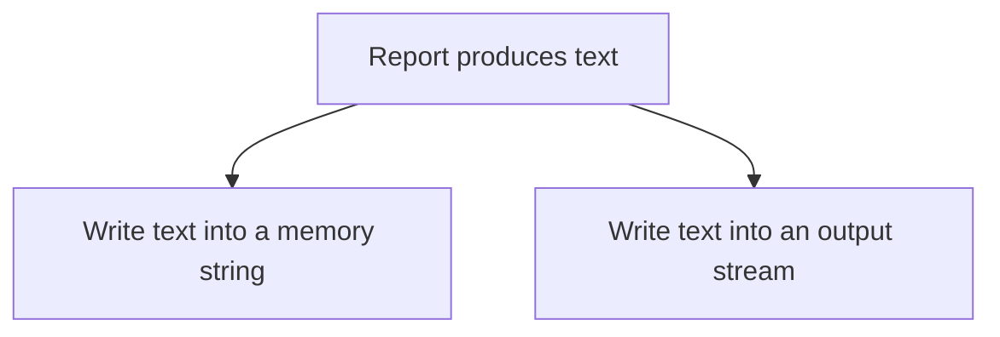
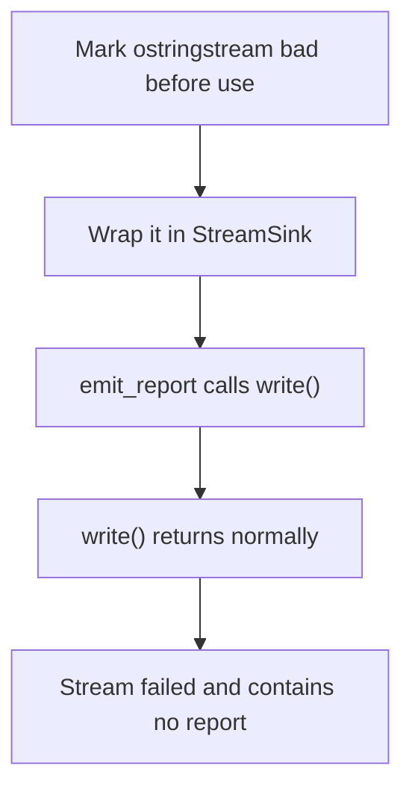
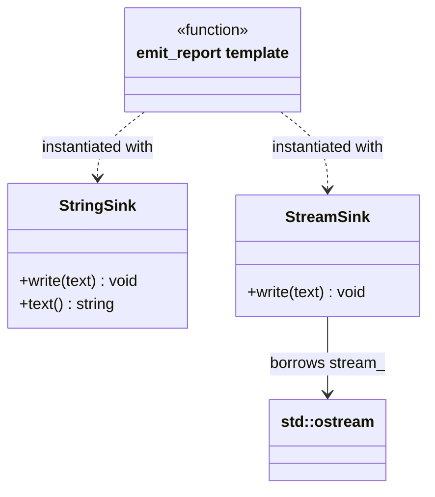
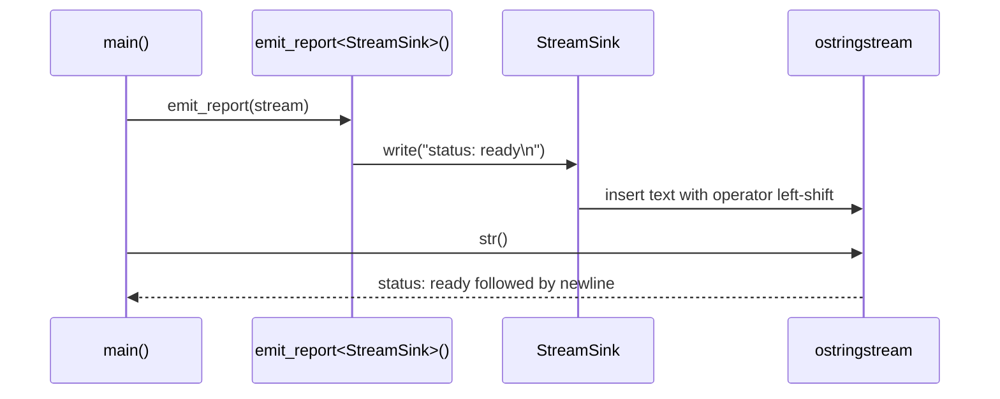

# Program to Interfaces, Not Implementations

## 1. Definition

**Program to interfaces means relying on what a helper can do, not on how it does it.**
Its **interface** is the set of operations you use; its **implementation** is the
code that carries them out.

For example, a report needs somewhere to write text. It should not require a disk
file if a memory buffer or another output destination can do the same job.

## 2. The Problem It Solves

Suppose report generation opens a file itself. A test only wants to check the text,
but now needs a file too. Sending the report to memory or another destination means
changing code whose real job was just to produce the report.

Give report generation something with a `write()` operation. It supplies the text;
the writer decides where that text goes. The same report code can now use a memory
writer in a test and another writer in the application.

## 3. Understand the Idea Step by Step

1. Identify the operation the caller actually needs.
2. State the input, result, and failure rules for that operation.
3. Have the caller use only that promise.
4. Supply a helper that fulfills it.

A writer is also called a **sink**, a destination for output. Its promise, or
**contract**, must explain more than the spelling of `write()`: does it finish
using the text before returning, and how does it report a failure? Callers need
those answers to use different writers safely.

### Picture: One Report, Two Possible Destinations

Read each arrow as "can write to." One call uses one supplied destination.

**Read it as a sentence:** report generation stays the same; the supplied destination
decides where the text goes. The report does not need the destination's storage details.

No virtual base class is required here. A C++ **template** lets the compiler build
the report function for any suitable writer with a `write()` operation. The promise
matters more than which language feature expresses it.

## 4. Real-World Scenario

A report generator writes into memory during a test, allowing the test to compare
the exact text. The application can give it a file or network writer later, provided
those writers honor the required behavior.

Real output can fail. Decide whether a write reports an error immediately or completes
later, and how long supplied text must remain alive. Those rules belong in the promise.

## 5. Understand the C++ Example

Open [interfaces.cpp](../../principles/interfaces.cpp).

`emit_report()` is a template expecting a sink with `write(string_view)`.
`string_view` refers to existing characters without owning a copy of them.

1. Create a `StringSink`, which appends text to its own string.
2. Emit `status: ready\n`, where `\n` means a line break.
3. Create an `ostringstream`, an output stream that stores text in memory.
4. Wrap that stream in `StreamSink` and emit the same report.
5. Checks confirm both destinations receive the same expected text.

There is no common base class: the compiler builds suitable code for each sink type.
Both sinks consume the view during the call rather than saving it for later.
The stream sink borrows its stream, so the stream must remain alive. Real stream
failures need additional handling beyond this successful in-memory test.

### C++ Flow Diagram

Follow the failed-stream case in the drawback function. A normal return is not
proof that the requested output was written.

The template checks that the operation can be called. It cannot infer a stronger
promise about failures; the output contract must define how errors are reported.

### C++ Class Diagram

Dotted arrows mean compile-time use by the template, not inheritance. The ordinary
arrow means `StreamSink` borrows an output stream.

There is no common `Sink` base class. `Sink` is a template parameter standing for
a suitable type, and `StringSink` owns its string rather than borrowing one.

### C++ Sequence Diagram

Time runs downward. Solid arrows call or insert data; dashed arrows return.
This traces the healthy stream path in `main()`.

The memory sink receives the same text through another instantiation. The caller
checks equality of outputs, while the drawback case separately inspects stream failure.

## 6. Benefits, Drawbacks, and Alternatives

**Benefits:** the same report writes to a string or a stream. Tests can compare the
text directly, without making report generation depend on a particular destination.

**Drawbacks:** matching `write()` methods does not prove matching behavior. In the
drawback example, a failed stream accepts the call without throwing but stores no
report. The template cannot infer how errors should be reported. That promise must
be clear and tested. Extra interfaces also add little when no alternative helper is needed.

**Use a suitable mechanism:** templates for choices made when compiling, virtual
interfaces or callables when useful for runtime selection. A concrete type is fine
when there is no meaningful need for alternative helpers.

## 7. Check Your Understanding

**Question:** Does following this principle require adding `virtual` everywhere?

**Answer:** No. This example depends on the promised `write()` operation through a
template. The important decision is what behavior the caller relies on, not which
C++ feature expresses it.

Optional detail: [principles technical notes](../../principles/README.md).