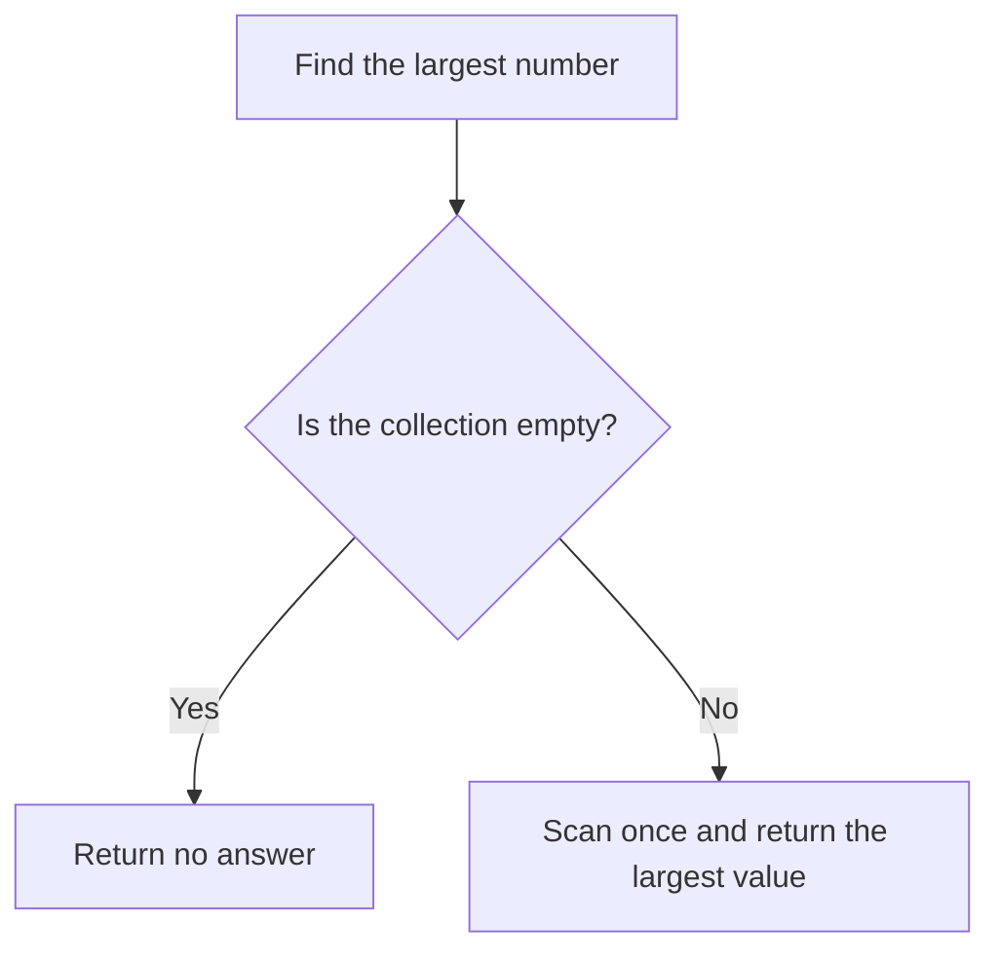

# KISS: Keep It Simple

## 1. Definition

**Choose the simplest design that correctly handles the actual requirements.**
KISS is commonly used as a reminder to keep a solution simple and understandable.
It does not mean the shortest possible code or skipping difficult cases.

For example, finding the largest number in a list needs a scan, not a custom sorting
framework. But it still needs a clear answer for an empty list.

## 2. The Problem It Solves

Extra classes, clever shortcuts, and unnecessary settings make readers learn more
before they can predict the result. Reimplementing standard algorithms also creates
more code that can contain mistakes.

At the other extreme, returning an unexplained magic value on failure makes the
function short but forces callers to guess. Simplicity must include clear behavior.

## 3. Understand the Idea Step by Step

1. State what the function must do, including unusual valid inputs and failures.
2. Check whether a standard operation already solves the main problem.
3. Represent missing answers explicitly.
4. Add more machinery only when a real requirement justifies it.

An **edge case** is an input that exposes a boundary or unusual situation, such as
an empty collection. A **sentinel** is a special value used to signal something else.
Returning zero for "no maximum" is a poor sentinel because zero can also be a real maximum.

### Picture: Handle Empty and Nonempty Input

Read downward and choose the branch matching the collection.

**Read it as a sentence:** an empty collection has no largest item; otherwise look
through the values once and keep the largest.

The simplest correct approach can change with the workload. One scan is appropriate
for one query. Millions of repeated queries may justify maintaining extra information.
Measure that need rather than adding complexity just because it looks advanced.

## 4. Real-World Scenario

A tool reads a few fixed settings at startup. A small reader with clear checks may
be enough. Adding live plug-ins, a scripting language, and remote configuration
creates more failure possibilities without helping its current users.

If live changes become a real requirement, add the necessary update and coordination
rules then. KISS does not forbid complexity that the actual job requires.

## 5. Understand the C++ Example

Open [kiss.cpp](../../principles/kiss.cpp).

`largest()` uses `std::max_element`, the standard operation for finding the largest
element. It returns an `optional`: a value that either contains an integer or contains no answer.

1. Empty input returns `nullopt`, meaning no answer.
2. Nonempty input is searched with the standard algorithm.
3. For `{-8, -2, -5}`, the answer is -2, not zero.
4. Repeated maximum values, such as two nines, still give the correct maximum.
5. Checks cover these cases; the program prints a known nonempty example's result.

The algorithm examines each item and needs only a small fixed amount of extra memory.
This is often written as O(N) time, where N is the number of items. Sorting would do
unnecessary work and could also require changing or copying the input.

## 6. Benefits, Drawbacks, and Alternatives

**Benefits:** easier reading, fewer moving parts, familiar standard behavior, and
less custom code to maintain.

**Drawbacks:** "simple" can be misused to ignore performance, safety, or error handling.
A tiny function is not a good solution if it pushes confusion onto every caller.

**Use it by comparing:** the whole cost of understanding and maintaining a solution,
not just its line count. Specialized structures are reasonable when evidence requires them.

## 7. Check Your Understanding

**Question:** Why not return zero when the collection is empty?

**Answer:** Callers could not tell "no answer" from a real maximum of zero. An optional
result makes that distinction explicit and also avoids mistakes with all-negative input.

Optional detail: [principles technical notes](../../principles/README.md).