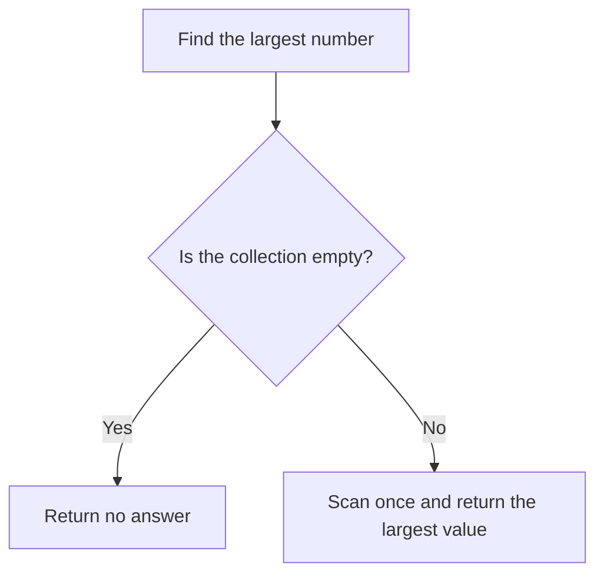
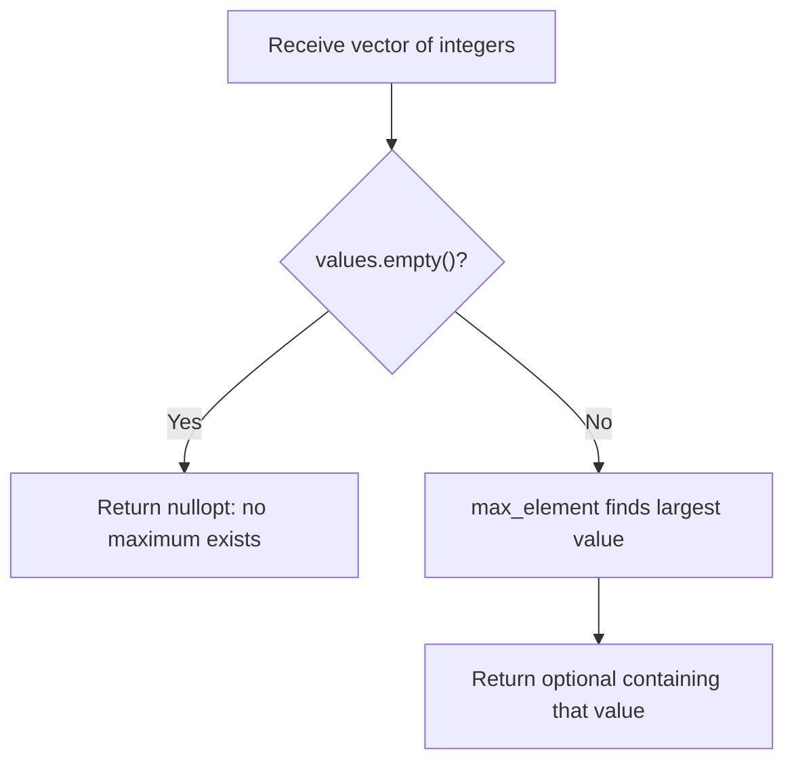
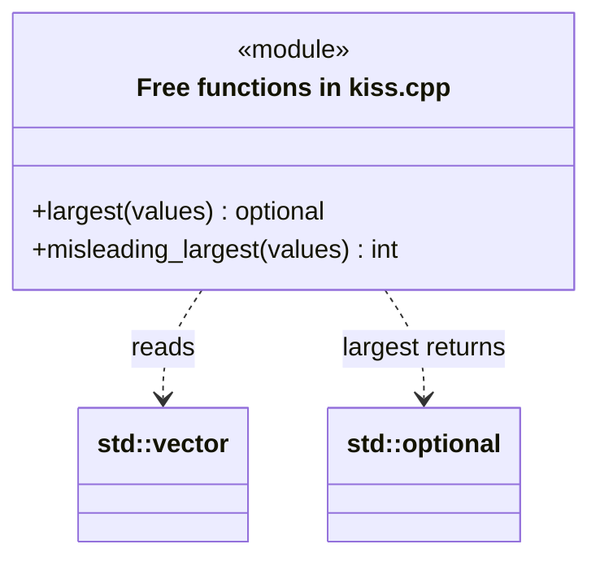
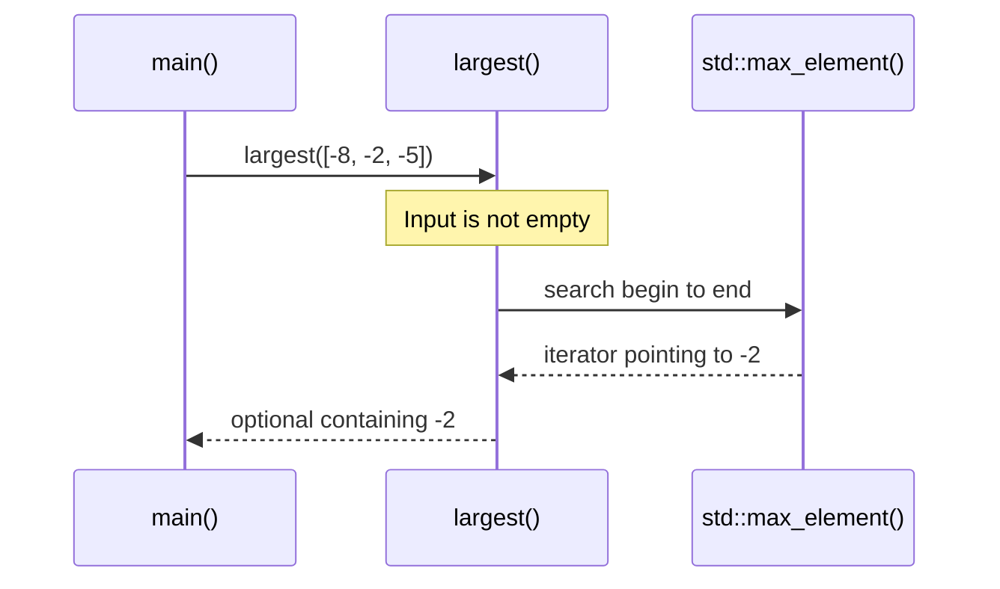

# KISS: Keep It Simple

## 1. Definition

**KISS means choosing the simplest solution that does the whole job correctly.**
Keep it understandable, but do not remove necessary checks just to make it shorter.

For example, finding the largest number in a list needs a scan, not a custom sorting
framework. But it still needs a clear answer for an empty list.

## 2. The Problem It Solves

Suppose we need the largest number in a list. Sorting the whole list would find
it, but also orders every other number, work we did not ask for. A custom search
framework would add even more code to understand.

Use the standard maximum search instead. There is still one question to answer:
what if the list is empty? Return an explicit "no answer" result, rather than
pretending zero was found. The solution stays small without making callers guess.

## 3. Understand the Idea Step by Step

1. State what the function must do, including unusual valid inputs and failures.
2. Check whether a standard operation already solves the main problem.
3. Represent missing answers explicitly.
4. Add more machinery only when a real requirement justifies it.

An empty list is an **edge case**, an input that needs special attention. Using
zero to mean "empty" would make it a **sentinel**, a special signal value. But zero
can also be a real maximum, so this signal would be ambiguous.

### Picture: Handle Empty and Nonempty Input

Read downward and choose the branch matching the collection.

**Read it as a sentence:** an empty collection has no largest item; otherwise look
through the values once and keep the largest.

One scan is enough for one maximum query. If the real job becomes answering the
same query millions of times, storing an extra result may help. Keep the design
as simple as the actual workload allows, not simpler than it requires.

## 4. Real-World Scenario

A tool reads a few fixed settings at startup. A small reader with clear checks may
be enough. Adding live plug-ins, a scripting language, and remote configuration
creates more failure possibilities without helping its current users.

If live changes become a real requirement, add the necessary update and coordination
rules then. KISS does not forbid complexity that the actual job requires.

## 5. Understand the C++ Example

Open [kiss.cpp](../../principles/kiss.cpp).

`largest()` uses `std::max_element`, the standard operation for finding the largest
element. It returns an `optional`: a value that either contains an integer or contains no answer.

1. Empty input returns `nullopt`, meaning no answer.
2. Nonempty input is searched with the standard algorithm.
3. For `{-8, -2, -5}`, the answer is -2, not zero.
4. Repeated maximum values, such as two nines, still give the correct maximum.
5. Checks cover these cases; the program prints a known nonempty example's result.

The algorithm examines each item and needs only a small fixed amount of extra memory.
This is often written as O(N) time, where N is the number of items. Sorting would do
unnecessary work and could also require changing or copying the input.

### C++ Flow Diagram

Arrows trace the correct `largest()` function. A diamond is a decision, and each
return box describes the meaning of the result rather than a magic number.

The drawback function compares this with starting the maximum at zero. That shorter
version invents zero for all-negative input and cannot distinguish empty input from `{0}`.

### C++ Class Diagram

There are no user-defined classes here. This is a static structure view: the
`module` box contains real free functions, and dotted arrows describe data use.

`optional` represents either one integer or no integer. No inheritance or extra
manager object is needed to express that distinction.

### C++ Sequence Diagram

Read downward. Solid arrows call; dashed arrows return. The algorithm lane is a
standard-library function, not an application object.

Square brackets abbreviate the input vector. The empty-input path never calls
`max_element`, so it never dereferences an end iterator.

## 6. Benefits, Drawbacks, and Alternatives

**Benefits:** readers recognize `std::max_element`, and there is little custom code
to maintain. The optional result clearly separates a number from no answer.

**Drawbacks:** "simple" can become an excuse to skip correctness. The drawback
example starts its maximum at zero and returns zero for all-negative input, even
though zero was never in the list. It also cannot distinguish an empty list from
one containing zero. Fewer lines are not worth a misleading result.

**Use it by comparing:** the whole cost of understanding and maintaining a solution,
not just its line count. Specialized structures are reasonable when evidence requires them.

## 7. Check Your Understanding

**Question:** Why not return zero when the collection is empty?

**Answer:** Callers could not tell "no answer" from a real maximum of zero. An optional
result makes that distinction explicit and also avoids mistakes with all-negative input.

Optional detail: [principles technical notes](../../principles/README.md).