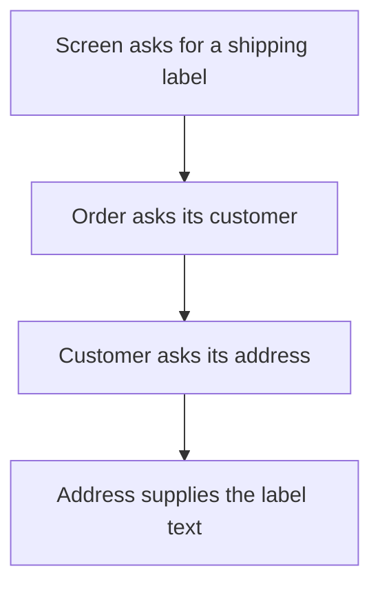
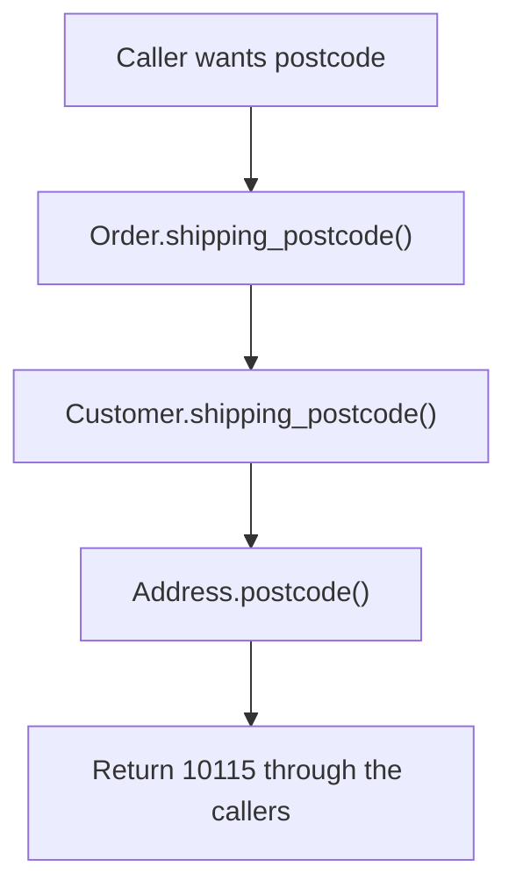
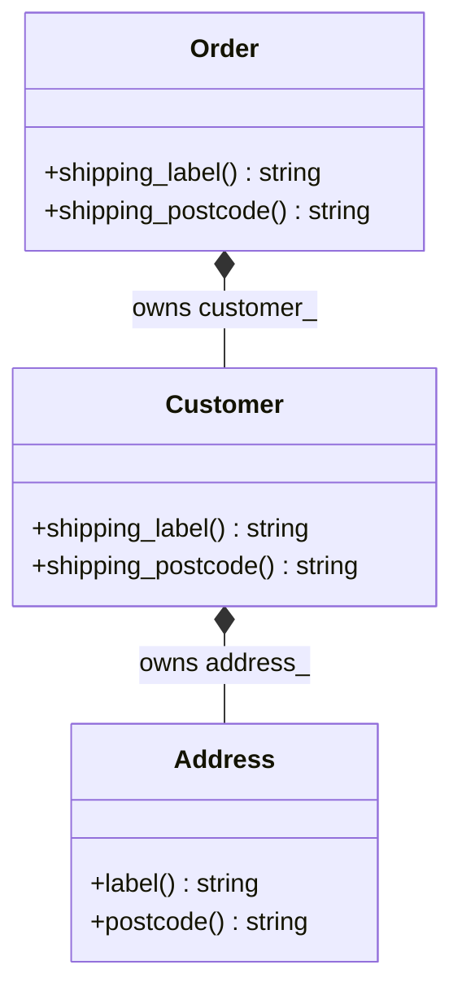
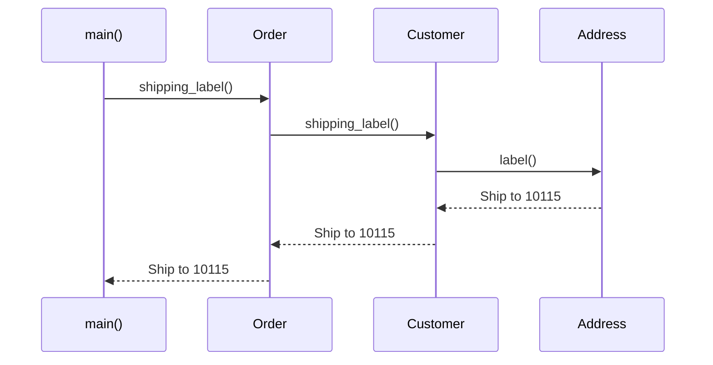

# Law of Demeter

## 1. Definition

**Law of Demeter means working with your direct helpers instead of reaching deep
into their internal objects.** Ask for the result you need, not every detail used to make it.

For example, ask an order for its shipping label. The caller should not normally
need to fetch the customer, fetch the address, and learn how its postcode is stored.

## 2. The Problem It Solves

Suppose the shipping screen fetches an order's customer, then the customer's address,
then its postcode, and finally builds a label. The screen now knows the whole storage
arrangement. A guest order with a different address arrangement could force a screen change.

Let the screen ask `order.shipping_label()` instead. The order asks its customer,
and the customer asks its address. Each part uses the relationship it already knows.
The screen can keep asking for a label even if the order's internals change.

## 3. Understand the Idea Step by Step

1. Identify the actual answer the caller needs.
2. Ask whether the caller is exploring unrelated internals to obtain it.
3. Put a meaningful operation on an appropriate direct helper.
4. Let that helper ask its own direct helpers for the necessary work.

The customer is the order's **collaborator**, or helper. Asking it for the label
is **delegation**. The way order, customer, and address are stored is the internal
**representation**. The screen should not need that layout just to show a label.

### Picture: Each Object Talks to Its Own Neighbor

Read each arrow as a request made only by the object immediately above it.

**Read it as a sentence:** the screen talks to the order, not directly to the
customer's address. Each object handles the next relationship it already understands.

The point is what the caller must know, not how many dots its expression contains.
A chain of builder calls may use one intended interface. Replacing every getter
with another forwarding method does not automatically improve the design.

## 4. Real-World Scenario

A shipping screen needs a destination label. If it formats nested customer records
itself, changes to saved addresses or guest orders spread into screen code.
An order-facing label operation can hide those changes.

If address formatting varies independently, a separate formatting helper may do that
part. Plain read-only records can also be appropriate when the caller genuinely
needs structured data, not one specific answer.

## 5. Understand the C++ Example

Open [law_of_demeter.cpp](../../principles/law_of_demeter.cpp).

`Order` contains a `Customer`, and that customer contains an `Address`. The caller
uses only `Order::shipping_label()`.

1. Create an address with postcode `10115`.
2. Put the address in the customer and the customer in the order.
3. Ask the order for its shipping label.
4. The order asks the customer, which asks the address.
5. The result is `Ship to 10115`; the example checks and prints it.

These inner objects are stored by value, so their lifetimes follow the containing
objects. The returned string is a separate value, not editable access to an internal
address field. The caller need not depend on a chain of getters.

### C++ Flow Diagram

These arrows show the forwarding required for the new postcode operation in the
drawback example. They are calls toward the stored address.

One new value required three methods. Repeating this for many fields can create
large forwarding lists; a meaningful operation or deliberate read-only view may be clearer.

### C++ Class Diagram

Filled diamonds mean value members: an order owns its customer, which owns its
address. This is storage structure, not inheritance.

The caller asks the order for a result rather than navigating into its fields.
That hides the object arrangement, but does not make forwarding cost-free.

### C++ Sequence Diagram

Read downward through the original label operation. Solid arrows call; dashed
arrows carry the finished label back to the original caller.

Only `Address` assembles the label text. The other methods delegate to their
direct collaborators; the principle concerns knowledge, not merely counting dots.

## 6. Benefits, Drawbacks, and Alternatives

**Benefits:** the screen asks for a shipping label without knowing where the address
lives. Internal relationship changes can stay behind that operation.

**Drawbacks:** doing this for every field can create long forwarding lists. The
postcode demonstration needs methods on order, customer, and address just to return
one value. If a caller genuinely needs a structured set of address data, a deliberate
read-only view may be clearer. Do not hide useful data merely to shorten expressions.

**Use it where:** callers learn changeable internal relationships without needing to.
Do not hide meaningful structured data merely to follow the principle mechanically.

## 7. Check Your Understanding

**Question:** Is `builder.url(...).timeout(...).build()` necessarily a violation?

**Answer:** No. These calls can use one intended builder interface. Ask how many
internal relationships the caller must understand, not how many dots appear.

Optional detail: [principles technical notes](../../principles/README.md).