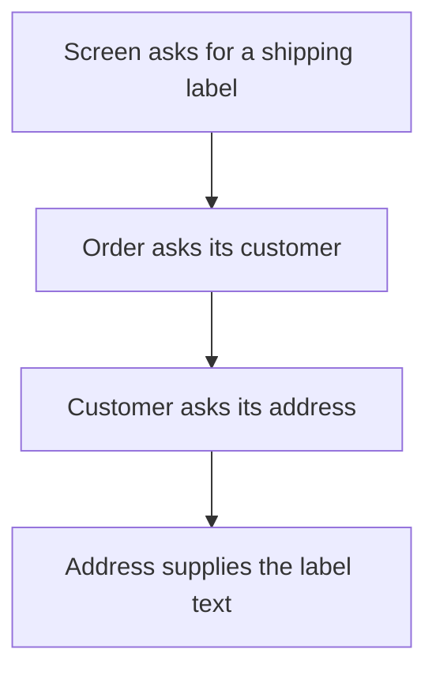

# Law of Demeter

## 1. Definition

**Ask the object you already work with for the result you need, instead of reaching
through several of its internal objects to assemble that result yourself.**

For example, ask an order for its shipping label. The caller should not normally
need to fetch the customer, fetch the address, and learn how its postcode is stored.

## 2. The Problem It Solves

A caller that follows a long chain of internal objects knows how another part is
organized. Moving address storage or introducing guest checkout can then break that caller,
even though it still only needs a label.

Give useful behavior to the object that understands the relationship. Keep outside
code focused on its goal rather than on navigating internal storage.

## 3. Understand the Idea Step by Step

1. Identify the actual answer the caller needs.
2. Ask whether the caller is exploring unrelated internals to obtain it.
3. Put a meaningful operation on an appropriate direct helper.
4. Let that helper ask its own direct helpers for the necessary work.

A **collaborator** is simply a helper object. **Delegation** means asking a helper
to perform part of a job. **Representation** means how information is organized
inside an object; callers should not need those details unnecessarily.

### Picture: Each Object Talks to Its Own Neighbor

Read each arrow as a request made only by the object immediately above it.

**Read it as a sentence:** the screen talks to the order, not directly to the
customer's address. Each object handles the next relationship it already understands.

This is not a rule about counting dots in C++ expressions. A sequence of calls on
one builder can be a well-designed public interface. Equally, adding dozens of
forwarding functions just to hide punctuation can make code worse.

## 4. Real-World Scenario

A shipping screen needs a destination label. If it formats nested customer records
itself, changes to saved addresses or guest orders spread into screen code.
An order-facing label operation can hide those changes.

If address formatting varies independently, a separate formatting helper may do that
part. Plain read-only records can also be appropriate when the caller genuinely
needs structured data, not one specific answer.

## 5. Understand the C++ Example

Open [law_of_demeter.cpp](../../principles/law_of_demeter.cpp).

`Order` contains a `Customer`, and that customer contains an `Address`. The caller
uses only `Order::shipping_label()`.

1. Create an address with postcode `10115`.
2. Put the address in the customer and the customer in the order.
3. Ask the order for its shipping label.
4. The order asks the customer, which asks the address.
5. The result is `Ship to 10115`; the example checks and prints it.

These inner objects are stored by value, so their lifetimes follow the containing
objects. The returned string is a separate value, not editable access to an internal
address field. The caller need not depend on a chain of getters.

## 6. Benefits, Drawbacks, and Alternatives

**Benefits:** less knowledge of internal structure, fewer callers affected by
relationship changes, and operations named after what callers want to accomplish.

**Drawbacks:** excessive forwarding can enlarge interfaces and make simple data
hard to access. Some navigation is deliberate and appropriate, such as traversing a tree.

**Use it where:** callers learn changeable internal relationships without needing to.
Do not hide meaningful structured data merely to follow the principle mechanically.

## 7. Check Your Understanding

**Question:** Is `builder.url(...).timeout(...).build()` necessarily a violation?

**Answer:** No. These calls can use one intended builder interface. Ask how many
internal relationships the caller must understand, not how many dots appear.

Optional detail: [principles technical notes](../../principles/README.md).