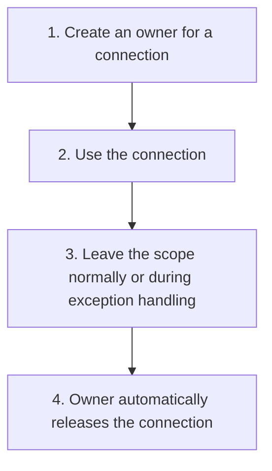

# RAII and Explicit Ownership

## 1. Definition

**Put each resource inside an object that releases it automatically when that
object's lifetime ends.** This C++ approach is called RAII, short for Resource
Acquisition Is Initialization.

A **resource** is something that must eventually be released: allocated memory,
an open file, a held lock, or a network connection. **Ownership** means responsibility
for that release. **Borrowing** means using the resource without taking that responsibility.

## 2. The Problem It Solves

Manual cleanup must be remembered on every normal return, early return, and error
path. Adding a new exit can accidentally skip cleanup and leave a file or connection open.
Unclear ownership can also make two parts release the same resource twice.

Let an owner's cleanup follow the C++ object's lifetime rather than trusting every
caller to remember each possible path.

## 3. Understand the Idea Step by Step

1. Acquire the resource and place it under an owning object.
2. Use the resource through that owner or through clearly limited borrowed access.
3. Transfer ownership deliberately if another object must take responsibility.
4. Let the owner's destruction perform cleanup.

A **constructor** initializes an object. A **destructor** runs cleanup when the
object is destroyed. A **scope** is a region of code, often a block in braces.
An ordinary local owner is destroyed when execution leaves its scope.

### Picture: Cleanup Follows the Owner

Read downward. Both ordinary exit and exception cleanup lead to the same release step.

**Read it as a sentence:** acquire through an owner, use the resource, and let cleanup
happen when the owner is destroyed. You do not add a separate manual release at every return.

An **exception** reports an error by leaving normal execution and searching for a
handler. Destroying local owners while it leaves scopes is called **stack unwinding**.
This does not guarantee cleanup after abrupt program termination or power loss.

Use `unique_ptr` for one owner of a dynamically created object. Use `shared_ptr`
only when several owners genuinely need to keep one object alive. `weak_ptr` can
observe shared ownership without keeping the object alive itself. Shared ownership
does not make simultaneous changes safe, and owners that keep each other alive can leak.

## 4. Real-World Scenario

A file-processing function opens a file and locks shared data before parsing text.
A file owner and lock guard can close the file and release the lock if parsing fails.
A **mutex** is a lock used to coordinate access; the lock guard owns the duty to unlock it.

Cleanup does not erase bytes already written. Undoing partial output needs another
design, such as writing a temporary file and replacing the destination only after success.

## 5. Understand the C++ Example

Open [raii_and_ownership.cpp](../../principles/raii_and_ownership.cpp).

`Connection` simulates a resource by increasing an active count when created and
decreasing it when destroyed. Copying is disabled to prevent duplicate ownership.

1. A `unique_ptr` owns one connection; the active count becomes one.
2. Move that pointer into another pointer. The old pointer becomes empty.
3. The count stays one because moving ownership did not copy the connection.
4. Leaving the scope destroys the owner and brings the count back to zero.
5. Another test deliberately throws after creating a connection.
6. Exception cleanup destroys the owner before the error is caught; the count is again zero.

The example uses a counter, not a real network. Destructors should normally not
throw errors. If a final save can fail, provide an explicit operation that reports
failure and keep destructor cleanup as a nonthrowing fallback.

## 6. Benefits, Drawbacks, and Alternatives

**Benefits:** fewer leaks, clear cleanup responsibility, and correct ordinary cleanup
across early returns and handled exceptions.

**Drawbacks:** shared ownership can be hard to follow. Borrowers must stop before
their resource disappears. Cleanup that itself can fail needs an explicit policy.

**Use existing owners first:** standard strings, containers, file wrappers, and lock
guards already solve many cleanup problems. Keep custom raw-resource handling small.

## 7. Check Your Understanding

**Question:** Does moving a `unique_ptr` move the connection to a new memory address?

**Answer:** No. It transfers the pointer's ownership. The connection remains where
it was, while the destination pointer becomes responsible for destroying it later.

Optional detail: [principles technical notes](../../principles/README.md).