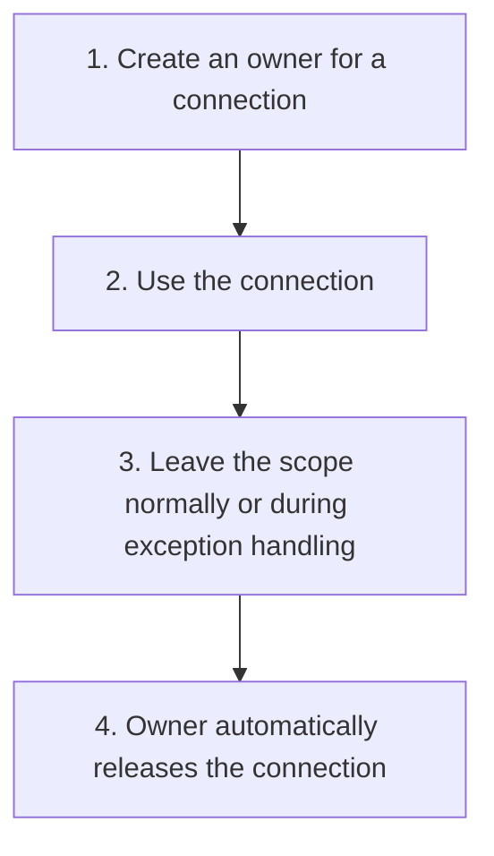
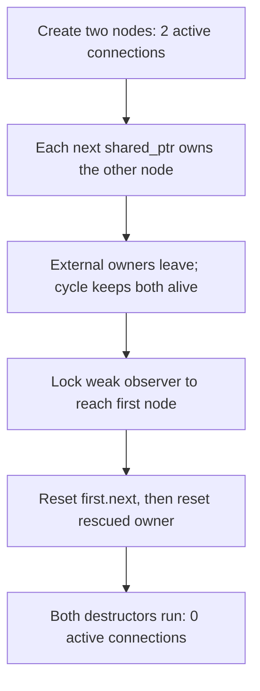
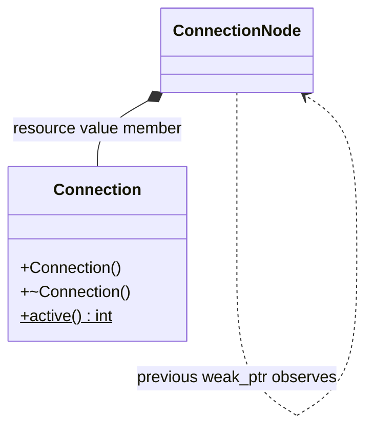
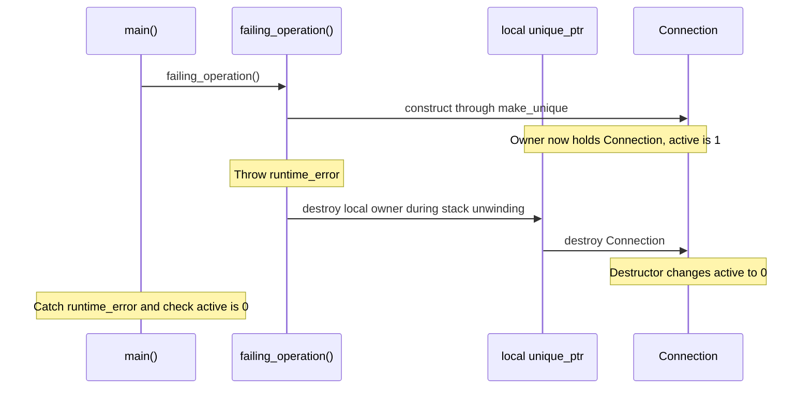

# RAII and Explicit Ownership

## 1. Definition

**RAII ties cleanup to an owning object's lifetime: when that owner is destroyed,
it releases its resource.** The name stands for Resource Acquisition Is Initialization.

A **resource** is something that must eventually be released: allocated memory,
an open file, a held lock, or a network connection. **Ownership** means responsibility
for that release. **Borrowing** means using the resource without taking that responsibility.

## 2. The Problem It Solves

Suppose a function opens a connection and closes it at the bottom. Later, someone
adds an early return halfway through. That path skips the close. An exception can
skip it too. Adding a manual close before every exit is easy to get wrong.

Put the connection under an owner instead. When execution leaves the owner's scope,
its destructor performs cleanup, whether the function returns normally or unwinds
toward an exception handler. The function can focus on using the resource rather
than remembering cleanup at every return.

## 3. Understand the Idea Step by Step

1. Acquire the resource and place it under an owning object.
2. Use the resource through that owner or through clearly limited borrowed access.
3. Transfer ownership deliberately if another object must take responsibility.
4. Let the owner's destruction perform cleanup.

A **constructor** sets up an object, and its **destructor** runs when it is destroyed.
A block inside braces is a **scope**. An ordinary local owner lives until execution
leaves that scope, which gives cleanup a clear place to happen.

### Picture: Cleanup Follows the Owner

Read downward. Both ordinary exit and exception cleanup lead to the same release step.

**Read it as a sentence:** acquire through an owner, use the resource, and let cleanup
happen when the owner is destroyed. You do not add a separate manual release at every return.

An **exception** reports an error by leaving normal execution and searching for a
handler. Destroying local owners while it leaves scopes is called **stack unwinding**.
This does not guarantee cleanup after abrupt program termination or power loss.

Choose ownership to match the job:

- `unique_ptr` has one owner responsible for deleting a dynamically created object.
- `shared_ptr` keeps an object alive until its last shared owner is gone.
- `weak_ptr` observes a shared object without keeping it alive.

Sharing ownership is not protection against simultaneous edits. It can also keep
objects alive longer than intended, as the cycle example below shows.

## 4. Real-World Scenario

A file-processing function opens a file and locks shared data before parsing text.
A file owner and lock guard can close the file and release the lock if parsing fails.
A **mutex** is a lock used to coordinate access; the lock guard owns the duty to unlock it.

The guard releases the lock and the file owner closes the file. They do not erase
bytes already written. If failed work must leave the old file untouched, that needs
another rule, such as writing a temporary file and replacing the old one only on success.

## 5. Understand the C++ Example

Open [raii_and_ownership.cpp](../../principles/raii_and_ownership.cpp).

`Connection` simulates a resource by increasing an active count when created and
decreasing it when destroyed. Copying is disabled to prevent duplicate ownership.

1. A `unique_ptr` owns one connection; the active count becomes one.
2. Move that pointer into another pointer. The old pointer becomes empty.
3. The count stays one because moving ownership did not copy the connection.
4. Leaving the scope destroys the owner and brings the count back to zero.
5. Another test deliberately throws after creating a connection.
6. Exception cleanup destroys the owner before the error is caught; the count is again zero.

The example uses a counter, not a real network. Destructors should normally not
throw errors. If a final save can fail, provide an explicit operation that reports
failure and keep destructor cleanup as a nonthrowing fallback.

### C++ Flow Diagram

Arrows follow the deliberately created ownership cycle and its cleanup in the
drawback function. No leak is left behind after the demonstration.

Reference counts cannot reach zero while the nodes keep owning each other. The
alternative uses a weak backward link, which observes without extending lifetime.

### C++ Class Diagram

The diamond means the connection is a value member. The ordinary arrows label
strong and weak links explicitly; neither is exclusive ownership of the next node.

`active()` is static (`$`) and counts live connection objects. The connection
class disables copying so a copied object cannot corrupt the acquisition count.

### C++ Sequence Diagram

Read downward through the exception path. Solid arrows call or clean up; the
notes distinguish the thrown error from an ordinary return.

Scope cleanup happens before the caller's catch handles the error. RAII works
when ownership ends; a strong shared cycle prevents that ending until it is broken.

## 6. Benefits, Drawbacks, and Alternatives

**Benefits:** normal returns, early returns, and handled exceptions use the owner's
same cleanup path. Moving a `unique_ptr` clearly transfers that responsibility
without creating a second connection.

**Drawbacks:** cleanup waits for ownership to end. In the drawback example, two
nodes own each other through `shared_ptr`, so neither is destroyed when the outside
owners leave. The demonstration breaks the cycle and then releases both. A weak
back-link avoids that ownership cycle. Borrowed access also must not outlive the
resource, and operations such as a final save need explicit error handling if they can fail.

**Use existing owners first:** standard strings, containers, file wrappers, and lock
guards already solve many cleanup problems. Keep custom raw-resource handling small.

## 7. Check Your Understanding

**Question:** Does moving a `unique_ptr` move the connection to a new memory address?

**Answer:** No. It transfers the pointer's ownership. The connection remains where
it was, while the destination pointer becomes responsible for destroying it later.

Optional detail: [principles technical notes](../../principles/README.md).