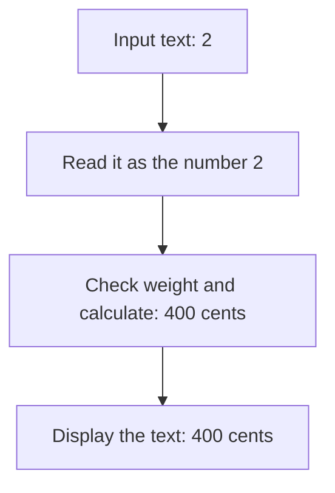
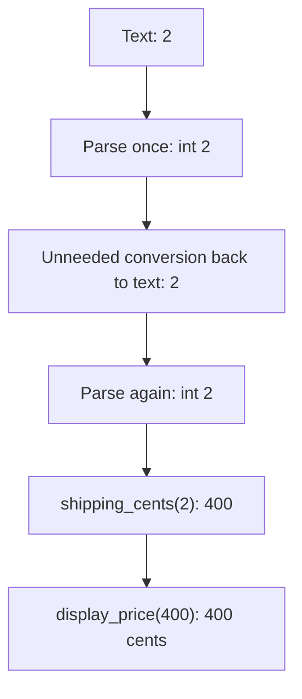
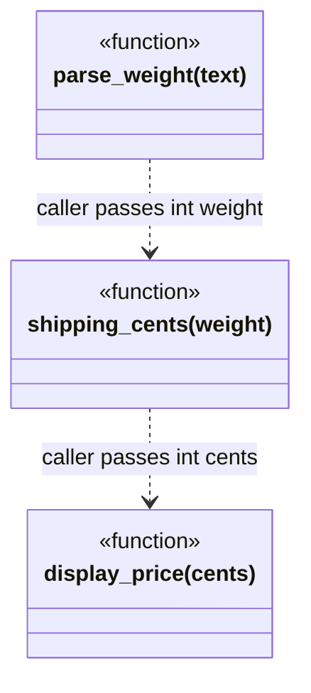
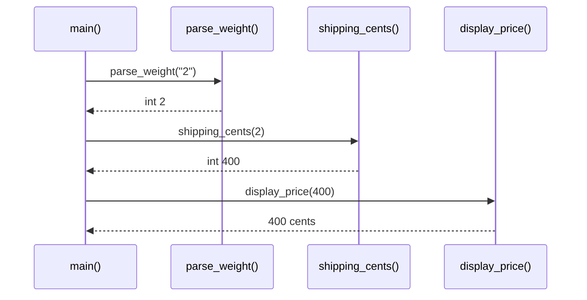

# Separation of Concerns

## 1. Definition

**Separation of concerns means giving different kinds of work their own places.**
A **concern** is a job such as reading input, calculating a price, or displaying
the answer.

For example, a shipping formula should not need to know whether the weight came
from a website, a text file, or a terminal prompt.

## 2. The Problem It Solves

Suppose one function asks for a parcel weight, converts the reply, calculates the
fee, and prints it. A website wants the same fee calculation, but not the terminal
prompt or printed message. Reusing the function means bringing along work it does
not need.

Split it into three functions: read a weight from text, calculate from a number,
and format the result. The terminal can use all three. A caller that already has
a number can use the calculation directly. No extra framework is needed.

## 3. Understand the Idea Step by Step

1. Turn input text into a value.
2. Check whether that value is allowed for the business operation.
3. Perform the calculation.
4. Turn the result into whatever output the caller needs.

Turning `"2"` into integer 2 is **parsing**. Checking the allowed weight and applying
the shipping formula are **domain rules**, the rules of this problem. Turning 400
into `400 cents` is **formatting**. Each step has a different reason to change.

### Picture: One Job per Stage

Read downward. Each arrow carries a result to the next stage.

**Read it as a sentence:** understand the text, calculate using a number, then
choose how to show the answer.

Parsing and business validation are not identical. `"0"` can be a perfectly readable
integer while zero is an invalid parcel weight. `"2kg"` is rejected by a parser
that expects only an integer, even though a human can guess what was intended.

## 4. Real-World Scenario

A booking-price calculation is used by a website, phone app, and support console.
Each can collect input and show results differently while sharing the same pricing function.

Each application still connects its own steps and decides how to show an error.
The shared price calculation does not need to know which screen will display it.

## 5. Understand the C++ Example

Open [separation_of_concerns.cpp](../../principles/separation_of_concerns.cpp).

The three functions are named after their jobs: `parse_weight`, `shipping_cents`,
and `display_price`.

1. `parse_weight("2")` uses `from_chars`, a standard text-to-number conversion.
2. It checks that all input was read, so `2kg` is not silently accepted as 2.
3. `shipping_cents(2)` checks the supported weight range and returns 400.
4. `display_price(400)` returns `400 cents`.
5. `main()` connects the stages and checks them separately as well.

The formula does not read terminal input or print anything. Another caller can use
it directly with a number. Parsing only uses the input text during the call and
does not save a reference that might later point to destroyed text.

### C++ Flow Diagram

Arrows follow the unnecessary conversions in `demonstrate_drawback()`.

The focused version skips the middle text conversion and second parse. Both
produce the same output, but only one respects a simple typed boundary between helpers.

### C++ Class Diagram

There are no custom classes. Each box is explicitly marked `function`; the dotted
arrows describe data passed by the caller, not calls between these helpers.

Parsing checks integer syntax, the rule checks the allowed weight range, and
display formats a result. One helper does not need to know another's text format.

### C++ Sequence Diagram

Solid arrows call; dashed arrows return. `main()` combines the helpers, even though
the source writes the calls as one nested expression.

The order follows data dependencies: the weight must exist before the fee can be
calculated. Invalid text such as `2kg` fails at parsing, before the business rule.

## 6. Benefits, Drawbacks, and Alternatives

**Benefits:** test the price with a number, test the parser with text, and change
the displayed wording without editing the formula. Each caller uses the parts it needs.

**Drawbacks:** unnecessary boundaries add work. The drawback example parses the
weight, turns it back into text, then parses it again before calculating. Passing
the integer directly is clearer. Separate different jobs, not every small step.

**Use the smallest useful split:** separate genuinely different jobs, not every
line. Single Responsibility examines a part's reasons to change; separation of
concerns describes how different kinds of work are organized across the program.

## 7. Check Your Understanding

**Question:** Should the pricing function print an error and return zero on invalid weight?

**Answer:** No. That mixes calculation with presentation and makes failure look
like free shipping. Report failure explicitly and let the caller decide how to show it.

Optional detail: [principles technical notes](../../principles/README.md).