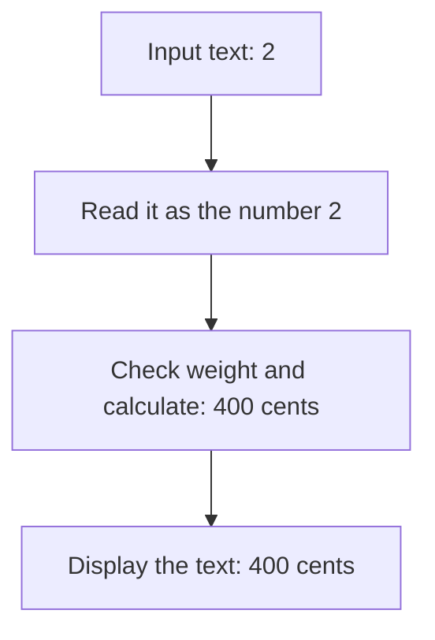

# Separation of Concerns

## 1. Definition

**Keep different kinds of work separate enough that each can be understood, tested,
and changed without dragging unrelated work along.** A **concern** means a kind of
responsibility, such as reading input, calculating a price, or displaying an answer.

For example, a shipping formula should not need to know whether the weight came
from a website, a text file, or a terminal prompt.

## 2. The Problem It Solves

One function may read text, calculate a price, write a database record, and print
an answer. Testing the calculation then requires arranging unrelated input and output.
Changing the displayed wording risks changing the formula by accident.

Separate the jobs and connect them explicitly. In a small program, separate functions
are often enough; separation does not require services, folders, or classes for everything.

## 3. Understand the Idea Step by Step

1. Turn input text into a value.
2. Check whether that value is allowed for the business operation.
3. Perform the calculation.
4. Turn the result into whatever output the caller needs.

**Parsing** means converting text according to a format, such as turning `"2"` into
integer 2. **Domain rules** are the rules of the problem being solved, such as allowed
parcel weights. **Formatting** means presenting an answer as text or another output form.

### Picture: One Job per Stage

Read downward. Each arrow carries a result to the next stage.

**Read it as a sentence:** understand the text, calculate using a number, then
choose how to show the answer.

Parsing and business validation are not identical. `"0"` can be a perfectly readable
integer while zero is an invalid parcel weight. `"2kg"` is rejected by a parser
that expects only an integer, even though a human can guess what was intended.

## 4. Real-World Scenario

A booking-price calculation is used by a website, phone app, and support console.
Each can collect input and show results differently while sharing the same pricing function.

One application function still connects the stages and decides what to do after
failure. Separating work does not remove the need to coordinate the overall request.

## 5. Understand the C++ Example

Open [separation_of_concerns.cpp](../../principles/separation_of_concerns.cpp).

The three functions are named after their jobs: `parse_weight`, `shipping_cents`,
and `display_price`.

1. `parse_weight("2")` uses `from_chars`, a standard text-to-number conversion.
2. It checks that all input was read, so `2kg` is not silently accepted as 2.
3. `shipping_cents(2)` checks the supported weight range and returns 400.
4. `display_price(400)` returns `400 cents`.
5. `main()` connects the stages and checks them separately as well.

The formula does not read terminal input or print anything. Another caller can use
it directly with a number. Parsing only uses the input text during the call and
does not save a reference that might later point to destroyed text.

## 6. Benefits, Drawbacks, and Alternatives

**Benefits:** reusable calculations, clearer failures, focused tests, and changes
to display wording that do not require changing business rules.

**Drawbacks:** pointless layers can make a short task hard to follow. Passing and
converting data between too many helpers can add work without useful independence.

**Use the smallest useful split:** separate genuinely different jobs, not every
line. Single Responsibility examines a part's reasons to change; separation of
concerns describes how different kinds of work are organized across the program.

## 7. Check Your Understanding

**Question:** Should the pricing function print an error and return zero on invalid weight?

**Answer:** No. That mixes calculation with presentation and makes failure look
like free shipping. Report failure explicitly and let the caller decide how to show it.

Optional detail: [principles technical notes](../../principles/README.md).