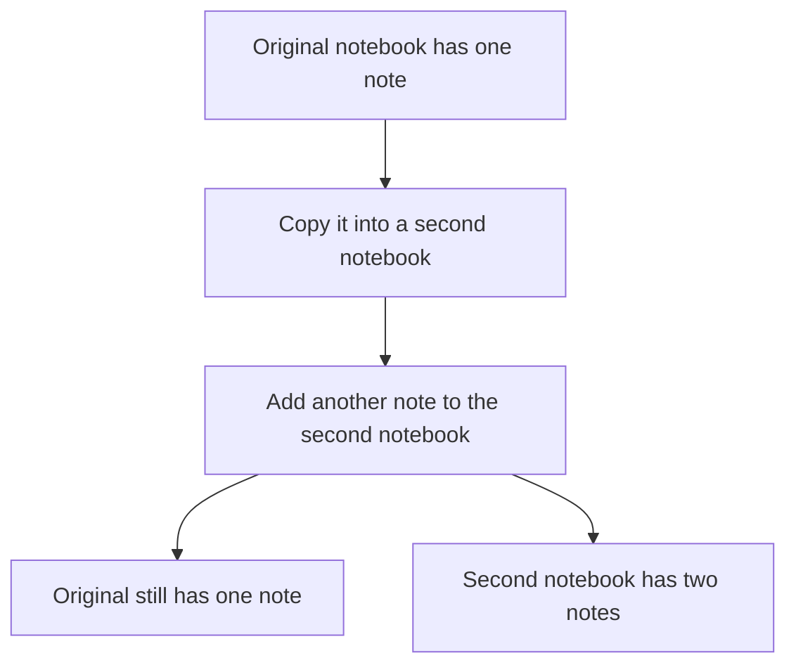
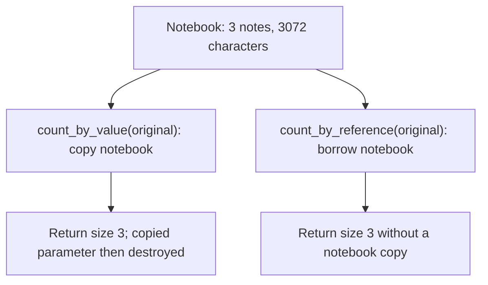
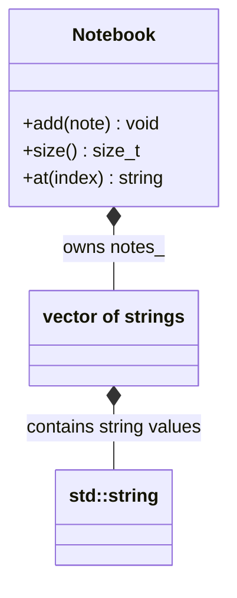
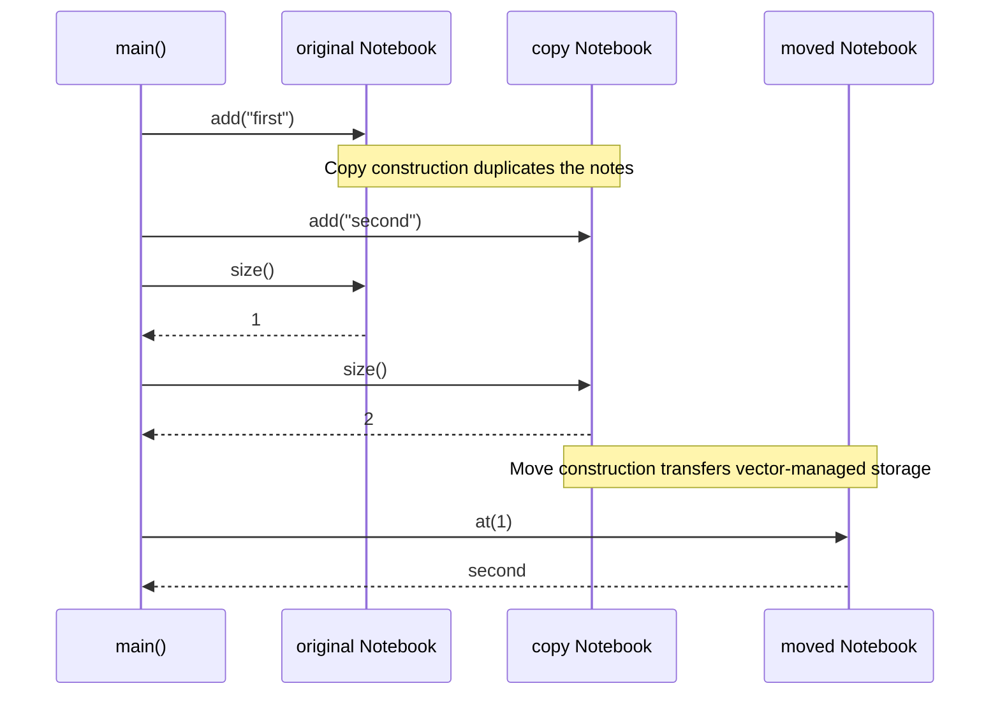

# Value Semantics and the Rule of Zero

## 1. Definition

**Value semantics means a copy behaves like its own value: editing it does not
unexpectedly edit the original.** Think of copying a notebook and adding a note
only to the new notebook.

**The Rule of Zero means letting well-chosen members handle copying, moving, and
cleanup, so your class needs none of those functions written by hand.** The members
must still have the copying behavior you want.

## 2. The Problem It Solves

Suppose a notebook owns text through a raw pointer. Copying the notebook may copy
only that address. Now both notebooks point to the same text: editing one can
change the other, and both may try to delete the same memory during cleanup.

Store the notes in `vector<string>` instead. Copying the vector copies the string
values, so each notebook gets its own notes. The standard types already manage
their storage; the notebook does not need to repeat that work.

## 3. Understand the Idea Step by Step

1. Decide what a copy should mean for your class.
2. Choose members whose copying behavior matches that meaning.
3. Let C++ generate the containing class's normal copy, move, and cleanup operations.
4. Check that editing a copy has the intended independence.

The vector is a **member**, a value stored inside the notebook. Creating a second
notebook from the first is **copy construction**; replacing an existing notebook's
contents is **assignment**. A **move** can transfer storage instead of copying it.
The vector's **destructor** releases that storage when its lifetime ends.

### Picture: Equal at First, Independent After Editing

Read downward. The final boxes show the two notebooks after the copied one is edited.

**Read it as a sentence:** the copy starts equal, but its later changes belong to
the copy. This is different from two pointers naming the same notebook.

C++ follows each member's copying rules. A `vector<string>` gives this notebook
independent notes. A `shared_ptr` would instead share its pointed-to object. Having
no custom copy function does not, by itself, guarantee independent data.

## 4. Real-World Scenario

A settings dialog edits a draft copy of preferences. Cancel discards the draft,
leaving active preferences unchanged. Apply replaces active preferences with the draft.

If both merely pointed to the same editable settings, typing in the dialog would
change active settings before Apply was pressed. An independent draft preserves
the intended behavior. A live network connection is different: copying it may not
make sense at all, so the right copying rule depends on the kind of object.

## 5. Understand the C++ Example

Open [value_semantics.cpp](../../principles/value_semantics.cpp).

`Notebook` stores a `vector<string>`, a growable list of independently owned text
values. It declares no custom resource-management functions.

1. Add `first` to the original notebook.
2. Copy it into another notebook.
3. Add `second` only to the copy; the original still has one note.
4. Move the copy into another notebook, which now contains the two notes.
5. Assign a fresh notebook to the moved-from source before reusing its contents.
6. Compile-time checks verify supported copy/move properties; runtime checks verify values.

The standard-library members handle their own storage. A moved-from object is the
source after a move. Many standard types promise it remains valid but do not promise
specific contents. The example therefore does not assume the moved-from vector is empty.

### C++ Flow Diagram

Arrows compare two read-only calls in the drawback function. The original notebook
contains three strings of 1024 characters each.

The separate `independent` copy confirms the duplicated text payload. Correct
copying is not free; use a value when independence is needed, not just to read a count.

### C++ Class Diagram

Filled diamonds mean contained values. The notebook owns the vector, and the
vector owns its strings; these are standard-library types, not new wrapper classes.

`at()` actually returns `const std::string&`. Compiler-generated copy, move, and
destruction use the well-behaved members; no custom resource-management methods are needed.

### C++ Sequence Diagram

Read downward through the main example. Solid arrows call or initialize; dashed
arrows return values. Construction notes distinguish copying from moving.

The program does not assume a particular moved-from content. It assigns a fresh
`Notebook{}` to `copy` before adding and checking its reused content.

## 6. Benefits, Drawbacks, and Alternatives

**Benefits:** adding a note to the copy leaves the original alone. Standard members
handle cleanup, and the notebook needs no custom copy or move code to get that behavior.

**Drawbacks:** a correct copy still costs something. The drawback example copies
three 1024-character notes just to read their count through a by-value parameter.
A const reference can read the same count without copying the notebook. Use a copy
when independence is needed, and define different rules for objects whose identity
or internal references make copying inappropriate.

**Use standard owning members when possible.** A custom low-level resource owner
must consider destructor, copy constructor, copy assignment, move constructor, and
move assignment together. This is often called the Rule of Five. Keep that work
inside the owner so higher-level classes can follow the Rule of Zero.

## 7. Check Your Understanding

**Question:** Can an owning raw `char*` be added without reconsidering copying?

**Answer:** No. A generated copy would copy the address, not the owned characters.
Prefer `string` or a correctly designed owner so copying and cleanup retain their
intended meaning.

Optional detail: [principles technical notes](../../principles/README.md).