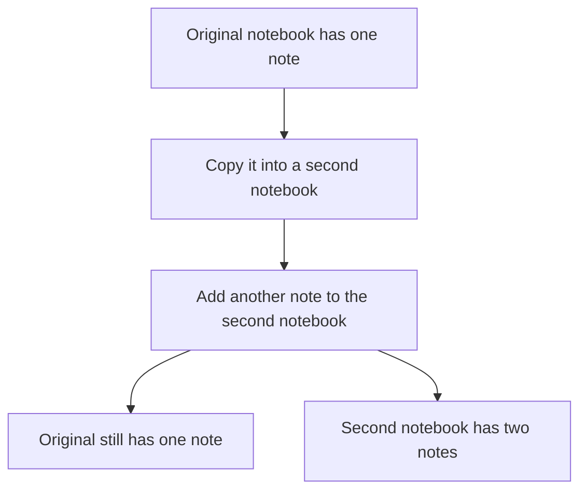

# Value Semantics and the Rule of Zero

## 1. Definition

**Value semantics means copying an object gives an independent value: changing
the copy does not unexpectedly change the original.** Think of copying a notebook
and adding a note only to the new notebook.

**The Rule of Zero means using member types that already manage their resources,
so your class needs no hand-written copying, moving, assignment, or cleanup functions.**
The two ideas work well together, but one does not automatically prove the other.

## 2. The Problem It Solves

Suppose a class owns memory through a raw pointer. An automatic copy may copy only
the address, leaving two objects referring to the same memory. Editing one affects
the other, and both may later try to delete the same allocation.

Use a suitable owning value such as `string` or `vector` so the stored data already
knows how to copy and clean up correctly.

## 3. Understand the Idea Step by Step

1. Decide what a copy should mean for your class.
2. Choose members whose copying behavior matches that meaning.
3. Let C++ generate the containing class's normal copy, move, and cleanup operations.
4. Check that editing a copy has the intended independence.

A **member** is a value stored inside an object. **Copy construction** creates an
object from another. **Assignment** replaces an existing object's value. A **move**
can transfer owned resources instead of making a full copy. A **destructor** performs
cleanup when an object's lifetime ends.

### Picture: Equal at First, Independent After Editing

Read downward. The final boxes show the two notebooks after the copied one is edited.

**Read it as a sentence:** the copy starts equal, but its later changes belong to
the copy. This is different from two pointers naming the same notebook.

Generated operations follow the members' behavior. Copying `shared_ptr` shares
its object rather than making an independent copy. Therefore avoiding custom
functions is not enough: the chosen members must match your intended copy meaning.

## 4. Real-World Scenario

A settings dialog edits a draft copy of preferences. Cancel discards the draft,
leaving active preferences unchanged. Apply replaces active preferences with the draft.

If both merely pointed to the same editable settings object, typing in the dialog
would change active settings immediately. Some objects, such as a live service or
network connection, should not be independently copyable at all; copying must fit the job.

## 5. Understand the C++ Example

Open [value_semantics.cpp](../../principles/value_semantics.cpp).

`Notebook` stores a `vector<string>`, a growable list of independently owned text
values. It declares no custom resource-management functions.

1. Add `first` to the original notebook.
2. Copy it into another notebook.
3. Add `second` only to the copy; the original still has one note.
4. Move the copy into another notebook, which now contains the two notes.
5. Assign a fresh notebook to the moved-from source before reusing its contents.
6. Compile-time checks verify supported copy/move properties; runtime checks verify values.

The standard-library members handle their own storage. A moved-from object is the
source after a move. Many standard types promise it remains valid but do not promise
specific contents. The example therefore does not assume the moved-from vector is empty.

## 6. Benefits, Drawbacks, and Alternatives

**Benefits:** predictable independent copies, automatic cleanup, less error-prone
special-function code, and efficient moves where member types support them.

**Drawbacks:** copying large values costs time and memory. Objects containing references
to themselves or representing unique identities may need different rules.

**Use standard owning members when possible.** A custom low-level resource owner
must consider destructor, copy constructor, copy assignment, move constructor, and
move assignment together. This is often called the Rule of Five. Keep that work
inside the owner so higher-level classes can follow the Rule of Zero.

## 7. Check Your Understanding

**Question:** Can an owning raw `char*` be added without reconsidering copying?

**Answer:** No. A generated copy would copy the address, not the owned characters.
Prefer `string` or a correctly designed owner so copying and cleanup retain their
intended meaning.

Optional detail: [principles technical notes](../../principles/README.md).