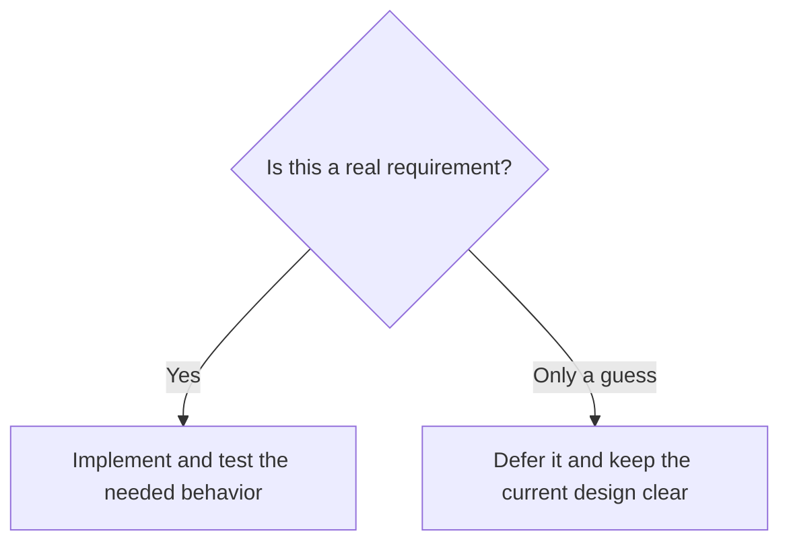

# YAGNI: You Aren't Gonna Need It

## 1. Definition

**Do not build a feature just because someone imagines it might be useful someday.**
Build it when there is a real, justified need. YAGNI stands for You Aren't Gonna Need It.

This is not a prediction that a feature will never be needed. It is a reminder that
building it now has a cost, while the eventual requirement may be different or never arrive.

## 2. The Problem It Solves

A simple report request can turn into weeks of building themes, plug-ins, email
scheduling, and multiple export formats. All that unused code still needs testing,
documentation, and maintenance.

Worse, the guessed framework may make the real future feature harder to add because
it was designed around the wrong assumptions.

## 3. Understand the Idea Step by Step

1. Identify what users actually need now.
2. Build that behavior clearly and correctly.
3. Keep code readable and tested so later changes remain practical.
4. Reconsider the design when a real additional requirement appears.

A **requirement** is something the system must provide or guarantee. A **speculative
feature** is a guessed future capability without sufficient evidence. Known security,
safety, and data-protection requirements are not optional speculation.

### Picture: Decide Whether the Feature Has a Real Need

Read the question first, then follow the appropriate answer.

**Read it as a sentence:** build what is justified; postpone guessed features
without making today's code careless or difficult to change.

Some decisions are expensive to reverse, such as stored data formats and public
interfaces used by customers. Think about them early. YAGNI rejects unnecessary
feature work, not thoughtful planning about known risks.

## 4. Real-World Scenario

An internal stock tool needs a text message showing availability. No one needs
PDF themes or scheduled exports yet. A text-formatting function meets the request.

Later, a signed customer requirement may demand monthly PDF reports. That new
evidence justifies implementing PDF output. Even then, a second formatter may be
enough; a full plug-in system is not automatically necessary.

## 5. Understand the C++ Example

Open [yagni.cpp](../../principles/yagni.cpp).

`stock_report()` is deliberately small. Its job is to format an available count,
not to demonstrate how many classes can be fitted into a reporting problem.

1. Receive the count.
2. Convert it to text.
3. Put `Available: ` before it.
4. Checks verify zero and 12.
5. The displayed result is `Available: 12`.

There is no report registry or inheritance tree because the current job does not
need one. The formatter also does not own stock validity. If negative counts are
forbidden, the inventory or input code must enforce that rule deliberately rather
than assuming formatting has validated it.

## 6. Benefits, Drawbacks, and Alternatives

**Benefits:** less unused code, faster feedback from actual users, fewer unnecessary
failure paths, and less maintenance of guessed designs.

**Drawbacks:** applying the slogan carelessly can ignore costly long-term obligations.
Some planning is essential for safety, compatibility, and durable data.

**Use it by asking:** what evidence supports this feature, and what happens if we
delay the decision? Open/Closed is useful for known kinds of change; it does not
require extension points for every imagined possibility.

## 7. Check Your Understanding

**Question:** Can we skip tests because we do not know which future bugs will occur?

**Answer:** No. Tests check today's promised behavior and help us change it safely.
YAGNI targets unneeded functionality, not the work required to deliver current
functionality correctly.

Optional detail: [principles technical notes](../../principles/README.md).