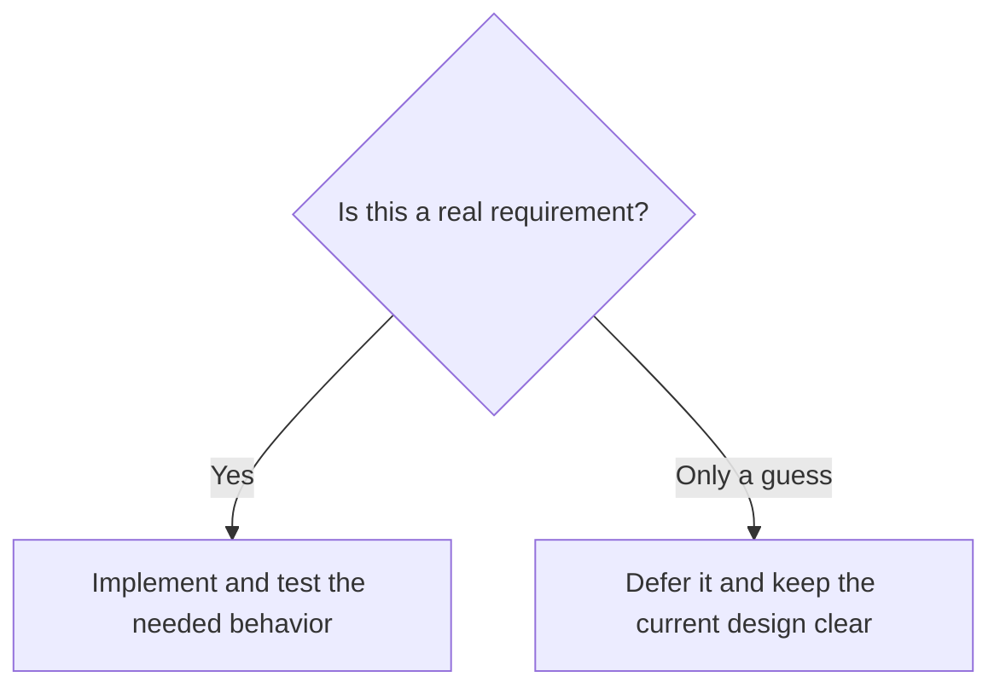
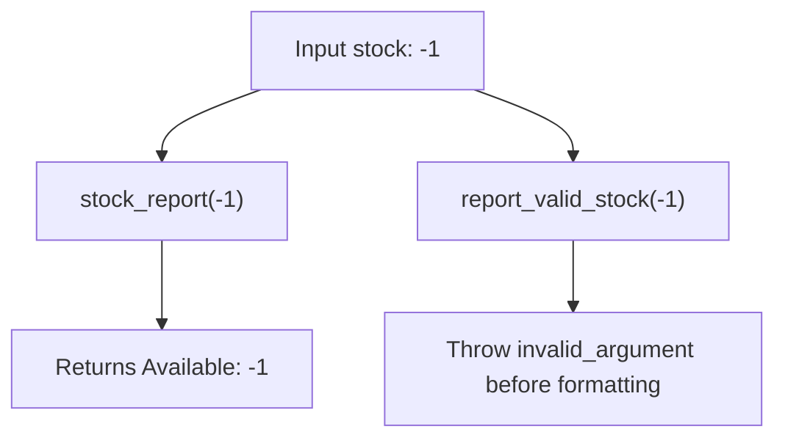
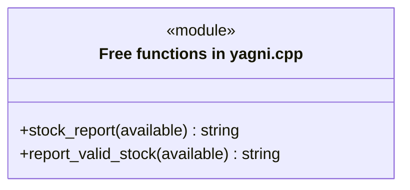
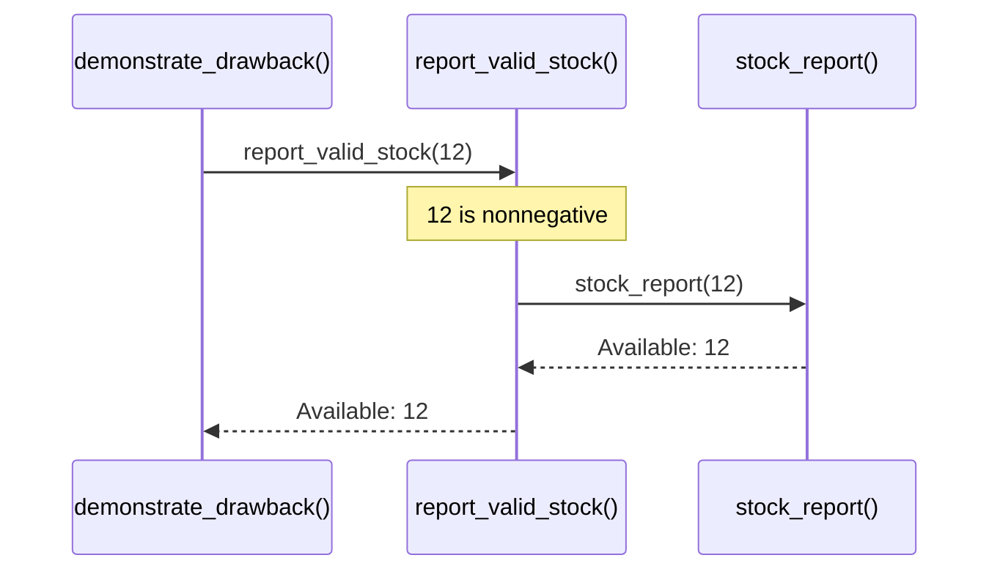

# YAGNI: You Aren't Gonna Need It

## 1. Definition

**YAGNI means postponing features that nobody needs yet.** It stands for You Aren't
Gonna Need It. Build the required behavior well before adding guessed future features.

This is not a prediction that a feature will never be needed. It is a reminder that
building it now has a cost, while the eventual requirement may be different or never arrive.

## 2. The Problem It Solves

The request is to show `Available: 12`. We could write one formatting function.
Instead, imagine first building themes, a plug-in registry, scheduled emails, and
several export formats, just in case.

The user still needs the same short message, but now there is much more code to
test and maintain. The eventual reporting request may not even fit our guesses.
Deliver the needed text output now, and add another format when there is a real
reason to support it.

## 3. Understand the Idea Step by Step

1. Identify what users actually need now.
2. Build that behavior clearly and correctly.
3. Keep code readable and tested so later changes remain practical.
4. Reconsider the design when a real additional requirement appears.

A **requirement** is something the system must do or guarantee now. A guessed
future capability is a **speculative feature**. Rejecting invalid stock counts may
be a requirement; supporting unrequested report themes is speculation. Do not treat
known security or data-protection work as an optional future feature.

### Picture: Decide Whether the Feature Has a Real Need

Read the question first, then follow the appropriate answer.

**Read it as a sentence:** build what is justified; postpone guessed features
without making today's code careless or difficult to change.

Some decisions are expensive to reverse, such as stored data formats and public
interfaces used by customers. Think about them early. YAGNI rejects unnecessary
feature work, not thoughtful planning about known risks.

## 4. Real-World Scenario

An internal stock tool needs a text message showing availability. No one needs
PDF themes or scheduled exports yet. A text-formatting function meets the request.

Later, a signed customer requirement may demand monthly PDF reports. That new
evidence justifies implementing PDF output. Even then, a second formatter may be
enough; a full plug-in system is not automatically necessary.

## 5. Understand the C++ Example

Open [yagni.cpp](../../principles/yagni.cpp).

`stock_report()` is deliberately small. Its job is to format an available count,
not to demonstrate how many classes can be fitted into a reporting problem.

1. Receive the count.
2. Convert it to text.
3. Put `Available: ` before it.
4. Checks verify zero and 12.
5. The displayed result is `Available: 12`.

The formatter needs no report registry or class hierarchy. It only makes text from
a count. It does not check whether the count is valid, so the drawback example adds
a small checked entry point when nonnegative stock is required.

### C++ Flow Diagram

Follow the two entry points used in `demonstrate_drawback()`. Arrows are calls or
results, not instructions to add a larger framework.

Known validation is part of the present requirement. YAGNI rejects speculative
features, not a small check already needed to reject invalid input.

### C++ Class Diagram

This example has no user-defined classes. The `module` box groups its two actual
free functions; it is a structure view rather than an inheritance hierarchy.

`stock_report()` formats a number. `report_valid_stock()` adds a known boundary
rule and reuses the formatter. No plugin or database class exists in the sample.

### C++ Sequence Diagram

Time runs downward. Solid arrows call functions; dashed arrows return text.
This is the valid-input comparison in the drawback function.

For negative input, the formatter call is skipped. The original `main()` calls
the formatter directly for the known-valid values 0 and 12.

## 6. Benefits, Drawbacks, and Alternatives

**Benefits:** users get the required report sooner, and there are no unused plug-ins
or export modes to maintain. Later choices can follow real requests instead of guesses.

**Drawbacks:** misusing YAGNI can leave today's job incomplete. The formatter happily
prints `Available: -1`; the checked function rejects it. That validation is not an
unnecessary future feature when negative stock is forbidden. Stored data formats
and public interfaces also need thought early because changing them later can be costly.

**Use it by asking:** what evidence supports this feature, and what happens if we
delay the decision? Open/Closed is useful for known kinds of change; it does not
require extension points for every imagined possibility.

## 7. Check Your Understanding

**Question:** Can we skip tests because we do not know which future bugs will occur?

**Answer:** No. Tests check today's promised behavior and help us change it safely.
YAGNI targets unneeded functionality, not the work required to deliver current
functionality correctly.

Optional detail: [principles technical notes](../../principles/README.md).