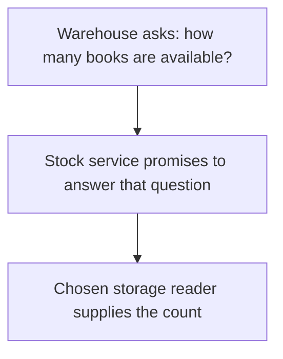
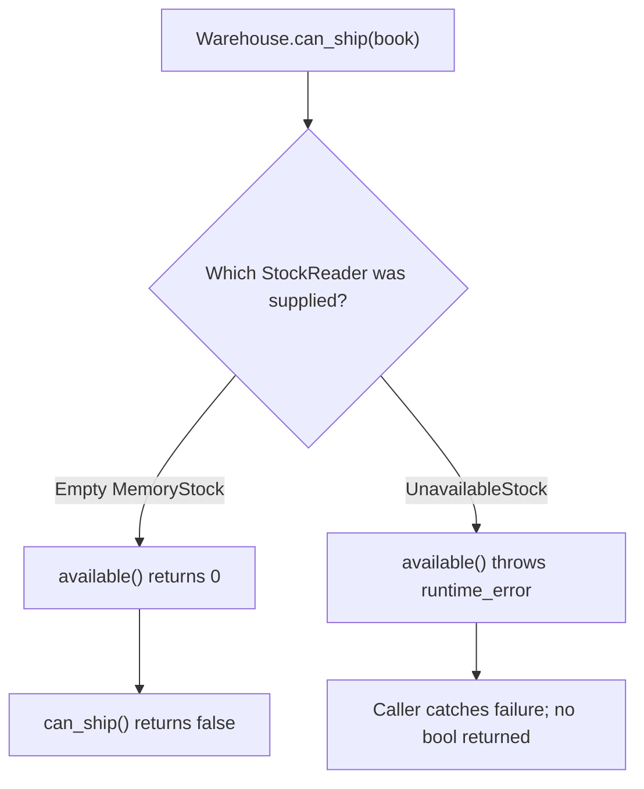
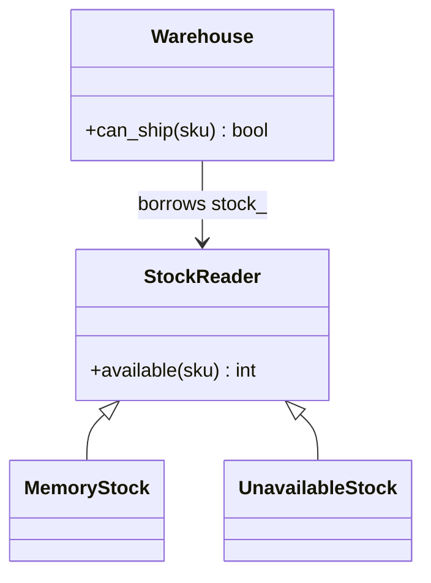
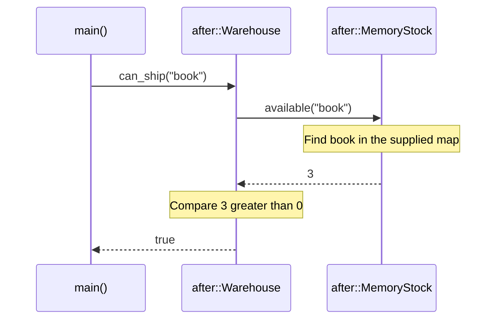

# Dependency Inversion Principle (DIP)

## 1. Definition

**Dependency Inversion Principle means writing business code around the service it
needs, not around a particular tool that provides it.** It is usually shortened to DIP.

For example, a warehouse deciding whether an item is available needs a stock count.
It should not need to know database table names just to make that decision.

## 2. The Problem It Solves

Suppose a warehouse creates a SQL stock reader itself. Its decision is simple:
can this item ship? But testing that decision now requires the reader it chose,
and switching storage means changing the warehouse.

The warehouse only needs to ask, "How many are available?" Describe that operation
in `StockReader`, then let a database reader or in-memory reader provide it. The
warehouse makes the shipping decision without knowing how the count was obtained.

## 3. Understand the Idea Step by Step

1. Write down the operation the business rule needs.
2. Describe it in an interface, including important results and failure behavior.
3. Make the business code use that interface.
4. Make the selected storage tool implement it.
5. Connect the business object and storage object in setup code, often `main()`.

The reader is a **dependency**: something the warehouse needs. The shipping decision
is the **high-level policy**, while SQL storage is a **low-level detail**.
`StockReader` is the **abstraction**, a small description of the service required.

Why "inversion"? Instead of making the warehouse follow a database library's
design, we make the storage code fit the operation the warehouse needs. Both sides
use that shared description.

### Picture: A Question Without Database Details

Read arrows as "asks the next part." The warehouse knows the stock question, not
the storage commands used to answer it.

**Read it as a sentence:** the warehouse asks for a count through an agreed service;
the selected reader does the storage work. This picture shows calls, not C++ inheritance.

Keep the question about stock, not SQL commands. If `StockReader` simply exposes
all the database's details, the warehouse still has to understand that database.
An interface helps only if it separates the details that should stay outside.

## 4. Real-World Scenario

A reservation service needs to reserve one seat if one is available. A database
implementation and a test implementation can both offer that operation.

Both versions must really reserve the seat, not just report an old count. Otherwise
two requests could both claim the last seat. Choosing a useful service operation
matters just as much as putting it behind an interface.

## 5. Understand the C++ Example

Open [dip.cpp](../../solid/dip.cpp).

The old warehouse contains a specific simulated `SqlStock`. The new warehouse uses
the `StockReader` interface. `MemoryStock` supplies counts from memory for the example.

1. Create one reader containing three books and another with no stock.
2. Pass each reader to a warehouse when constructing it.
3. `can_ship()` asks for the quantity and checks whether it is greater than zero.
4. The stocked warehouse answers true for `book`.
5. The empty warehouse and an unknown item answer false.
6. Checks test these decisions without starting a database.

The warehouse borrows its reader, so the reader must remain alive. This example
only checks availability; it does not reserve stock or guarantee a later shipment.

Passing the reader in is **dependency injection**: supplying a helper from outside.
DIP is the separate decision to depend on a suitable interface. Passing a specific
database object can be injection without removing database-specific dependence.

### C++ Flow Diagram

Follow the two supplied-reader cases from `demonstrate_drawback()`. The paths
separate missing stock from an unavailable storage service.

An in-memory fake returning counts does not test outages. The abstraction still
needs documented error behavior and tests for more than its successful path.

### C++ Class Diagram

Triangles mean inheritance; the ordinary arrow means a borrowed reference.
Warehouse, StockReader, and MemoryStock are the `after` versions.

The warehouse depends on the operation it needs, not a SQL class. Setup supplies
a concrete reader and must keep that borrowed object alive.

### C++ Sequence Diagram

Solid arrows call; dashed arrows return. This is the ready warehouse in `main()`.

The warehouse owns the business decision; the reader supplies data. Neither the
interface nor this call sequence provides automatic retries or fallback storage.

## 6. Benefits, Drawbacks, and Alternatives

**Benefits:** test the warehouse with three books or no books without starting a
database. Another reader can supply stock without rewriting the shipping decision.

**Drawbacks:** there is more setup, and a simple test reader may miss real failures.
The drawback example distinguishes no stock from an unavailable reader: one returns
zero, while the other throws. The shared interface still needs clear failure rules;
using it does not make outages disappear.

**Use it for:** important boundaries that perform outside work or are likely to change.
Do not invent an interface for every simple value merely to follow a slogan.

## 7. Check Your Understanding

**Question:** Should a database timeout automatically be reported as zero stock?

**Answer:** No. "Could not get the answer" differs from "the answer is zero."
The interface should preserve that distinction unless the application deliberately
defines and accepts a different rule.

Optional detail: [SOLID technical notes](../../solid/README.md).