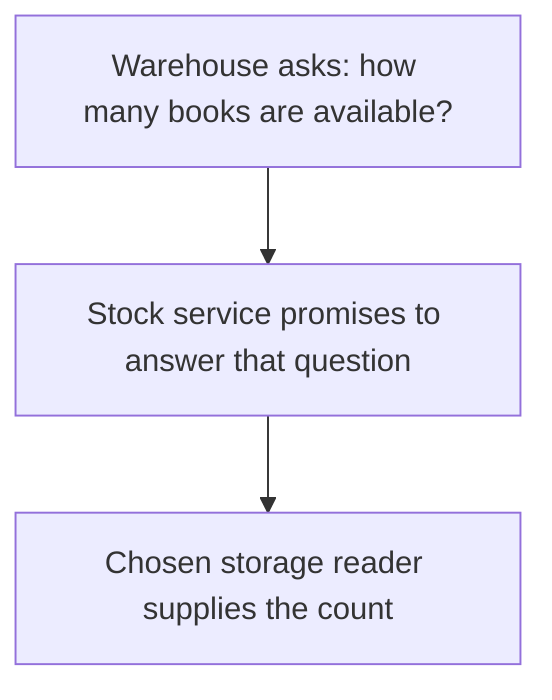

# Dependency Inversion Principle (DIP)

## 1. Definition

**Business rules should ask for the service they need instead of being tied to a
particular database, device, or external library.** This is the Dependency Inversion
Principle, shortened to DIP.

For example, a warehouse deciding whether an item is available needs a stock count.
It should not need to know database table names just to make that decision.

## 2. The Problem It Solves

If warehouse code constructs a specific database driver, even a simple test may
need that database running. Switching storage can also force changes to business decisions.

Define the needed service in terms the warehouse understands, such as "available
quantity for this item." Let storage code provide that service.

## 3. Understand the Idea Step by Step

1. Write down the operation the business rule needs.
2. Describe it in an interface, including important results and failure behavior.
3. Make the business code use that interface.
4. Make the selected storage tool implement it.
5. Connect the business object and storage object in setup code, often `main()`.

| Technical term | Plain meaning here |
| --- | --- |
| Dependency | Something another part needs to do its work |
| High-level policy | The business decision, such as whether stock is available |
| Low-level detail | The particular database or other tool that supplies data |
| Abstraction | The small interface describing the needed service |
| Inversion | The tool fits the business-facing interface instead of the business code following the tool's API |

### Picture: A Question Without Database Details

Read arrows as "asks the next part." The warehouse knows the stock question, not
the storage commands used to answer it.

**Read it as a sentence:** the warehouse asks for a count through an agreed service;
the selected reader does the storage work. This picture shows calls, not C++ inheritance.

The interface should express business needs. If it exposes every command and type
from a specific database library, the business code still needs database knowledge.
Adding virtual functions alone does not remove that dependence.

## 4. Real-World Scenario

A reservation service needs to reserve one seat if one is available. A database
implementation and a test implementation can both offer that operation.

They must promise the same thing. Merely reporting an old seat count is not equivalent
to checking and reserving together. That combined action needs protection so two
requests cannot both claim the same last seat.

## 5. Understand the C++ Example

Open [dip.cpp](../../solid/dip.cpp).

The old warehouse contains a specific simulated `SqlStock`. The new warehouse uses
the `StockReader` interface. `MemoryStock` supplies counts from memory for the example.

1. Create one reader containing three books and another with no stock.
2. Pass each reader to a warehouse when constructing it.
3. `can_ship()` asks for the quantity and checks whether it is greater than zero.
4. The stocked warehouse answers true for `book`.
5. The empty warehouse and an unknown item answer false.
6. Checks test these decisions without starting a database.

The warehouse borrows its reader, so the reader must remain alive. This example
only checks availability; it does not reserve stock or guarantee a later shipment.

Passing the reader in is **dependency injection**: supplying a helper from outside.
DIP is the separate decision to depend on a suitable interface. Passing a specific
database object can be injection without removing database-specific dependence.

## 6. Benefits, Drawbacks, and Alternatives

**Benefits:** test business decisions without external services, replace storage
details more easily, and make required services explicit.

**Drawbacks:** more interfaces and setup. A test reader may misrepresent real storage
behavior unless both are checked against the same promises.

**Use it for:** important boundaries that perform outside work or are likely to change.
Do not invent an interface for every simple value merely to follow a slogan.

## 7. Check Your Understanding

**Question:** Should a database timeout automatically be reported as zero stock?

**Answer:** No. "Could not get the answer" differs from "the answer is zero."
The interface should preserve that distinction unless the application deliberately
defines and accepts a different rule.

Optional detail: [SOLID technical notes](../../solid/README.md).