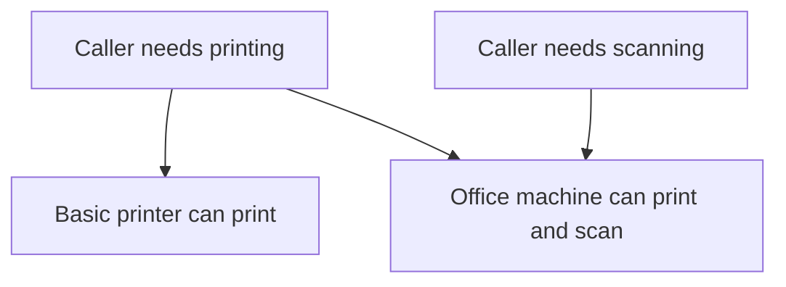

# Interface Segregation Principle (ISP)

## 1. Definition

**Give callers the operations they need without forcing unrelated operations on them.**
This is the Interface Segregation Principle, shortened to ISP.

An **interface** lists operations an object promises to support. **Segregation** here
means separating that list into useful groups. A basic printer should promise
printing, not pretend it can scan just because a larger office machine can.

## 2. The Problem It Solves

A huge machine interface might require printing, scanning, faxing, and stapling.
A simple printer then has to invent meaningless implementations for most of it,
often functions that only throw "unsupported."

Callers that only print are also tied to a list containing unrelated features.
Separate useful capabilities so objects and callers can honestly support what they need.

## 3. Understand the Idea Step by Step

1. Look at what each caller actually needs to do.
2. Group related operations into focused interfaces.
3. Let an object support the interfaces it can genuinely implement.
4. Have each caller ask only for its needed interface.

A **capability** is an ability, such as printing. An **implementation** supplies the
working code for an interface. A device can implement several interfaces without
forcing every caller to use all of them.

### Picture: Ask Only for the Needed Ability

Read arrows as "can send its request to." The printing caller does not require scanning.

**Read it as a sentence:** either machine can serve printing, but only the office
machine serves scanning. The basic printer makes no false scanning promise.

This does not mean one interface per function. Several functions can belong to one
ability. For example, beginning, finishing, and cancelling a multi-step operation
may need to be understood together rather than split arbitrarily.

## 4. Real-World Scenario

A document preview screen needs to read documents. An editor also needs to change
them, while an administrator may delete them. The preview code can use a small
read interface without depending on every administrative operation.

This reduces accidental connections, but it is not a complete security system.
The service still needs permission checks for actual reads, edits, and deletions.

## 5. Understand the C++ Example

Open [isp.cpp](../../solid/isp.cpp).

The old `Machine` interface requires both printing and scanning. The new code
separates `Printer` from `Scanner`.

1. The old basic printer throws an error when asked to scan; the check exposes the problem.
2. The new `BasicPrinter` implements only printing.
3. `OfficeMachine` implements printing and scanning.
4. `print_job()` asks for a `Printer`, so either new device can be supplied.
5. A separate check confirms the office machine can scan.

`OfficeMachine` uses multiple inheritance to promise two sets of operations. Here,
that means supporting two abstract interfaces, not copying a complicated collection
of shared data from two parent implementations.

## 6. Benefits, Drawbacks, and Alternatives

**Benefits:** fewer unsupported operations, simpler callers, smaller test substitutes,
and less impact from changes to unrelated features.

**Drawbacks:** too many tiny interfaces become hard to find and connect. Repeatedly
asking what type an object really is can undo the clarity gained by the split.

**Use it by grouping:** operations around real caller needs. Small, meaningful
interfaces are better than either one enormous interface or dozens of arbitrary fragments.

## 7. Check Your Understanding

**Question:** Does an office machine violate ISP because it supports both printing and scanning?

**Answer:** No. It can honestly provide both. The important point is that printing
code is not forced to require scanning, and a printing-only device is not forced
to claim a scanning ability it lacks.

Optional detail: [SOLID technical notes](../../solid/README.md).