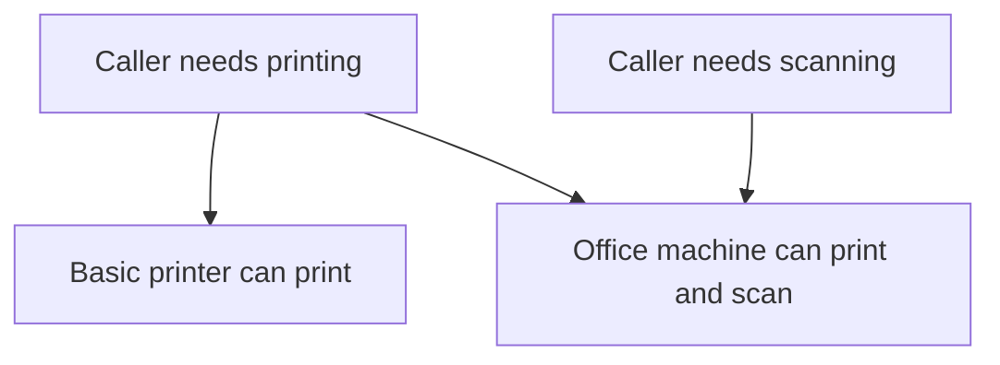
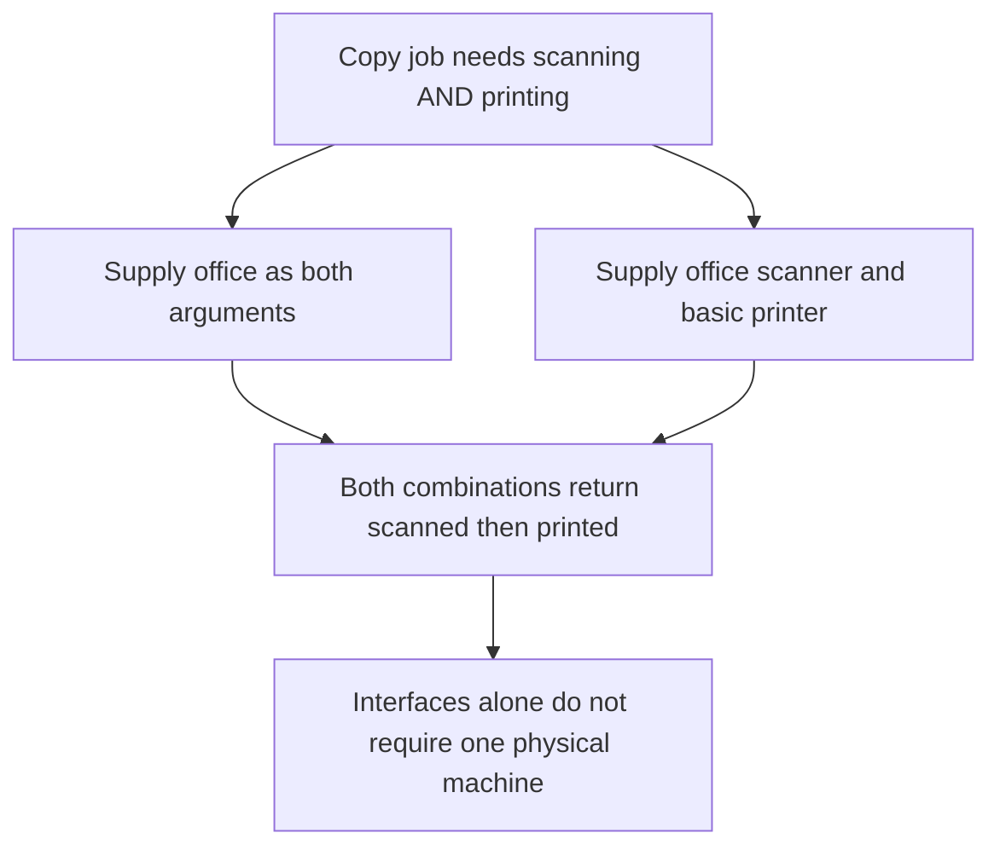
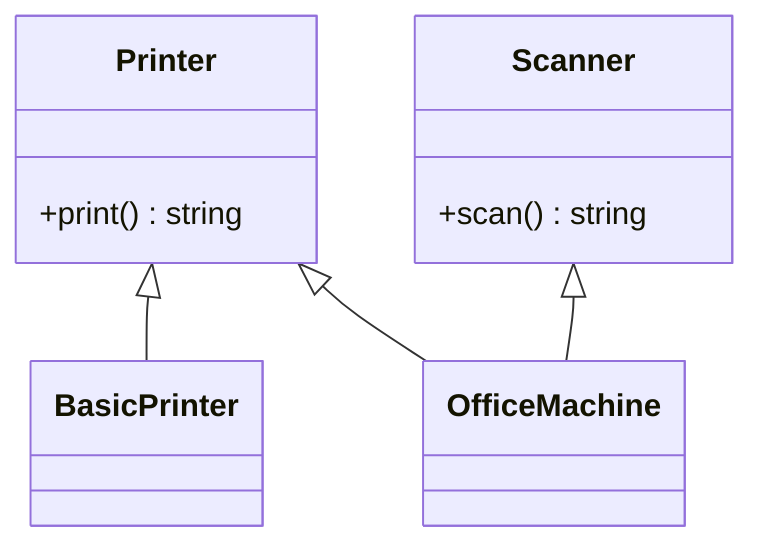
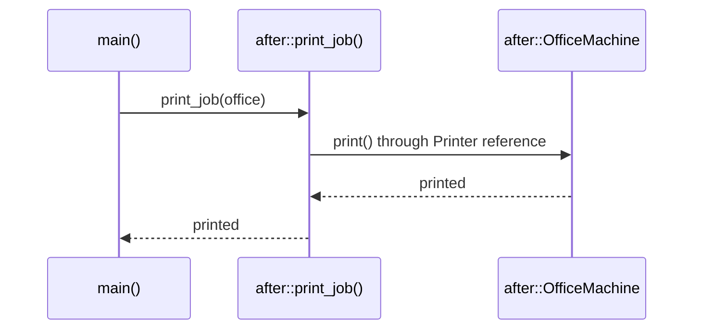

# Interface Segregation Principle (ISP)

## 1. Definition

**Interface Segregation Principle means giving callers the abilities they need,
without requiring unrelated ones.** It is usually shortened to ISP.

An **interface** lists operations an object promises to support. **Segregation** here
means separating that list into useful groups. A basic printer should promise
printing, not pretend it can scan just because a larger office machine can.

## 2. The Problem It Solves

Suppose `Machine` promises both printing and scanning. An office machine can do
both, but a basic printer cannot. To fit the interface, the basic printer ends up
with a `scan()` function that only throws "unsupported."

Even a print-only job now asks for more than it needs. Split the promises into
`Printer` and `Scanner`. The print job asks for a `Printer`, so either device can
serve it. Scanning code asks for a `Scanner`, which only the office machine supplies.

## 3. Understand the Idea Step by Step

1. Look at what each caller actually needs to do.
2. Group related operations into focused interfaces.
3. Let an object support the interfaces it can genuinely implement.
4. Have each caller ask only for its needed interface.

Printing and scanning are separate **capabilities**, meaning abilities. The office
machine can implement both interfaces. The split does not limit what the machine
can do; it limits what each caller must ask for.

### Picture: Ask Only for the Needed Ability

Read arrows as "can send its request to." The printing caller does not require scanning.

**Read it as a sentence:** either machine can serve printing, but only the office
machine serves scanning. The basic printer makes no false scanning promise.

Do not split just to make interfaces tiny. Starting, finishing, and cancelling a
print job may belong together because printing callers need them together.

## 4. Real-World Scenario

A document preview screen needs to read documents. An editor also needs to change
them, while an administrator may delete them. The preview code can use a small
read interface without depending on every administrative operation.

The preview cannot accidentally request deletion through its read-only interface.
The service still checks permissions; a smaller interface is not a replacement
for access control.

## 5. Understand the C++ Example

Open [isp.cpp](../../solid/isp.cpp).

The old `Machine` interface requires both printing and scanning. The new code
separates `Printer` from `Scanner`.

1. The old basic printer throws an error when asked to scan; the check exposes the problem.
2. The new `BasicPrinter` implements only printing.
3. `OfficeMachine` implements printing and scanning.
4. `print_job()` asks for a `Printer`, so either new device can be supplied.
5. A separate check confirms the office machine can scan.

`OfficeMachine` uses multiple inheritance to promise two sets of operations. Here,
that means supporting two abstract interfaces, not copying a complicated collection
of shared data from two parent implementations.

### C++ Flow Diagram

These arrows show dependency choices in `copy_document()`, not evaluation order.

Small interfaces remove unsupported operations, but setup must connect all the
capabilities a larger job needs. A same-device requirement would need another rule.

### C++ Class Diagram

Triangles point to supported interfaces. All types shown are from `after`.
Two arrows from `OfficeMachine` mean it implements both capabilities.

`BasicPrinter` has no scanner interface. The corrected print-only caller therefore
cannot accidentally request scanning through its printer parameter.

### C++ Sequence Diagram

Read downward; solid arrows call, dashed arrows return. This traces
`after::print_job(office)` from `main()`, not the two-operation copy expression.

The caller depends only on printing even though this particular object can also
scan. The same function works with `BasicPrinter` without a special-case branch.

## 6. Benefits, Drawbacks, and Alternatives

**Benefits:** the basic printer no longer has a fake scanning operation. Printing
code works with either device and can be tested with a helper that only prints.

**Drawbacks:** larger jobs still need their abilities connected. The copy example
accepts separate scanner and printer arguments; those may refer to different
machines. If copying must use one physical device, that needs another rule. Too
many tiny interfaces can also make a straightforward job harder to assemble.

**Use it by grouping:** operations around real caller needs. Small, meaningful
interfaces are better than either one enormous interface or dozens of arbitrary fragments.

## 7. Check Your Understanding

**Question:** Does an office machine violate ISP because it supports both printing and scanning?

**Answer:** No. It can honestly provide both. The important point is that printing
code is not forced to require scanning, and a printing-only device is not forced
to claim a scanning ability it lacks.

Optional detail: [SOLID technical notes](../../solid/README.md).