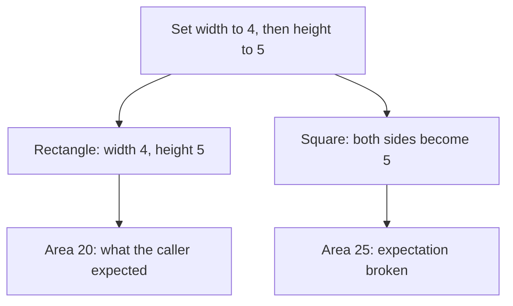
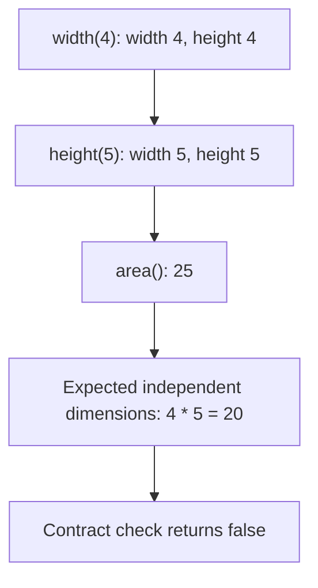
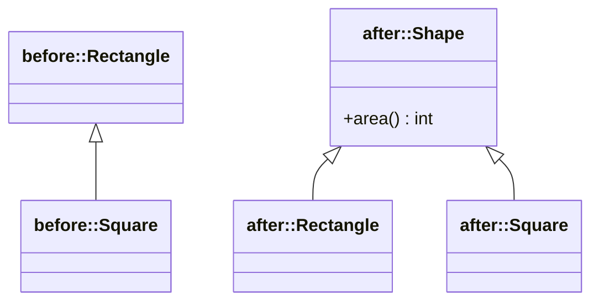
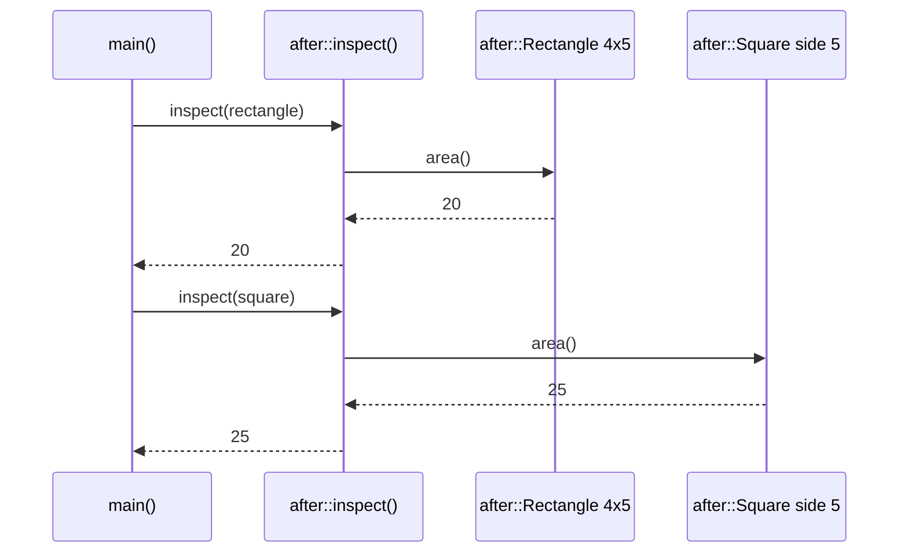

# Liskov Substitution Principle (LSP)

## 1. Definition

**Liskov Substitution Principle means that a replacement must behave as the caller
was promised.** It is usually shortened to LSP.

In C++, a **derived class** extends another class, called the **base class**. Code
using the base type should still work correctly when given a derived object.
Being accepted by the compiler does not prove that the behavior is correct.

## 2. The Problem It Solves

Suppose code sets a rectangle's width to 4, then its height to 5. It expects an area
of 20 because changing height is not supposed to change width.

Now pass it a square that inherits the rectangle's operations. To remain square,
it changes both sides whenever either is set. The same calls leave both sides at 5,
giving an area of 25. The code compiles, but the caller's expectation is broken.

The question is not whether a square is a rectangle in mathematics. It is whether
this square can keep this software rectangle's promise about changing dimensions.

## 3. Understand the Idea Step by Step

1. State what callers are allowed to expect from the base type.
2. Check whether the proposed replacement accepts those inputs and keeps those results.
3. Check effects on other data and what errors can occur.
4. If the promises differ, change the shared interface or stop using that inheritance relationship.

These promises are called a **contract**. It covers three useful questions:

- What may the caller pass in? These are **preconditions**; a replacement must not
    reject inputs the original promise accepts.
- What must be true afterward? These are **postconditions**; here, setting height
    must leave the earlier width alone.
- What must remain true during normal use? These are **invariants**, such as the
    rules for valid dimensions.

Matching method names is not enough. The behavior must match too.

### Picture: Same Calls, One Broken Promise

Read downward. Both branches receive the same two setter calls.

**Read it as a sentence:** changing the square's height also changes its width,
so it cannot honor this rectangle interface's independent-setter promise.

The revised design can make square and rectangle separate kinds of a read-only
shape. Both can promise an `area()` operation without promising independent setters.
"Read-only" here means callers can ask questions without changing the dimensions.

## 4. Real-World Scenario

A storage interface promises it can save valid documents. A read-only store cannot
keep that promise by rejecting every save as unsupported, unless such rejection
was explicitly allowed by the original contract.

Give reading code a read-only interface. A writable store can support an additional
save operation, but a read-only store should not pretend to support it. The shared
promise should be something callers can genuinely rely on.

## 5. Understand the C++ Example

Open [lsp.cpp](../../solid/lsp.cpp).

The `before` code demonstrates the problem; the `after` code changes the shared type.

1. A caller sets width to 4, then height to 5, and expects area 20.
2. A rectangle returns 20.
3. The old square changes both dimensions and returns 25.
4. The test deliberately detects that broken expectation.
5. In the new design, rectangle and square separately support `Shape::area()`.
6. Both keep that smaller promise without exposing the incompatible setters.

The program passes its checks because it detects the old fault and confirms the
new design. It uses small positive dimensions to focus on replacement behavior;
production geometry needs agreed rules for other inputs too.

### C++ Flow Diagram

Arrows follow the intentionally broken `before::Square` through
`before::rectangle_contract()`. Both setters change both dimensions.

The arithmetic is correct for a square, but the caller's promised behavior is
broken. The corrected common interface drops independently mutable dimensions.

### C++ Class Diagram

Triangles mean inheritance. Namespace labels separate the broken hierarchy from
the corrected one; there is no relationship between the two versions.

The corrected square is a sibling of the rectangle, not its subclass. Both can
promise area, but a caller needing rectangle-specific resizing needs another operation.

### C++ Sequence Diagram

Solid arrows call; dashed arrows return. `inspect()` only uses the shared read-only
promise, so both corrected shapes can satisfy the same caller.

Different results are allowed for different shapes. Substitution requires keeping
the interface's promises, not returning the same number for every object.

## 6. Benefits, Drawbacks, and Alternatives

**Benefits:** code using `Shape::area()` can trust both shapes without special
checks for a square. Tests can check the same shared promise across implementations.

**Drawbacks:** deciding what to promise takes thought. The corrected `Shape` can
answer area questions, but it cannot promise independently changeable width and
height for every shape. Some callers will need a more specific operation. A smaller,
honest interface is useful, but it may offer less than the original design hoped for.

**Use it whenever:** types claim they can replace one another. When they cannot,
using one object as a part inside another is often clearer than inheritance.

## 7. Check Your Understanding

**Question:** Is a square always an invalid replacement for a rectangle?

**Answer:** No. It depends on the operations and promises. A read-only rectangle
view may support squares correctly. Independent changes to width and height are
the promise that fails in this example.

Optional detail: [SOLID technical notes](../../solid/README.md).