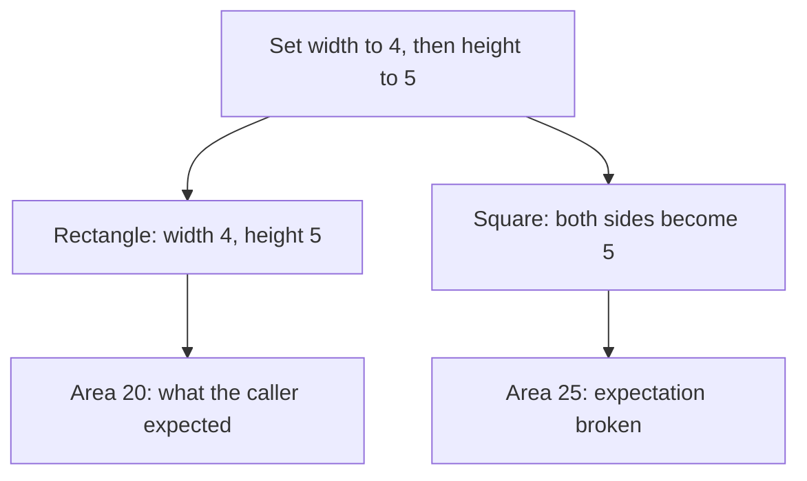

# Liskov Substitution Principle (LSP)

## 1. Definition

**A replacement object must keep the promises of the type it replaces.** That is
the Liskov Substitution Principle, shortened to LSP.

In C++, a **derived class** extends another class, called the **base class**. Code
using the base type should still work correctly when given a derived object.
Being accepted by the compiler does not prove that the behavior is correct.

## 2. The Problem It Solves

Suppose a rectangle lets callers set width and height independently. A square class
inherits those operations but changes both sides whenever either one is set.
Now code expecting independent changes gets a surprising result.

The problem is not whether a square is mathematically a rectangle. The problem is
whether this software square keeps the promises of this changeable rectangle type.

## 3. Understand the Idea Step by Step

1. State what callers are allowed to expect from the base type.
2. Check whether the proposed replacement accepts those inputs and keeps those results.
3. Check effects on other data and what errors can occur.
4. If the promises differ, change the shared interface or stop using that inheritance relationship.

A **contract** is the collection of promises. A **precondition** is a requirement
before a call; replacements must not demand more. A **postcondition** is a promised
result; replacements must not deliver less. An **invariant** is a rule that remains
true during normal use, such as a balance not becoming negative.

### Picture: Same Calls, One Broken Promise

Read downward. Both branches receive the same two setter calls.

**Read it as a sentence:** changing the square's height also changes its width,
so it cannot honor this rectangle interface's independent-setter promise.

The revised design can make square and rectangle separate kinds of a read-only
shape. Both can promise an `area()` operation without promising independent setters.
"Read-only" here means callers can ask questions without changing the dimensions.

## 4. Real-World Scenario

A storage interface promises it can save valid documents. A read-only store cannot
keep that promise by rejecting every save as unsupported, unless such rejection
was explicitly allowed by the original contract.

Give read-only users an interface that promises reading instead. Do not weaken all
promises until every implementation qualifies; callers still need useful guarantees.

## 5. Understand the C++ Example

Open [lsp.cpp](../../solid/lsp.cpp).

The `before` code demonstrates the problem; the `after` code changes the shared type.

1. A caller sets width to 4, then height to 5, and expects area 20.
2. A rectangle returns 20.
3. The old square changes both dimensions and returns 25.
4. The test deliberately detects that broken expectation.
5. In the new design, rectangle and square separately support `Shape::area()`.
6. Both keep that smaller promise without exposing the incompatible setters.

The program passes its checks because it detects the old fault and confirms the
new design. It uses small positive dimensions to focus on replacement behavior;
production geometry needs agreed rules for other inputs too.

## 6. Benefits, Drawbacks, and Alternatives

**Benefits:** callers can trust common types, shared tests become useful, and code
needs fewer special cases for surprising replacements.

**Drawbacks:** complete promises take thought to define and test. The honest shared
interface may offer fewer operations than originally hoped.

**Use it whenever:** types claim they can replace one another. When they cannot,
using one object as a part inside another is often clearer than inheritance.

## 7. Check Your Understanding

**Question:** Is a square always an invalid replacement for a rectangle?

**Answer:** No. It depends on the operations and promises. A read-only rectangle
view may support squares correctly. Independent changes to width and height are
the promise that fails in this example.

Optional detail: [SOLID technical notes](../../solid/README.md).