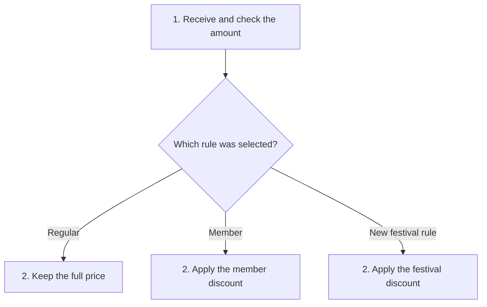

# Open/Closed Principle (OCP)

## 1. Definition

**Make expected new behavior possible without repeatedly rewriting the working
code that uses it.** This is the Open/Closed Principle, shortened to OCP.

"Open" means you can add a supported kind of behavior. "Closed" means the stable
part should not need editing for every such addition. It does not mean existing
code must never be corrected or improved.

## 2. The Problem It Solves

Imagine one pricing function with a growing list of customer types and discounts.
Every new discount requires editing the same function, possibly disturbing existing cases.

If new pricing rules are a real, repeated need, separate each rule from the common
code that checks an amount and asks for a price.

## 3. Understand the Idea Step by Step

1. Identify the kind of change that should be easy, such as adding a discount rule.
2. Describe the operation every rule must provide.
3. Make the common pricing code use that operation.
4. Add new rules by supplying new implementations of the operation.

An **implementation** is the code that does the job. An **extension point** is the
place designed to accept a new version of that job. The common **contract** describes
what inputs are allowed and what the result means.

### Picture: Plug a New Rule into the Same Process

Read downward and follow the selected pricing rule. The common checking step is unchanged.

**Read it as a sentence:** check the amount once, then ask the selected rule to
price it. Adding a rule does not mean adding another branch to the shared price function;
the diagram shows the choices that setup can supply.

Setup must still know how to choose a new rule. A new requirement may also change
the shared contract itself. OCP protects a specific part against a specific kind
of change; no design prevents every future edit.

## 4. Real-World Scenario

A monitoring service validates an alert, asks a routing rule where to send it, and
records delivery attempts. Adding weekend routing should not require copying the
validation and recording steps.

If a new rule needs information missing from the shared input, the input may need
to change. Do not hide that information in global variables just to avoid an honest edit.

## 5. Understand the C++ Example

Open [ocp.cpp](../../solid/ocp.cpp).

The old code chooses regular or member pricing with a switch. The new code accepts
a `PricingRule` object and asks it to calculate the result after common validation.

1. `Regular` leaves 1000 cents unchanged: 1000.
2. `Member` subtracts one tenth: 900.
3. `Festival` subtracts one fifth: 800.
4. The new festival class works without adding a case inside the common price function.
5. Checks confirm the original cases still match the old design and the new case works.

The chosen rule is used during the call; the function does not take ownership of it.
Integer arithmetic discards fractional parts, so rounding must be part of the
agreed behavior. Subtracting a rounded discount can differ from rounding a multiplied price.

## 6. Benefits, Drawbacks, and Alternatives

**Benefits:** additions have focused code; existing formulas remain easier to check;
changes are less likely to disturb unrelated cases.

**Drawbacks:** extra interfaces and setup code. Guessing the wrong future changes
can make a simple program unnecessarily complicated.

**Use it when:** there is evidence that a particular behavior needs new versions.
A small switch is fine for a genuinely fixed set of choices. Do not build a plug-in
framework for features nobody currently needs.

## 7. Check Your Understanding

**Question:** Is editing `main()` to select the festival rule a violation?

**Answer:** No. Something must choose the rule. The goal here is to keep the common
pricing process unchanged, not freeze every line of the whole application.

Optional detail: [SOLID technical notes](../../solid/README.md).