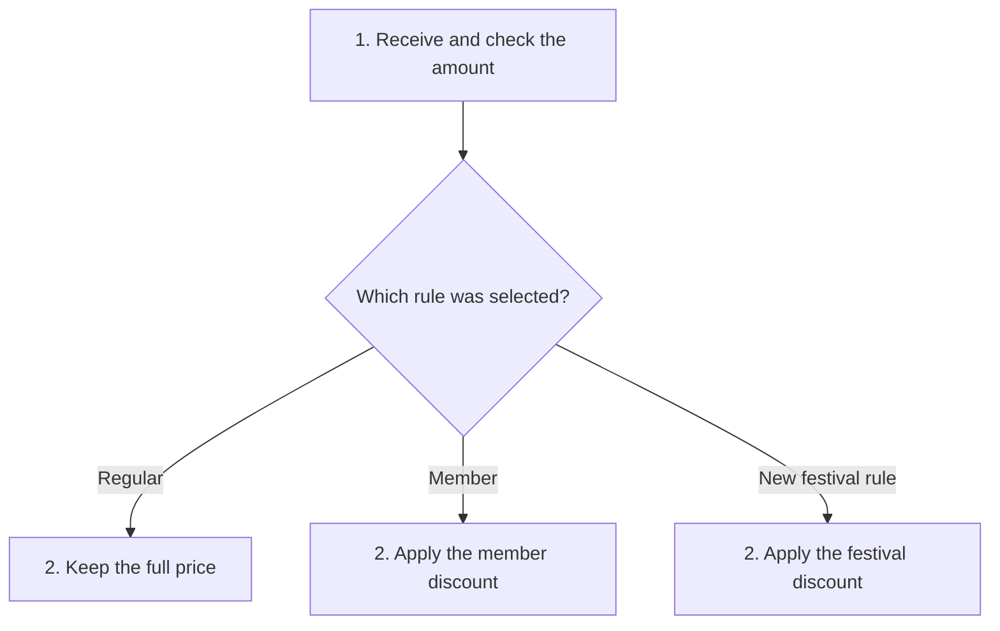
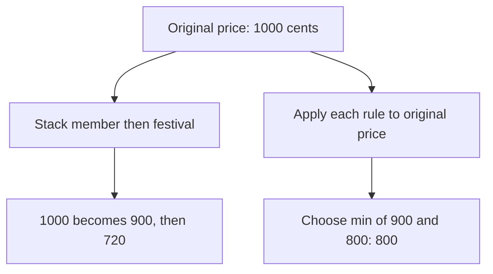
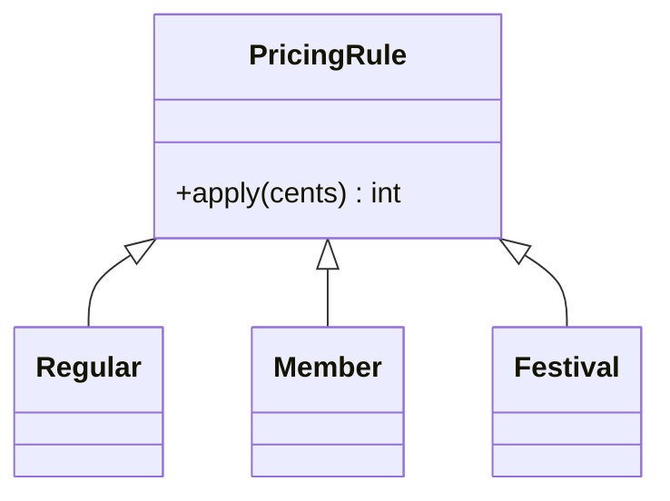
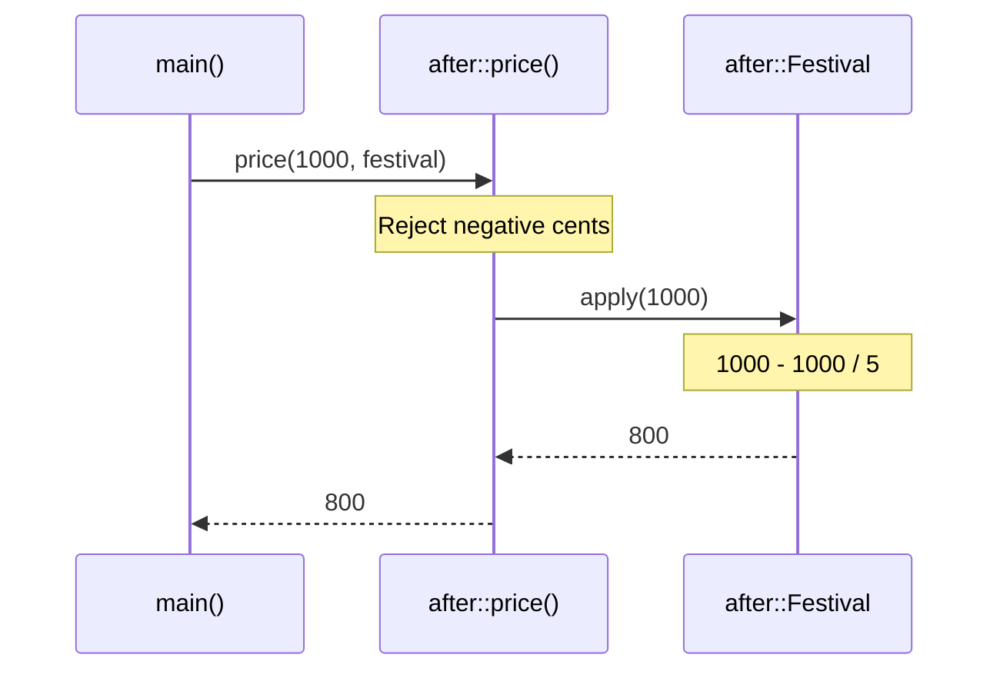

# Open/Closed Principle (OCP)

## 1. Definition

**Open/Closed Principle means making room for new behavior without rewriting the
shared code every time.** It is usually shortened to OCP.

"Open" means you can add a supported kind of behavior. "Closed" means the stable
part should not need editing for every such addition. It does not mean existing
code must never be corrected or improved.

## 2. The Problem It Solves

Suppose a pricing function has branches for regular customers and members. Now the
shop wants a festival discount. We add another branch. Next month, another offer
means opening the same function again, alongside all the working rules.

The amount checks have not changed; only the discount formula has. Put each formula
in a pricing rule and let the shared function ask the selected rule for an answer.
A festival rule can then be added without another branch in that shared function.

## 3. Understand the Idea Step by Step

1. Identify the kind of change that should be easy, such as adding a discount rule.
2. Describe the operation every rule must provide.
3. Make the common pricing code use that operation.
4. Add new rules by supplying new implementations of the operation.

Each rule supplies an `apply()` function. That is its **implementation**, the code
that calculates the price. Accepting a rule gives the shared pricing function an
**extension point**: a place where another formula can fit. The rules must still
agree on inputs and results, including that prices are measured in cents.

### Picture: Plug a New Rule into the Same Process

Read downward and follow the selected pricing rule. The common checking step is unchanged.

**Read it as a sentence:** check the amount once, then ask the selected rule to
price it. Adding a rule does not mean adding another branch to the shared price function;
the diagram shows the choices that setup can supply.

Setup still chooses which rule to use. The part we kept unchanged is the common
pricing function, not the whole application. A different requirement, such as
combining two discounts, may need another design change.

## 4. Real-World Scenario

A monitoring service validates an alert, asks a routing rule where to send it, and
records delivery attempts. Adding weekend routing should not require copying the
validation and recording steps.

The weekend rule gets the same alert information and supplies another routing
decision. If it also needs the day of the week, that information must be provided.
OCP is not a reason to avoid a necessary change to the inputs.

## 5. Understand the C++ Example

Open [ocp.cpp](../../solid/ocp.cpp).

The old code chooses regular or member pricing with a switch. The new code accepts
a `PricingRule` object and asks it to calculate the result after common validation.

1. `Regular` leaves 1000 cents unchanged: 1000.
2. `Member` subtracts one tenth: 900.
3. `Festival` subtracts one fifth: 800.
4. The new festival class works without adding a case inside the common price function.
5. Checks confirm the original cases still match the old design and the new case works.

The chosen rule is used during the call; the function does not take ownership of it.
Integer arithmetic discards fractional parts, so rounding must be part of the
agreed behavior. Subtracting a rounded discount can differ from rounding a multiplied price.

### C++ Flow Diagram

Follow the two ways to apply discounts in `demonstrate_drawback()`. Both are valid
calls, but they implement different business decisions.

The extension point accepts one rule. Adding implementations does not decide
whether discounts should stack; that new requirement needs an explicit policy.

### C++ Class Diagram

Triangles point to the base rule. All classes shown are in namespace `after`.
`price()` is a free function using this interface, not another class.

Adding `Festival` did not require a new branch in `after::price()`. Setup still
has to choose the object to supply, and changed requirements may change the interface.

### C++ Sequence Diagram

Read downward; solid arrows call, dashed arrows return. The middle lane is a
free function, so it has no persistent object state.

Common validation stays in `price()`, while the chosen rule supplies the formula.
The example uses integer cents, so its rounding behavior is part of the contract.

## 6. Benefits, Drawbacks, and Alternatives

**Benefits:** the festival formula has its own place, and existing formulas do not
need editing to add it. All rules reuse the same amount checks.

**Drawbacks:** extra rule classes and setup are only useful when this variation is
needed. They do not answer every new business question: stacking member and festival
discounts gives 720 cents, while choosing the best single discount gives 800. The
drawback example shows why that choice still needs an explicit rule.

**Use it when:** there is evidence that a particular behavior needs new versions.
A small switch is fine for a genuinely fixed set of choices. Do not build a plug-in
framework for features nobody currently needs.

## 7. Check Your Understanding

**Question:** Is editing `main()` to select the festival rule a violation?

**Answer:** No. Something must choose the rule. The goal here is to keep the common
pricing process unchanged, not freeze every line of the whole application.

Optional detail: [SOLID technical notes](../../solid/README.md).