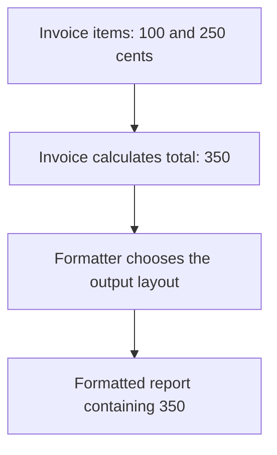
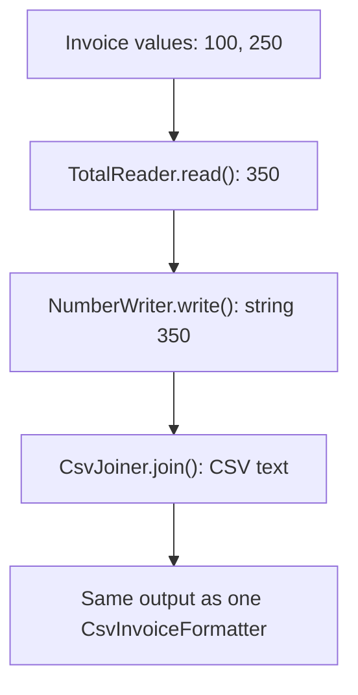
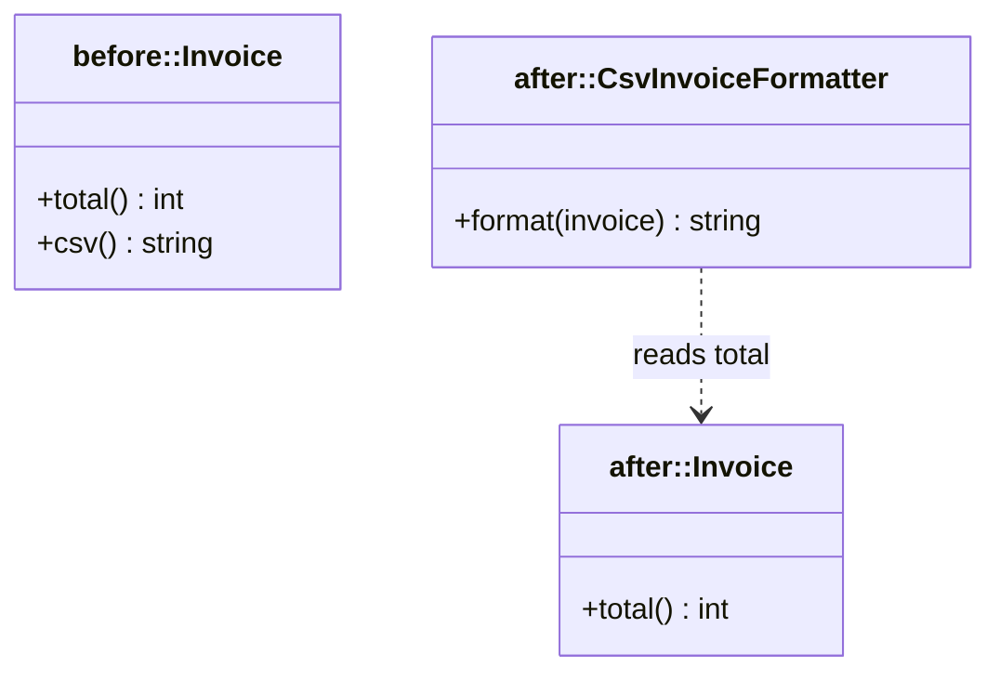
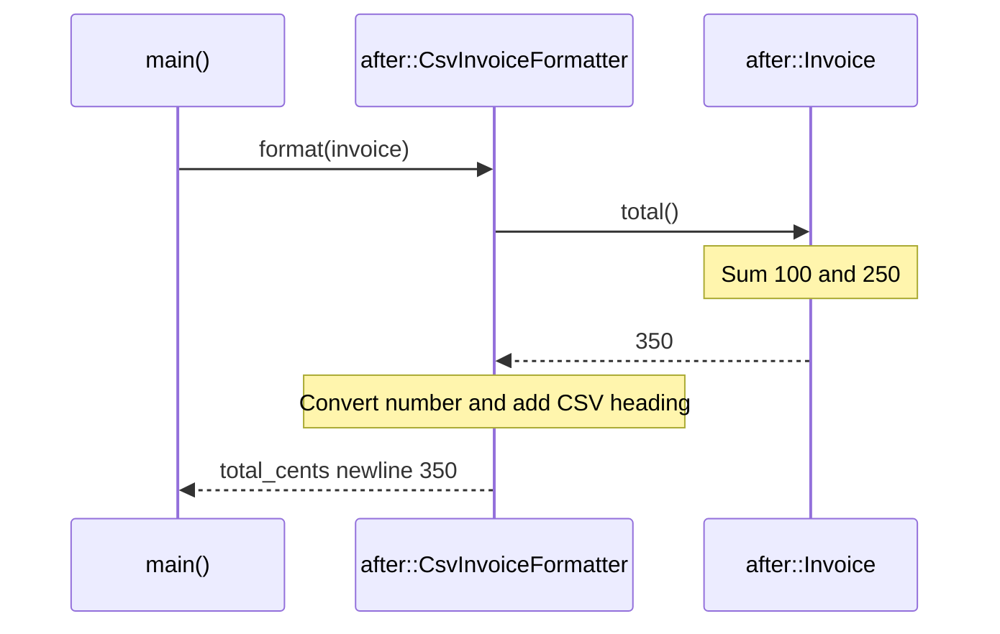

# Single Responsibility Principle (SRP)

## 1. Definition

**Single Responsibility Principle means keeping one closely related job together,
and separating work that changes for different reasons.** It is usually shortened
to SRP.

For example, calculating an invoice total and choosing how to display that total
are different jobs. A new discount rule changes the calculation; a new file format
changes the display. They should not be forced into one class just because both use invoices.

## 2. The Problem It Solves

Suppose `Invoice` both calculates the total and produces a CSV report. Accounting
asks for a new calculation rule. Later, someone asks for a different report heading.
Both changes send us into the same class, even though one concerns money and the
other concerns presentation.

Keep the total calculation in `Invoice` and move the report layout to a formatter.
Now changing the heading does not require editing the arithmetic. We can also test
the total without producing a report at all.

That is the useful meaning of **responsibility** here: a related job with its own
reasons to change, not a rule that each class can have only one function.

## 3. Understand the Idea Step by Step

1. List the kinds of changes a class currently handles.
2. Ask which changes follow the same rules and which come from unrelated needs.
3. Keep closely related work together.
4. Move unrelated work to a separate helper and let the parts cooperate.

Adding an item, removing one, and calculating the total can still belong together.
They all manage the invoice's contents. Formatting the result follows different
rules, so it gets a separate home. The same question works for a whole source file
as well as for a class: what changes should this part be responsible for?

### Picture: Calculate First, Format Separately

Read arrows as "passes its result to." Each box has one clear job.

**Read it as a sentence:** the invoice supplies the number; the formatter decides
how to present it. A layout change belongs in the formatter, not the arithmetic.

The formatter asks for the total; it does not reach inside the invoice and change
its amounts. Separating the jobs should make each part easier to understand, not
scatter one job across many tiny helpers.

## 4. Real-World Scenario

A payroll program calculates wages, stores records, and generates a bank file.
Wage rules may change independently of the database or bank format. Separate helpers
allow a format change without rewriting the pay calculation.

One function can still run payroll from start to finish. It calls the wage calculator,
the record store, and the bank-file writer in order. Separating the jobs does not
mean they can no longer work together.

## 5. Understand the C++ Example

Open [srp.cpp](../../solid/srp.cpp).

The `before` and `after` namespaces are named groups of code showing two designs.
Before, `Invoice` both totals values and formats CSV text. CSV is a simple table-like
text format. After, `Invoice` calculates and `CsvInvoiceFormatter` handles formatting.

1. Add amounts of 100 and 250 cents.
2. The new invoice calculates 350 without deciding an output format.
3. The formatter creates `total_cents\n350`; `\n` represents a line break.
4. A check confirms the result matches the old combined design.
5. Another check confirms an empty invoice totals zero.

The point is separate reasons to change, not merely an extra class. The formatter
could also be a regular function. The small sample does not model complete accounting rules.

### C++ Flow Diagram

Arrows follow the unnecessary three-helper formatting path in the drawback function.

The cost is extra pieces to connect for one formatting job. SRP separates reasons
to change; it does not require a separate class for every expression.

### C++ Class Diagram

Boxes use namespace labels because the file contains two different `Invoice`
classes. The dotted arrow means the formatter temporarily reads an invoice.

There is no inheritance between the two versions. The corrected invoice owns its
amounts; the formatter receives a reference for the duration of a call.

### C++ Sequence Diagram

Solid arrows call; dashed arrows return. This traces the corrected formatter.

Calculation stays with invoice data. Changing the output heading belongs to the
formatter and does not require changing the sum calculation.

## 6. Benefits, Drawbacks, and Alternatives

**Benefits:** a report-layout change stays in the formatter. The invoice total can
be tested on its own, and another formatter can use the same calculation.

**Drawbacks:** splitting too far adds work without adding clarity. The drawback
example uses a reader, a number writer, and a joiner to do what one formatter
already does. Following three helpers makes a small formatting job harder to read.

**Use it by asking:** "Why would this part change?" Do not split a small, focused
class merely because it contains several functions.

## 7. Check Your Understanding

**Question:** Does an invoice violate SRP because it has `add_item()`, `remove_item()`,
and `total()`?

**Answer:** Not necessarily. All three can serve the same job of managing invoice
items and their total. Formatting emails or opening database connections may have
separate reasons to change and deserve separate homes.

Optional detail: [SOLID technical notes](../../solid/README.md).