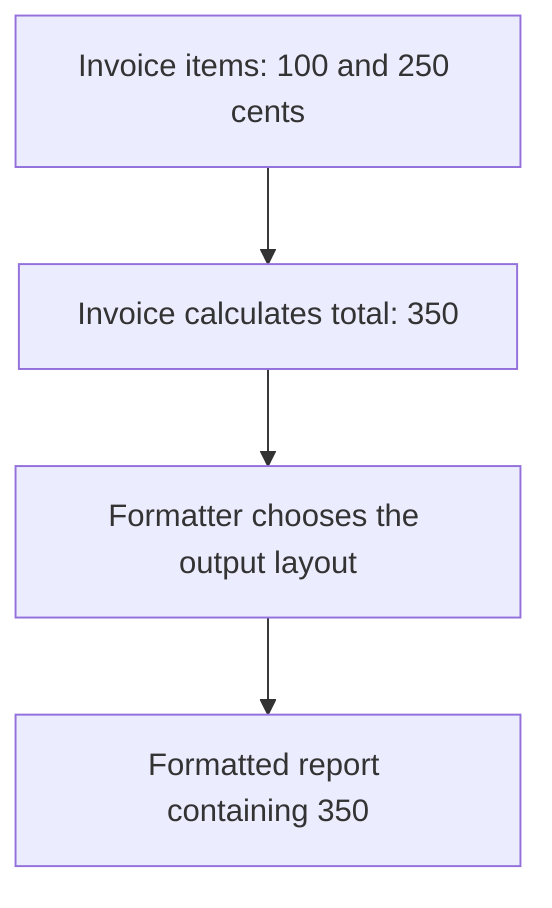

# Single Responsibility Principle (SRP)

## 1. Definition

**Keep work that changes for different reasons in separate places.** That is the
Single Responsibility Principle, shortened to SRP.

For example, calculating an invoice total and choosing how to display that total
are different jobs. A new discount rule changes the calculation; a new file format
changes the display. They should not be forced into one class just because both use invoices.

## 2. The Problem It Solves

A class that calculates, saves, prints, and emails invoices is affected by many
unrelated requests. Changing an email layout might accidentally disturb accounting
code. Testing arithmetic might require setting up a mail service or database.

Separate the responsibilities so that a change has a smaller, clearer place to go.
A **responsibility** means a related set of work, not necessarily one function.

## 3. Understand the Idea Step by Step

1. List the kinds of changes a class currently handles.
2. Ask which changes follow the same rules and which come from unrelated needs.
3. Keep closely related work together.
4. Move unrelated work to a separate helper and let the parts cooperate.

A **module** can mean a class, source file, or larger unit of code. SRP can be used
at these different sizes. It does not set a maximum number of methods. Adding,
removing, and totaling invoice items may all belong to the same invoice responsibility.

### Picture: Calculate First, Format Separately

Read arrows as "passes its result to." Each box has one clear job.

**Read it as a sentence:** the invoice supplies the number; the formatter decides
how to present it. A layout change belongs in the formatter, not the arithmetic.

Do not split related rules so aggressively that every function must edit someone
else's public data. The object responsible for keeping its data valid should still
control those changes. The aim is understandable responsibilities, not maximum file count.

## 4. Real-World Scenario

A payroll program calculates wages, stores records, and generates a bank file.
Wage rules may change independently of the database or bank format. Separate helpers
allow a format change without rewriting the pay calculation.

One coordinator can still run the entire payroll process. Splitting the code does
not remove the need to handle incomplete storage, errors, or required audit records.

## 5. Understand the C++ Example

Open [srp.cpp](../../solid/srp.cpp).

The `before` and `after` namespaces are named groups of code showing two designs.
Before, `Invoice` both totals values and formats CSV text. CSV is a simple table-like
text format. After, `Invoice` calculates and `CsvInvoiceFormatter` handles formatting.

1. Add amounts of 100 and 250 cents.
2. The new invoice calculates 350 without deciding an output format.
3. The formatter creates `total_cents\n350`; `\n` represents a line break.
4. A check confirms the result matches the old combined design.
5. Another check confirms an empty invoice totals zero.

The point is separate reasons to change, not merely an extra class. The formatter
could also be a regular function. The small sample does not model complete accounting rules.

## 6. Benefits, Drawbacks, and Alternatives

**Benefits:** changes have clearer homes; small parts are easier to test; unrelated
work is less likely to be accidentally affected by a change.

**Drawbacks:** splitting too far makes code harder to navigate and connect. Work
that really belongs together can become scattered.

**Use it by asking:** "Why would this part change?" Do not split a small, focused
class merely because it contains several functions.

## 7. Check Your Understanding

**Question:** Does an invoice violate SRP because it has `add_item()`, `remove_item()`,
and `total()`?

**Answer:** Not necessarily. All three can serve the same job of managing invoice
items and their total. Formatting emails or opening database connections may have
separate reasons to change and deserve separate homes.

Optional detail: [SOLID technical notes](../../solid/README.md).