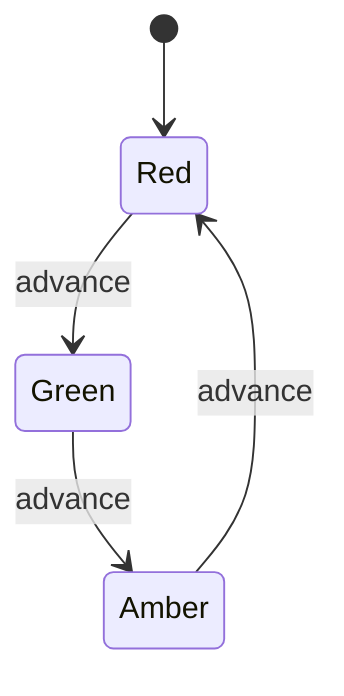

# Behavioral Patterns: Make Collaboration and Control Flow Explicit

## Concept-First Lessons

These standalone lessons teach each pattern independently of its code, then connect
the definition and real-world scenario to an explicit C++ execution walkthrough.

Each diagram link opens the **flow diagram**, followed immediately by the **class**
and **sequence diagrams**, with explanations tied to that C++ program.

| Topic | Standalone lesson | C++ diagrams |
| --- | --- | --- |
| Chain of Responsibility | [Lesson](../../lessons/patterns/behavioral/chain_of_responsibility.md) | [Flow, class, sequence](../../lessons/patterns/behavioral/chain_of_responsibility.md#c-flow-diagram) |
| Command | [Lesson](../../lessons/patterns/behavioral/command.md) | [Flow, class, sequence](../../lessons/patterns/behavioral/command.md#c-flow-diagram) |
| Interpreter | [Lesson](../../lessons/patterns/behavioral/interpreter.md) | [Flow, class, sequence](../../lessons/patterns/behavioral/interpreter.md#c-flow-diagram) |
| Iterator | [Lesson](../../lessons/patterns/behavioral/iterator.md) | [Flow, class, sequence](../../lessons/patterns/behavioral/iterator.md#c-flow-diagram) |
| Mediator | [Lesson](../../lessons/patterns/behavioral/mediator.md) | [Flow, class, sequence](../../lessons/patterns/behavioral/mediator.md#c-flow-diagram) |
| Memento | [Lesson](../../lessons/patterns/behavioral/memento.md) | [Flow, class, sequence](../../lessons/patterns/behavioral/memento.md#c-flow-diagram) |
| Observer | [Lesson](../../lessons/patterns/behavioral/observer.md) | [Flow, class, sequence](../../lessons/patterns/behavioral/observer.md#c-flow-diagram) |
| State | [Lesson](../../lessons/patterns/behavioral/state.md) | [Flow, class, sequence](../../lessons/patterns/behavioral/state.md#c-flow-diagram) |
| Strategy | [Lesson](../../lessons/patterns/behavioral/strategy.md) | [Flow, class, sequence](../../lessons/patterns/behavioral/strategy.md#c-flow-diagram) |
| Template Method | [Lesson](../../lessons/patterns/behavioral/template_method.md) | [Flow, class, sequence](../../lessons/patterns/behavioral/template_method.md#c-flow-diagram) |
| Visitor | [Lesson](../../lessons/patterns/behavioral/visitor.md) | [Flow, class, sequence](../../lessons/patterns/behavioral/visitor.md#c-flow-diagram) |

See the [complete lesson index](../../lessons/README.md). Additional implementation
details, comparisons, and diagrams remain below.

## Technical Notes and Comparisons

These eleven GoF patterns organize algorithms, notifications, requests, state, and
traversal. Their hardest bugs often involve ordering and lifetime rather than class
syntax. Read each trace as a description of who calls whom and what can change.

| Pattern | What varies or needs coordination? | Example |
| --- | --- | --- |
| Chain of Responsibility | Which handler processes or rejects a request | Request filters |
| Command | A request that must be stored, executed, or undone | Text edits |
| Interpreter | Meaning of a small expression language | Boolean access rule |
| Iterator | Traversal without exposing storage | Playlist |
| Mediator | Rules governing colleague interactions | Sign-in form |
| Memento | Restorable private state | Editor checkpoint |
| Observer | Subscribers reacting to a publisher | Sensor readings |
| State | Behavior determined by current state | Traffic signal |
| Strategy | Interchangeable algorithms | Shipping policy |
| Template Method | Selected steps of a fixed algorithm | Report generation |
| Visitor | New operations over stable element types | Shape analysis |

## 1. Chain of Responsibility

**Source:** [chain_of_responsibility.cpp](chain_of_responsibility.cpp).
**Target:** `chain_of_responsibility`.

### Problem and Roles

A request needs authentication and quota validation. A client should not know the
details of every check, and checks may need reordering or replacement. A handler
either deals with the request or delegates to its successor.

`Handler` owns an optional next handler. `Authentication` and `Quota` override
`handle()`, forwarding only when their own condition passes. The base implementation
delegates or returns `accepted` at the end. This sample uses the filtering form of
the pattern, where every successful filter forwards the request.

### Worked Trace

```text
{authenticated=false, within_quota=false} -> Authentication -> unauthorized
{authenticated=true,  within_quota=false} -> Authentication -> Quota -> quota exceeded
{authenticated=true,  within_quota=true } -> Authentication -> Quota -> accepted
```

All three results are checked; the last is printed. The stack-allocated first
handler owns the remaining chain through `unique_ptr`, and null links are rejected
by `then()`.

### Benefits

- Separates request senders from individual processing steps.
- Makes ordering and composition configurable.
- Each handler has a focused purpose and can be tested independently.
- Useful for middleware, validation pipelines, and escalation workflows.

### Drawbacks and Limits

- A request may go unhandled unless end-of-chain behavior is defined.
- Ordering can affect both correctness and information disclosure.
- Long recursive chains add stack depth and tracing difficulty.
- A simple fixed sequence of two function calls may be easier to understand.

### Variants and Failure Cases

In another common form, the first capable handler consumes the request and does
not forward it, such as escalating a support ticket. Do not mix “every filter must
approve” and “first handler wins” without a clear protocol.

The sample's end accepts by default. Security-sensitive production pipelines may
need a deny-by-default terminal handler and validation that all required filters
exist. A quota check before authentication can reveal account information or use
resources unnecessarily. The booleans are simulated decisions, not authentication.

`then()` replaces an existing successor. A reference to the returned successor is
borrowed and becomes invalid if that link is replaced or its owner is destroyed.
Async chains require owned request state rather than references to expired stack
arguments. Exception propagation and cancellation must be defined separately.

**Exercise with answer:** Add input validation. Where should it go? Before work
that assumes valid input, but after any minimal checks needed to prevent abuse.
Write tests for the required order; the pattern itself does not choose it.

## 2. Command

**Source:** [command.cpp](command.cpp). **Target:** `command`.

### Problem and Roles

An editor needs to execute an operation now, record it, and undo it later. A plain
call disappears after execution. Command turns an action into an object containing
the information needed to invoke a receiver.

`Document` is the receiver. `Append` is a concrete command storing text, a borrowed
document reference, and the document's prior size. `History` is the invoker and owns
commands in done and undone stacks. `Command` defines execution and undo operations.

### Worked Trace

1. Run `Append("hello")`: document becomes `hello`.
2. Run `Append(" world")`: document becomes `hello world`.
3. Undo the last command: truncate to the saved size, giving `hello`.
4. Redo it: append again, giving `hello world`.
5. Undo, then append `" C++"`: the new branch becomes `hello C++`.
6. Redo is unavailable because the abandoned branch was cleared.

The program checks each step plus empty-history operations, then prints `hello C++`.
`Document` is declared before `History` and outlives commands that borrow it.

### Benefits

- Decouples the UI or scheduler from the action's receiver.
- Supports history, queues, macros, and deferred execution.
- Makes request parameters explicit values that can be inspected or recorded.
- Different invokers can execute the same command abstraction.

### Drawbacks

- Adds objects and retained history state for otherwise simple calls.
- Undo is not always possible, cheap, or exact.
- Storing commands with raw references limits their lifetime and portability.
- Serializing arbitrary C++ objects or lambdas is not automatically supported.

### Contracts, Exception Safety, and Variants

`Append::undo()` assumes exclusive, last-in-first-out edits through this history.
External mutation of the document can make truncation discard unrelated work or
even grow a shorter document. This is a stated sample precondition, not a general
collaborative-editing undo system.

The invoker reserves stack capacity before executing or undoing. That prevents a
later vector allocation from losing the record after the document has changed.
The concrete append operation relies on `std::string`'s exception guarantees;
arbitrary commands still need their own guarantees. No generic invoker can roll
back every unknown partially failed operation merely by storing a pointer.

A macro command groups operations. A command can capture a Memento instead of an
inverse operation. A queued command must keep its receiver alive or use a checked
weak handle. Retrying a “charge card” command needs idempotency, and undo may mean
issuing a compensating refund rather than reversing time.

**Exercise with answer:** Can a command safely outlive `Document` here? No. Its
reference would dangle. Keep the receiver alive longer, change the ownership model,
or store an identifier resolved by an application service at execution time.

## 3. Interpreter

**Source:** [interpreter.cpp](interpreter.cpp). **Target:** `interpreter`.

### Problem and Grammar

A small access-rule language combines named boolean variables with AND. Interpreter
represents grammar elements as objects and evaluates the resulting expression tree
against a context. The example grammar is conceptually:

```text
expression := variable | (expression AND expression)
context    := mapping from variable names to boolean values
```

`Variable` is a terminal expression. `And` is a nonterminal owning two expressions.
`Context` supplies runtime meanings for variable names. `main()` constructs the
tree directly; there is deliberately no lexer, parser, or external scripting engine.

### Worked Evaluation

For `signed_in AND paid`, the left variable is read first. If false, AND returns
false without evaluating the right expression. If true, the right variable decides
the result. Tests cover true/true, true/false, false with missing `paid`, and true
with missing `paid`. The last throws `out_of_range`; the short-circuited case does not.

Output is `signed_in AND paid verified`. Both child pointers must be non-null, and
the expression tree owns its children. Context is borrowed only during evaluation.

### Benefits

- Maps a small, stable grammar to a clear recursive object model.
- Expressions can be composed, reused with different contexts, and tested in isolation.
- Adding an operator is localized when its semantics fit the existing interface.
- Suitable for small rules, filters, and teaching expression-tree evaluation.

### Drawbacks and Limits

- Large grammars produce many classes and expensive object trees.
- Parsing, precedence, syntax errors, and source locations still need implementation.
- Recursive evaluation can overflow the stack for adversarially deep expressions.
- A mature parser or language engine is usually better for a real language.

### Semantic Choices

Missing variables could be errors, false values, or unknown values in a three-valued
logic. The sample chooses errors when evaluated. That choice interacts with
short-circuiting and must be documented. Evaluation cost is proportional to visited
nodes plus map lookups, not necessarily every node in the tree.

An enum/variant-based AST can replace virtual expression objects. Visitor can add
operations such as pretty-printing and analysis to the same tree. An interpreter
must not evaluate arbitrary host-language code merely to support a small DSL.

**Exercise with answer:** Add OR. Evaluate the left expression first and return
true immediately when it is true; otherwise evaluate the right. Add a test proving
that `true OR missing_variable` does not read the missing variable.

## 4. Iterator

**Source:** [iterator.cpp](iterator.cpp). **Target:** `iterator`.

### Problem and C++ Interpretation

A playlist stores track titles, but clients should traverse it without accessing
its vector directly. Iterator separates traversal position from the collection's
representation. C++ expresses this through iterator operations and categories,
rather than requiring a virtual `Iterator` base class.

`Playlist::Iterator` wraps a vector const iterator and supports dereference,
member access, increment, and equality. Its traits identify a forward iterator.
`begin()` and `end()` define a half-open range: the beginning is included and the
end is a sentinel position that must not be dereferenced.

### Worked Trace and Tests

An empty playlist has `begin() == end()`. After adding `Intro` and `Finale`, the
program copies and post-increments the first iterator: the saved copy still points
at `Intro`, while the advanced copy points at `Finale`. `std::distance` returns 2,
`std::find` locates `Finale`, and range-for prints the two tracks on separate lines.

These checks demonstrate multi-pass traversal and interoperability with standard
algorithms. The wrapper intentionally exposes only const references, not mutation.

### Benefits

- Algorithms need not know the container's storage details.
- Independent iterators can track separate positions.
- Standard iterator protocols unlock a large algorithm library.
- Traversal can later filter or project values through ranges and views.

### Drawbacks and Hazards

- Iterator invalidation is easy to overlook.
- A borrowed iterator does not keep the container alive.
- Claiming a stronger category than implemented can break algorithms.
- For a simple vector-backed API, returning its `const_iterator` alias is often
  sufficient; the explicit wrapper here makes the protocol visible for learning.

### Lifetime and Complexity

Adding tracks can reallocate the vector and invalidate every existing iterator.
Even without reallocation, the old end iterator is invalidated by insertion at the
end. Destroying or moving the playlist can also affect validity according to the
underlying container operation. Do not compare iterators from unrelated containers
or increment past the end.

Forward iterators support multiple passes. Input iterators may be single-pass;
bidirectional iterators add decrement; random-access iterators add arithmetic and
constant-time jumps. This wrapper advertises only forward capabilities even though
its underlying vector iterator is stronger, so `std::distance` traverses it in O(N).

**Exercise with answer:** Can a callback add tracks during this range-for loop?
Not safely without a documented iteration strategy. Vector mutation may invalidate
the loop's current/end iterators. Defer additions, iterate a snapshot, or use a
container/API whose mutation rules support the intended behavior.

## 5. Mediator

**Source:** [mediator.cpp](mediator.cpp). **Target:** `mediator`.

### Problem and Roles

A submit button depends on two text fields. If fields directly update one another
and the button, coordination becomes scattered. Mediator centralizes interaction
rules while colleague objects report changes through a small interface.

`TextField` is a colleague. `Mediator` declares `changed()`. `SignInForm` is the
concrete mediator, owns both fields, and computes whether submission is enabled.
Fields know the mediator abstraction, not each other's representation.

### Worked Trace

An empty form is disabled. Setting only the username keeps it disabled. Setting
the password enables submission. Clearing the username disables it again. Each
field setter notifies the mediator after updating its own state. All four states
are checked; output is `Form coordination verified`.

The sample stores only demonstration strings and checks nonemptiness. It is not
credential validation, authentication, or secure password storage.

### Benefits

- Removes many direct relationships among colleagues.
- Keeps a use case's coordination rules in one place.
- Allows colleagues to be reused with different mediators.
- Makes interaction tests focus on one explicit coordinator.

### Drawbacks

- The mediator can become a large controller with too many unrelated rules.
- Changes in the workflow can require frequent mediator modifications.
- Central coordination can hide event cycles and reentrant calls.
- A tiny fixed form might only need one straightforward controller function.

### C++ Lifetime and Reentrancy

The form passes `*this` into field constructors, but those constructors merely store
a reference; they do not call back into a partially constructed form. The form is
noncopyable, which also suppresses implicit moving here. Otherwise copied fields
could keep references to the old form. Self-referential objects need explicit copy
and move design.

`changed()` reads fields but does not set them. If it called setters that notify
again, a feedback loop could result. More complex mediators need event origins,
reentrancy guards, or batched updates. Avoid firing callbacks from member
destructors into a mediator whose lifetime is ending.

Observer broadcasts changes to subscribers. Mediator decides coordinated behavior
among colleagues. A mediator may use Observer to receive events, but the roles are
not identical.

**Exercise with answer:** Add a terms checkbox. The checkbox reports changes, and
the mediator requires all three conditions. Do not make each text field reach into
the checkbox to toggle submission independently.

## 6. Memento

**Source:** [memento.cpp](memento.cpp). **Target:** `memento`.

### Problem and Encapsulation

An editor needs checkpoints, but an external history manager should not modify the
editor's private fields. Memento captures state in an opaque object that the
originator knows how to restore. The caretaker stores snapshots without understanding
their internals.

`Editor` is the originator. `Editor::Snapshot` stores private text plus originator
identity and makes `Editor` a friend. `main()` is the simple caretaker. It can copy
and hold a snapshot but cannot directly inspect or edit its private text.

### Worked Trace

The editor contains `draft`, saves a checkpoint, then becomes `draft with changes`.
Restoring returns it to `draft`. Restoring again gives the same result. A different
editor rejects the snapshot. Checks cover all four behaviors; output is `draft`.

Snapshots contain their own string values. They do not refer to the editor's live
string storage. The owner pointer is an identity token, not an owning pointer.

### Benefits

- Supports restoration without exposing internal representation to the caretaker.
- Keeps state capture and restoration logic with the object that understands it.
- Useful for undo, checkpoints, speculative edits, and recovery within one process.

### Drawbacks

- Full snapshots can consume substantial memory and copying time.
- Restoring object memory cannot undo external effects such as sent messages.
- Long-lived snapshots need compatibility and lifetime rules.
- A snapshot can retain sensitive data even after the live document changes.

### Variants and Limits

Full snapshots are simple but cost O(document size) each. Deltas reduce storage but
make restoration dependent on a base state and a valid sequence. Persistent immutable
structures can share unchanged parts. Command records an action; Memento records
state. A command can use a memento internally to implement undo.

This sample's owner pointer is valid as an identity check only within the stated
lifetime: keep snapshots associated with their live original editor. After object
destruction and address reuse, pointer identity alone is not a robust long-term ID.
Durable or cross-process snapshots need explicit IDs, versions, validation, and
serialization, not raw pointers. Copying/moving editors is disabled to keep identity
stable in the demonstration.

**Exercise with answer:** Should the caretaker read `snapshot.text_` to display a
preview? Not through this narrow memento API. Add deliberate safe metadata, such as
a timestamp or title, or expose a separate preview operation without allowing
arbitrary mutation of saved internals.

## 7. Observer

**Source:** [observer.cpp](observer.cpp). **Target:** `observer`.

### Problem and Notification Contract

A sensor publishes readings to interested consumers without hardcoding every
consumer. Observer establishes one-to-many notification: subscribers register, and
the subject notifies them when an event occurs.

This C++ version stores callbacks in `Sensor`, keyed by numeric subscription tokens.
There is no mandatory observer base class. Each subscription is owned by the map;
its captured references remain borrowed and must outlive every callback invocation.

### Worked Trace and Mutation Policy

The display subscriber collects 20 and 21. A one-shot subscriber removes itself
while handling 20 and is not called again. Removing the display prevents it from
receiving 22. A later callback registers another subscriber during publication;
the newcomer waits until the next publication.

The implementation snapshots **tokens**, then looks up each token just before
calling it. A removed token is skipped. A new token is absent from the snapshot.
The callback is copied before invocation, so self-removal does not destroy the
callable object that is currently executing.

Output is `Observer delivery and subscription changes verified`. Checks cover
ordinary delivery, self-removal, disconnection, and subscription during delivery.

### Benefits

- Publishers do not depend on concrete listeners.
- Consumers can join and leave dynamically.
- Useful for UI events, telemetry updates, and in-process model notifications.
- Callbacks can capture small pieces of context without a class per subscriber.

### Drawbacks

- Event flow can become hard to trace across many listeners.
- Subscriber lifetime mistakes produce dangling captures or ownership cycles.
- Slow listeners delay synchronous publication.
- Reentrancy and exception policy are part of the API, not implementation details.

### C++ and Production Concerns

The sample is synchronous and single-threaded. A callback exception propagates and
stops the current publication; later listeners may not run. A callback that calls
`publish()` again causes nested delivery and can recurse indefinitely. A production
API should specify ordering, error isolation, and whether events are queued.

Callbacks are copied per invocation. A mutable lambda that stores state by value
will mutate that invocation's copy, not persistent state in the stored callback.
Use externally owned state as in the sample, or a stable callable ownership model
when callback-local mutable state must persist. This is an explicit tradeoff of
the self-removal-safe implementation.

RAII connection objects can automatically disconnect, but must safely handle a
subject that has already died. Capturing `shared_ptr` can keep subscribers alive;
cycles need `weak_ptr` or explicit disconnection. Cross-thread delivery additionally
needs synchronization and a queue/lifetime policy. Numeric token overflow is not
handled in this small demonstration.

**Exercise with answer:** Listener A removes listener B before B's turn. Should B
run? Under this implementation, no: B's token is in the snapshot but its current
lookup fails. A snapshot-of-callbacks design would instead still call B. Both are
possible contracts; tests and documentation must choose one.

## 8. State

**Source:** [state.cpp](state.cpp). **Target:** `state`.

### Problem and State Machine

A traffic signal's behavior depends on its current phase. A State object packages
the behavior of one phase and, in this example, chooses the next phase.
`TrafficSignal` is the context; `SignalState` is the interface; `Red`, `Green`, and
`Amber` are concrete states.



### Worked Trace and Safe Transition

The signal begins red with `can_go() == false`. Advancing makes it green and true,
then amber and false, then red again. Checks verify every phase; output is
`red -> green -> amber -> red`.

`advance()` first calls the current state's `next()` to build a new state. Only
after that method returns does the context replace its pointer. The old state is
therefore not destroyed while its method is still executing. Allocation failure
leaves the old state installed.

### Benefits

- Keeps state-specific behavior together instead of repeating switches everywhere.
- Makes valid transitions discoverable in a state model.
- New complex states can bring their own data and behavior.
- The context can delegate operations through one stable interface.

### Drawbacks and Alternatives

- A class for every trivial state can be excessive.
- Transition knowledge may become scattered across state classes.
- Per-transition allocation can be wasteful or unsuitable for real-time systems.
- An enum plus an explicit transition table is often clearer for a small machine.

### Variants and Failure Cases

Transitions can be chosen by states, by the context, or by a table. Shared immutable
state objects avoid allocation when states have no per-context data. `std::variant`
can represent state-specific data without heap allocation. Hierarchical state
machines handle nested modes more systematically than a flat class explosion.

The traffic sample has no timers, pedestrian logic, hardware I/O, failure mode, or
safety certification. Real controllers require verified timing and fault handling.
Concurrent events need serialization so two callers cannot race to replace state.
Entry/exit side effects require an exception policy; “new state allocated” is not
equivalent to “hardware transition completed.”

**Exercise with answer:** Is this just Strategy with different names? Structurally
they resemble each other, but State models evolving internal mode and valid
transitions. Strategy normally represents a policy selected externally by the
client. The intent and transition rules distinguish them.

## 9. Strategy

**Source:** [strategy.cpp](strategy.cpp). **Target:** `strategy`.

### Problem and Trace

Shipping prices vary by service level. Checkout should not accumulate a growing
switch containing every formula. Strategy encapsulates an interchangeable algorithm
behind a common contract.

`ShippingPolicy` is the strategy. `StandardShipping` computes `300 + 50 * weight`;
`ExpressShipping` computes `600 + 100 * weight`. `Checkout` is the context and
borrows a policy pointer that can be changed through `use()`.

For 2 kg, the prices are 400 and 800 cents. The context validates weight in the
range 1..1000 before delegation. Tests check both algorithms and zero-weight
rejection; output is `Express: 800 cents`.

### Benefits

- Algorithms vary independently from the context's workflow.
- Runtime selection does not require a context subclass for every policy.
- Policies can be tested and reused separately.
- Often provides a useful OCP extension point.

### Drawbacks and Limits

- Clients still need to choose an appropriate strategy.
- Common interfaces can become awkward when algorithms need very different data.
- Many trivial policy classes may be more verbose than callable functions.
- Arbitrary strategies can still violate the common semantic contract.

### C++ Alternatives and Ownership

The context borrows its policies; both policy objects are declared before checkout.
Passing a temporary policy into a retained context would dangle. Own a
`unique_ptr<ShippingPolicy>` for exclusive runtime ownership, or use a shared
immutable policy when lifetime genuinely is shared.

`std::function<int(int)>` can replace the virtual interface for one operation. A
template policy supports compile-time selection and possible inlining. A plain
switch is reasonable for a small, closed set of formulas. None of these mechanisms
removes the need for a stable input/output contract.

Concrete formulas assume the context's validated range. Directly calling them with
arbitrary integers is outside the demonstrated contract. Production prices also
need currency, rounding, tax, and maximum-value policies.

**Exercise with answer:** Add free shipping without editing `Checkout`. Implement
a strategy returning zero for valid weights and choose it in composition code.
Keep shared weight validation in the context unless the domain truly changes.

## 10. Template Method

**Source:** [template_method.cpp](template_method.cpp). **Target:** `template_method`.

### Problem and Algorithm Skeleton

Different report formats must follow the same sequence: validate, generate header,
generate body, generate footer. Template Method puts that skeleton in a base class
and lets subclasses supply selected steps.

`Report::generate()` is the nonvirtual template method. `header()` and `body()` are
required primitive operations; `footer()` is an optional hook with a default.
`CsvReport` and `HtmlReport` implement formatting details.

### Worked Trace

Generating 42 validates the number, then dispatches header/body/footer through the
same skeleton. CSV returns `total\n42\n`; HTML returns `<p>42</p>\n`. A negative
total throws before formatting. The program checks both formats and that failure,
then prints the HTML line.

Each hook is called in a separate statement before its result is combined with the
others. This matters: writing `header() + body(total) + footer()` would not establish
a portable order of those calls in C++17. `TracedReport` records `HBF` to verify the
actual call order, and invalid input is checked to execute no hooks. A const method
can still have side effects through mutable fields or referenced objects.

### Benefits

- Centralizes shared invariants and overall workflow.
- Reuses common algorithm structure while allowing focused customization.
- Protected hooks keep implementation details out of the public API.
- Useful in frameworks where subclass extension is already a deliberate model.

### Drawbacks

- Inheritance couples subclasses to base-class lifecycle and hook expectations.
- Too many hooks make the skeleton difficult to reason about.
- Changing hook order or assumptions can silently break subclasses.
- Runtime recombination of individual steps is harder than with composition.

### Variants and C++ Hazards

The nonvirtual-interface idiom similarly exposes a nonvirtual public operation that
enforces rules before calling private/protected virtual implementation hooks.
Strategy uses composition to vary a whole algorithm or step; Template Method uses
inheritance to specialize parts of a skeleton. Despite its name, this pattern does
not require C++ templates.

A derived class could hide the nonvirtual name `generate`; calls through the base
interface still select the base skeleton. Do not use base constructors/destructors
to invoke derived hooks expecting fully constructed derived behavior. If a hook
throws, later steps will not run; use RAII for mandatory cleanup, not a footer hook.
Real HTML reports require escaping untrusted content; this sample only formats an
integer.

**Exercise with answer:** Must `footer()` always be overridden? No. The default
newline is suitable for CSV. Required steps should be pure virtual; optional
customizations can have documented defaults.

## 11. Visitor

**Source:** [visitor.cpp](visitor.cpp). **Target:** `visitor`.

### Problem and Double Dispatch

An application has a stable set of shape types but frequently adds operations such
as area, counting, export, or validation. Adding every operation as another virtual
method to every shape can clutter the shape hierarchy. Visitor moves operations
into separate visitor classes.

`Shape` is the element interface. `Circle` and `Rectangle` implement `accept()`.
`Visitor` declares an overload for each concrete element. `Area` and `Count` are
independent operations over the same element set.

### Worked Dispatch Trace

1. The loop holds a `unique_ptr<Shape>` pointing to a circle.
2. `shape->accept(area)` virtually selects `Circle::accept()`.
3. Inside that function, `*this` has static type `const Circle&`.
4. Overload resolution chooses `visit(const Circle&)`.
5. Virtual dispatch selects `Area`'s implementation of that overload.

This combination is commonly called double dispatch. A base pointer alone would
not make overload resolution discover a derived type.

The circle radius is 2 and the rectangle is 3 by 4. Total area is `4*pi + 12`,
checked with a floating-point tolerance. Count is 2. Output is `Visited 2 shapes`.
The vector owns shapes, while visitors borrow each shape only during the call.

### Benefits

- New operations can be added without modifying concrete element classes.
- Related logic for one operation stays together in one visitor.
- Visitors can accumulate state across a traversal, as area and count do here.
- Useful for stable AST node sets, document models, and analysis passes.

### Drawbacks and the Extension Tradeoff

- Adding a new element type changes the visitor interface and every visitor.
- Visitors need access to the element data required by their operations.
- The element hierarchy becomes aware of the visitor protocol.
- This is a poor fit when element types change frequently but operations are stable.

The central tradeoff is between extending operations and extending data types.
Ordinary virtual methods make new derived types easy; classic Visitor makes new
operations easy. Neither makes both dimensions universally free.

### Variants and Failure Cases

`std::variant<Circle, Rectangle>` with `std::visit` provides a closed-set alternative
with compile-time visitation and value storage. Acyclic visitors can reduce some
compile-time dependencies but trade them for more complicated runtime handling.
Const and mutable visitors should communicate whether they can modify elements.

`Area` and `Count` accumulate across calls. Reusing the same visitor for another
full traversal adds again; create a fresh visitor or provide an explicit reset.
The sample uses positive finite dimensions and does not implement geometry
validation. Concurrent traversal with one accumulating visitor would race.

**Exercise with answer:** Add a perimeter operation. Implement another visitor
with circle and rectangle overloads; the shapes remain unchanged. Add a triangle
instead, and you must extend the visitor protocol and each existing visitor too.

## Behavioral Comparisons

| Pair | Decisive difference |
| --- | --- |
| Strategy vs State | Client-selected algorithm vs behavior following an evolving mode |
| Command vs Strategy | Stored request with invocation identity vs interchangeable algorithm |
| Command vs Memento | Action and its parameters vs captured object state |
| Observer vs Mediator | Publish notifications vs coordinate colleague interactions |
| Template Method vs Strategy | Inherited skeleton with hooks vs composed policy |
| Iterator vs Visitor | How elements are traversed vs what operation is performed on each |
| Chain vs Observer | Forward/stop request processing vs notify subscribers of an event |

These patterns can cooperate. An iterator traverses an AST, a visitor validates it,
a command applies an edit, a memento records previous state, and observers refresh
views. Add each only where its particular responsibility is needed.