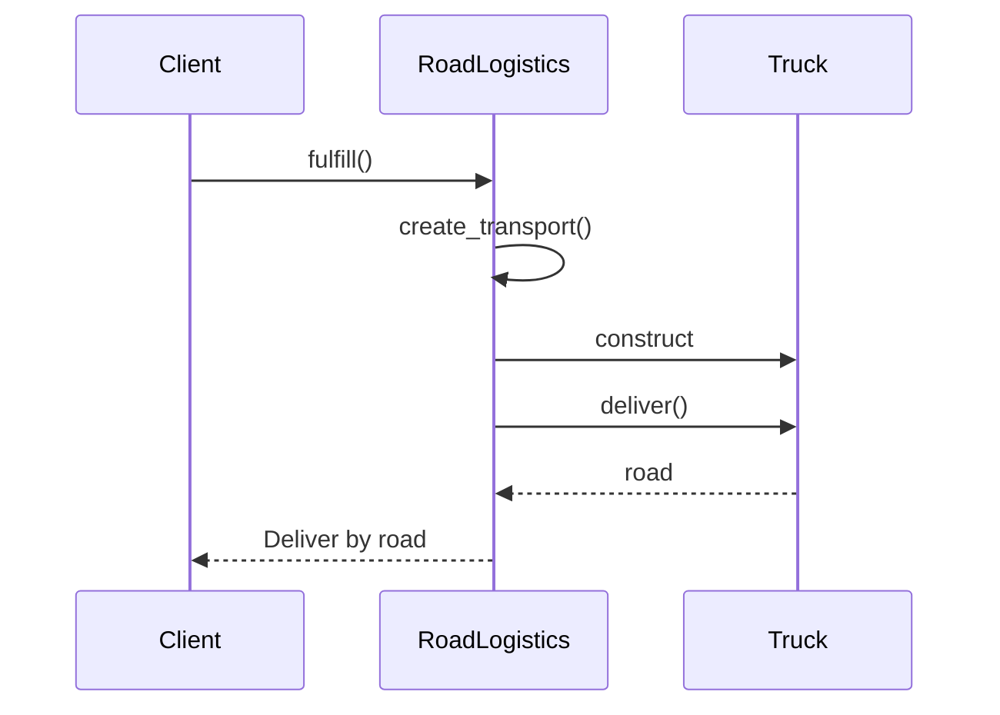
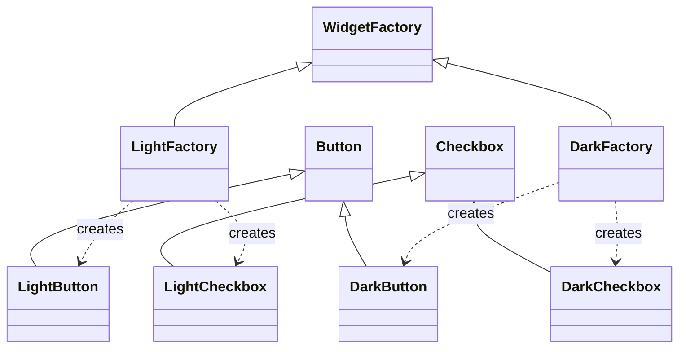

# Creational Patterns: Control How Objects Come Into Existence

## Concept-First Lessons

Start with a standalone lesson below. Each explains the definition and underlying
idea, gives a real-world scenario, and only then walks through the C++ example.
The sections later in this file retain additional implementation notes and diagrams.

Each diagram link opens the **flow diagram**, followed immediately by the **class**
and **sequence diagrams**, with explanations tied to that C++ program.

| Topic | Standalone lesson | C++ diagrams |
| --- | --- | --- |
| Factory Method | [Lesson](../../lessons/patterns/creational/factory_method.md) | [Flow, class, sequence](../../lessons/patterns/creational/factory_method.md#c-flow-diagram) |
| Abstract Factory | [Lesson](../../lessons/patterns/creational/abstract_factory.md) | [Flow, class, sequence](../../lessons/patterns/creational/abstract_factory.md#c-flow-diagram) |
| Builder | [Lesson](../../lessons/patterns/creational/builder.md) | [Flow, class, sequence](../../lessons/patterns/creational/builder.md#c-flow-diagram) |
| Prototype | [Lesson](../../lessons/patterns/creational/prototype.md) | [Flow, class, sequence](../../lessons/patterns/creational/prototype.md#c-flow-diagram) |
| Singleton | [Lesson](../../lessons/patterns/creational/singleton.md) | [Flow, class, sequence](../../lessons/patterns/creational/singleton.md#c-flow-diagram) |

See the [complete lesson index](../../lessons/README.md) for the other categories.

## Technical Notes and Comparisons

The five creational GoF patterns solve different construction problems. They are
not five spellings of `new`. First identify what varies: one product, a product
family, construction steps, an existing object's state, or instance count.

| Variation | Pattern | Example |
| --- | --- | --- |
| Which implementation one workflow creates | Factory Method | Road or sea delivery |
| Which compatible family the client receives | Abstract Factory | Light or dark widgets |
| How a complex valid object is assembled | Builder | Request options |
| Which configured object is copied | Prototype | Independent shape clone |
| Whether a type has one globally accessible instance | Singleton | Immutable settings |

All examples are independent executables. Names in backticks refer to the linked
source, not to classes you must find in another project.

## 1. Factory Method

**Source:** [factory_method.cpp](factory_method.cpp). **Target:** `factory_method`.

### Problem and Mental Model

A logistics workflow needs a transport, but road and sea logistics choose different
transport implementations. If the workflow directly constructs `Truck`, choosing
`Ship` requires editing that workflow. A factory method is an overridable creation
operation inside a creator abstraction. The creator can use the resulting product
without knowing its concrete class.

`Transport` is the product interface; `Truck` and `Ship` are concrete products.
`Logistics` is the creator; `RoadLogistics` and `SeaLogistics` override its protected
`create_transport()`. The important feature is that `Logistics::fulfill()` is
ordinary shared workflow code that calls that overridable method.



### Walk Through the Program

1. `main()` creates one creator of each kind.
2. `road.fulfill()` enters the inherited, nonvirtual workflow.
3. Virtual dispatch selects `RoadLogistics::create_transport()`.
4. The returned `unique_ptr<Transport>` owns a `Truck`.
5. `deliver()` dispatches to the truck, and `fulfill()` formats the result.
6. The local pointer destroys the product on normal return or stack unwinding.

Output:

```text
Deliver by road
Deliver by sea
```

The two checks verify that the same workflow gets different products from different
creators. They do not test actual network delivery or transport failures.

### Benefits and Good Uses

- Reuses a workflow while giving subclasses one focused extension point.
- Keeps concrete product constructors out of the workflow.
- Works naturally in a framework where clients already extend creator classes.
- The product can evolve behind its behavioral contract.

### Drawbacks and When to Avoid It

- Introduces a parallel creator hierarchy, sometimes doubling class count.
- Subclassing just to call `make_unique` can be heavier than passing a callable.
- The base workflow becomes coupled to a creation protocol and product interface.
- If there is only one stable product and no extension requirement, direct
  construction is clearer.

### Variants, Alternatives, and C++ Traps

A free function with a `switch` returning different products is often called a
**simple factory**. It centralizes construction but is not, by itself, this GoF
Factory Method structure. A creator may provide a default factory implementation
instead of making it pure virtual. A callback returning `unique_ptr<Transport>`
can replace subclassing when runtime composition is a better fit.

The base product needs a virtual destructor because deletion happens through a
base pointer. Returning a product by base value would slice derived state. Do not
call a virtual factory from a base constructor expecting the derived override:
construction-time virtual dispatch does not work that way. The sample assumes a
non-null factory result; a public plugin contract should state and enforce that.

`fulfill()` allocates a fresh product on each call. Caching products would change
lifetime, reuse, and possibly thread-safety semantics. Allocation failure propagates;
the RAII pointer protects ownership but does not make delivery transactional.

**Exercise with answer:** Add rail delivery. Add `Train : Transport` and
`RailLogistics : Logistics`, then select the new creator in `main()`. Do not edit
`fulfill()`. Editing the composition point is expected; extensibility does not mean
the whole application can remain textually unchanged.

## 2. Abstract Factory

**Source:** [abstract_factory.cpp](abstract_factory.cpp). **Target:** `abstract_factory`.

### Problem and Mental Model

A form needs both a button and a checkbox. Choosing each independently risks a
light button with a dark checkbox. Abstract Factory groups creation operations for
related products so that selecting one concrete factory selects one product family.

Here the product categories are `Button` and `Checkbox`; the families are light and
dark. `WidgetFactory` exposes one method per category. `draw_form()` knows the
abstract categories, not `LightButton` or `DarkCheckbox`.



### Worked Trace and Ownership

`draw_form(DarkFactory{})` asks the same factory for both products. It receives
owning pointers to a dark button and dark checkbox and calls their `draw()` methods.
The resulting string is `dark button + dark checkbox`. Temporary products are
destroyed after use; their string results remain values owned by the caller.

Checks cover both complete families. They establish that these factories produce
matching descriptions, not that the type system makes all possible mismatches
impossible. Someone can still manually combine products from two factories.

### Benefits

- A family choice is made in one place instead of at every construction site.
- Clients use consistent abstract APIs across themes, platforms, or providers.
- Adding another family can leave the client and existing families unchanged.
- Fake families make integration-level client tests easier.

### Drawbacks and Limits

- Adding a new **product category**, such as `Slider`, changes the abstract factory
  and every concrete factory. Extending families is easy; extending categories is not.
- There can be many small concrete product classes.
- Products with relationships may need a stronger compatibility contract than
  simply coming from factories with similar names.
- Avoid the pattern when only one unrelated product varies.

### Variants and Failure Cases

An abstract factory often implements each creation operation using factory methods;
the two patterns can coexist. A factory may return shared immutable resources,
prototypes, or pooled handles instead of always allocating new objects. Those are
different ownership contracts, not interchangeable pointer spellings.

For database families, mixing a connection from provider A and a transaction from
provider B can be a runtime error. Use provider identity checks, typed bundles, or a
single owning session when compatibility must be enforced. If creating the second
product fails, RAII releases the first, but external side effects still need rollback.

Compile-time factory templates can enforce family types with less virtual dispatch,
at the cost of fixing choices during compilation. Runtime virtual factories are
better for provider selection from configuration.

**Exercise with answer:** Which is cheaper: adding a high-contrast theme or a new
widget category? The theme needs one new factory and one implementation per existing
category. A category requires changing the factory interface and every family.

## 3. Builder

**Source:** [builder.cpp](builder.cpp). **Target:** `builder`.

### Problem and Mental Model

A request has a required URL, a timeout with a default, and an authentication option.
A long positional constructor makes `Request("/orders", 500, true)` hard to read and
does not provide a place to accumulate incomplete configuration safely.

Builder separates the **construction state** from the **usable product**. The
builder may be incomplete. The constructed `Request` must satisfy its invariant:
nonempty URL and positive timeout. A director is an optional object that applies a
reusable construction recipe; it is not required for every fluent builder.

### Worked Trace

`Builder{}.url("/orders").timeout(500).authenticate().build()` does the following:

1. Starts with empty URL, timeout 1000, and no authentication.
2. Each setter modifies the builder and returns `*this` for chaining.
3. `build()` validates all required conditions together.
4. A private `Request` constructor receives a complete value.

Output is `/orders timeout=500`. `RequestDirector::health_check()` separately builds
a request with a 200 ms timeout and no authentication. Checks verify the chosen
options, that recipe, missing URL rejection, and zero-timeout rejection.

### Benefits

- Named steps are more readable than many same-typed constructor arguments.
- Validation happens at the boundary between incomplete and valid state.
- Defaults are centralized, and reusable recipes can be shared by a director.
- The product need not expose setters just to support construction.

### Drawbacks and When to Avoid It

- Duplicates some product fields in the builder and adds API maintenance.
- Runtime builders report some mistakes only when `build()` is called.
- A fluent chain can hide required ordering or stale values on a reused builder.
- Two or three clear constructor arguments may not justify a builder.

### Variants, Lifetime, and Failure Cases

This is a concrete fluent builder with an optional director. The classic GoF
variation uses an abstract builder so a director can apply the same steps to
different representations. A **staged builder** uses distinct types for successive
steps, making a call to `build()` unavailable until required values exist. That
improves compile-time enforcement but increases type and API complexity.

The sample's `build() const` copies configuration into an independent product. It
does not consume or reset the builder; building twice repeats the same configuration.
A move-only builder for expensive data could instead expose `build() &&` and move
fields into the product. Document whether reuse is allowed.

The fluent setters return a reference to the builder. Using the temporary within
the one full expression is safe; storing a reference returned from a temporary's
setter would dangle after that statement. The product's `url()` returns a borrowed
reference valid only while that product remains alive and unmodified.

The authentication flag is only sample data, not a security implementation. A real
request builder would validate URI syntax, credentials policy, timeout bounds, and
mutually exclusive options. Failed validation does not make a partial `Request`.

**Exercise with answer:** Add retries in the range 0..5. Store the pending value
in the builder, validate in `build()`, and pass it to the private constructor.
Validate relationships too: a per-attempt timeout and five retries can exceed a
total deadline even when each field is individually valid.

## 4. Prototype

**Source:** [prototype.cpp](prototype.cpp). **Target:** `prototype`.

### Problem and Mental Model

An editor receives a `Shape&` and wants a copy with the same actual runtime type and
configuration. It cannot simply write `Shape copy = original`: the base may be
abstract, and copying a nonabstract base by value would slice derived data.

Prototype asks an existing object to create a polymorphic copy of itself. `clone()`
is a virtual copy operation. `Circle::clone()` uses the circle's copy constructor,
then returns the new object through an owning base pointer.

### Worked Trace and Checks

The original is a red circle of radius 5. Cloning produces a second circle with the
same description. Changing only the clone's color gives:

```text
red circle r=5
blue circle r=5
```

The original is a stack value; the clone is exclusively owned by a `unique_ptr`.
Checks establish initial equality and later independence. The copied `std::string`
has value semantics, so mutating one circle's color does not change the other.

### Benefits

- Preserves runtime type without type switches in the caller.
- Starts from configured objects instead of repeating configuration steps.
- Useful for editor duplication, simulation entities, and template catalogs.
- A registry of named prototypes can avoid a large concrete-constructor switch.

### Drawbacks and Limits

- Every subtype must define a correct cloning policy.
- Deep copying a graph can be expensive and must preserve the intended relationships.
- Files, sockets, mutexes, identities, and subscriptions are not ordinary copyable
  state. A clone policy must say whether to recreate, share, reset, or reject them.
- If the concrete value type is already known, its normal copy constructor is simpler.

### C++ Variants and Traps

Copying `shared_ptr<Data>` shares the data; it does not deep-copy `Data`. Copying
`unique_ptr<Data>` is disabled by default. A clone with unique-owned data normally
allocates a fresh nested object, while a clone with immutable shared data may
intentionally share it. Cycles require a visited-object map to avoid infinite
recursion and to preserve aliasing.

`unique_ptr<Circle>` cannot be used as a covariant virtual return type for an
override declared to return `unique_ptr<Shape>`; smart pointer conversions are not
virtual return-type covariance. Keep the virtual signature consistent, as here.

Allocation can throw. The original remains unchanged, and partially constructed
owned members clean themselves up. The sample does not validate circle geometry;
it isolates clone semantics using a small positive radius.

**Exercise with answer:** Suppose each circle owns a mutable palette through a
`shared_ptr`. Would the current generated copy guarantee independence? No. Both
circles would share that palette. Either clone the palette explicitly or state
that shared immutable palettes are part of the intended model.

## 5. Singleton

**Source:** [singleton.cpp](singleton.cpp). **Target:** `singleton`.

### Problem and Mental Model

Singleton combines two decisions: one instance of a type and global access to it.
Those decisions are separable. Having one application configuration object does not
automatically justify letting any function fetch it from global state.

`Settings` has a private constructor, deleted copying, and an `instance()` function
containing a function-local static. The accessor returns `const Settings&`; this
example deliberately has no mutable global counters or caches.

### Worked Trace

The first call initializes the local static. Subsequent calls refer to the same
object. The address-equality check verifies identity, not merely equal contents.
The program prints `Pattern demo`.

Initialization of a function-local static is synchronized by C++11 and later. This
does **not** make arbitrary later mutations of a singleton thread-safe. Here the
exposed state is immutable, so readers do not mutate shared data.

### Benefits and Narrow Use Cases

- Lazy construction and straightforward access to a unique shared service.
- Avoids accidental construction through the public API.
- Can fit process-wide immutable metadata with genuinely uniform lifetime.

### Drawbacks

- Hides dependencies: a function can use settings without declaring that need.
- Makes test isolation, alternate configurations, and multiple application instances
  in one process harder.
- Global lifetime can cause shutdown-order problems between static objects.
- Mutable singletons create contention, data races, and order-dependent tests.
- It can turn into a service locator that silently couples the entire program.

### Alternatives and C++ Pitfalls

Usually construct one `Settings` object in `main()` and pass it by reference. This
still gives one application instance while preserving explicit dependencies and
testability. A namespace constant or `constexpr` value is enough for simple fixed
data. `thread_local` gives one instance per thread, not one global instance.

Do not implement hand-written double-checked locking for this example. Correct
publication requires careful memory ordering, and local-static initialization
already solves the initialization problem. If initialization throws, the language
requires a later entry to retry; this sample does not exercise that path.

Do not recursively call `instance()` while its static is being initialized. Avoid
calling it from unrelated static destructors after its object has been destroyed.
Shared libraries and plugin boundaries can complicate claims of process-wide
uniqueness depending on linkage and loading; a C++ singleton is not a distributed
lock or a cross-process uniqueness mechanism.

**Exercise with answer:** Two tests need different settings in the same process.
Should `instance()` gain a global reset method? Usually no. Reset introduces
ordering and dangling-reference risks. Pass configuration explicitly and let each
test own its own value.

## Choosing Between the Five

For one straightforward object, start with a constructor or named free factory.
Use Factory Method when a reusable creator workflow needs subclass-controlled
construction. Use Abstract Factory when the choice applies to a related family.
Use Builder when assembling one valid product involves several options or steps.
Use Prototype when the desired configuration already exists in an object. Treat
Singleton as a restrictive lifetime and access decision, not a default factory.

A system can combine these: an abstract factory may supply builders or clone
prototypes. Combining patterns is useful only when it resolves separate, concrete
requirements; combining names is not itself an improvement.