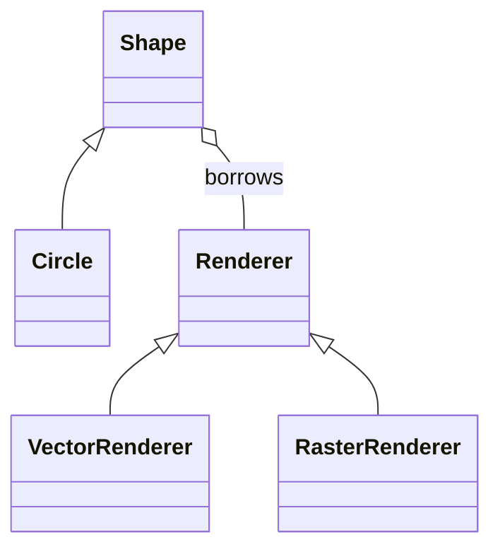

# Structural Patterns: Connect Objects Without Confusing Responsibilities

## Concept-First Lessons

Read a standalone lesson first for the definition, deeper idea, real-world scenario,
and then the C++ walkthrough. The existing sections below provide further technical notes.

Each diagram link opens the **flow diagram**, followed immediately by the **class**
and **sequence diagrams**, with explanations tied to that C++ program.

| Topic | Standalone lesson | C++ diagrams |
| --- | --- | --- |
| Adapter | [Lesson](../../lessons/patterns/structural/adapter.md) | [Flow, class, sequence](../../lessons/patterns/structural/adapter.md#c-flow-diagram) |
| Bridge | [Lesson](../../lessons/patterns/structural/bridge.md) | [Flow, class, sequence](../../lessons/patterns/structural/bridge.md#c-flow-diagram) |
| Composite | [Lesson](../../lessons/patterns/structural/composite.md) | [Flow, class, sequence](../../lessons/patterns/structural/composite.md#c-flow-diagram) |
| Decorator | [Lesson](../../lessons/patterns/structural/decorator.md) | [Flow, class, sequence](../../lessons/patterns/structural/decorator.md#c-flow-diagram) |
| Facade | [Lesson](../../lessons/patterns/structural/facade.md) | [Flow, class, sequence](../../lessons/patterns/structural/facade.md#c-flow-diagram) |
| Flyweight | [Lesson](../../lessons/patterns/structural/flyweight.md) | [Flow, class, sequence](../../lessons/patterns/structural/flyweight.md#c-flow-diagram) |
| Proxy | [Lesson](../../lessons/patterns/structural/proxy.md) | [Flow, class, sequence](../../lessons/patterns/structural/proxy.md#c-flow-diagram) |

See the [complete lesson index](../../lessons/README.md) for the other categories.

## Technical Notes and Comparisons

The seven structural GoF patterns describe how objects and classes fit together.
Similar diagrams can represent different intentions. Ask whether you are adapting
an interface, separating two dimensions, representing a tree, adding behavior,
simplifying a subsystem, sharing state, or controlling access.

| Pattern | Main question | Example |
| --- | --- | --- |
| Adapter | How can this existing API satisfy my client's API? | Temperature units |
| Bridge | How can two dimensions evolve independently? | Shape and renderer |
| Composite | How can a leaf and a group support the same operation? | File tree size |
| Decorator | How can I layer optional behavior? | Beverage additions |
| Facade | How can a client perform a subsystem workflow simply? | Checkout |
| Flyweight | How can many objects share repeated intrinsic state? | Glyph styles |
| Proxy | How can I control access behind the same interface? | Lazy image |

## 1. Adapter

**Source:** [adapter.cpp](adapter.cpp). **Target:** `adapter`.

### Problem, Roles, and Trace

A temperature client expects Celsius through `TemperatureSensor::celsius()`.
An existing device exposes `LegacyThermometer::read_fahrenheit()`. Changing the
device might be impossible or undesirable. The adapter translates the API and its
meaning, not merely the method name.

`TemperatureSensor` is the target interface; `LegacyThermometer` is the adaptee;
`TemperatureAdapter` implements the target while holding a reference to the adaptee.
Calling the adapter through `TemperatureSensor&` performs:

```text
client -> celsius() -> read_fahrenheit() -> unit conversion -> client
```

For 212 degrees Fahrenheit, subtract 32 to get 180, multiply by 5, and divide by 9
to get 100 degrees Celsius. For 32 degrees Fahrenheit the result is 0. The program
checks both reference points and prints `100 C`.

### Benefits

- Keeps third-party or legacy details outside the client.
- Gives the client one coherent contract even when providers differ.
- Centralizes translation, including units, error types, and argument formats.
- Lets old and new components coexist during an incremental migration.

### Drawbacks and Limits

- Adds another layer to trace when behavior fails.
- Cannot invent capabilities the old API fundamentally lacks.
- A misleading conversion can compile while violating the target's semantics.
- If the old interface is already suitable, direct use is simpler.

### Ownership, Variants, and Edge Cases

This is an **object adapter**: it composes an existing object. It borrows a const
reference, so both thermometer objects are declared before and outlive their
adapters. Constructing an adapter from a temporary thermometer and retaining it
would create a dangling reference. An owning adapter could store a value or
`unique_ptr` instead.

A C++ **class adapter** may use inheritance from the legacy implementation and the
target interface. That can access protected legacy behavior, but tightly couples
the adapter to that implementation. Composition usually permits more flexibility.

Real devices need decisions about sensor errors, stale readings, calibration,
NaN, and precision. These simple reference temperatures are exactly comparable in
the sample; general floating-point tests should use a stated tolerance. A target
that promises nonblocking reads cannot be honestly implemented by blindly wrapping
a blocking old API.

**Exercise with answer:** Is renaming `read_fahrenheit()` to `celsius()` enough?
No. The return contract includes units. Without the arithmetic, clients receive a
well-typed but semantically incorrect result.

## 2. Bridge

**Source:** [bridge.cpp](bridge.cpp). **Target:** `bridge`.

### Problem and Structure

Suppose shapes vary independently from rendering backends. A combined hierarchy
can grow into `VectorCircle`, `RasterCircle`, `VectorRectangle`, and
`RasterRectangle`. Every new dimension multiplies combinations.

Bridge places the high-level abstraction on one side and the implementation
interface on the other. A `Shape` holds a `Renderer&`; `Circle` delegates rendering
to whichever renderer it receives. This sample has one refined shape and two
backends, the smallest arrangement that shows backend independence.



### Worked Trace

`Circle(vector, 4).draw()` calls `VectorRenderer::circle(4)`.
`Circle(raster, 4).draw()` calls `RasterRenderer::circle(4)`. Both circles retain the
same shape behavior. Output is:

```text
vector circle 4
raster circle 4
```

The renderers are declared before the circles and outlive them. Rendering is
represented by strings, not actual graphics. The checks verify delegation to each
backend; no pixel rendering is claimed.

### Benefits

- Avoids a concrete subclass for every abstraction/backend combination.
- Separates high-level policy from platform-specific implementation.
- Allows runtime backend selection and backend-specific tests.
- One backend object can serve several abstractions when its contract permits it.

### Drawbacks and Design Constraints

- Adds indirection and requires a carefully chosen implementation interface.
- A poorly chosen renderer API can force unrelated changes through both sides.
- If there is only one real axis of change, this may be unnecessary structure.
- Sharing a mutable backend introduces synchronization and state-isolation concerns.

Adding `Rectangle` would require rectangle support in this sample's renderer
interface and its implementations. Bridge does not magically make every future
operation free. A stable backend vocabulary such as paths, strokes, and fills can
support more shapes without modifying the interface, but may be too low-level for
some systems.

### Distinctions and C++ Choices

Adapter usually reconciles interfaces that already exist. Bridge deliberately
separates dimensions of a design. Strategy swaps an algorithm used by a context;
Bridge organizes an abstraction/implementation relationship. The object diagrams
can look alike, so the reason for the separation matters.

A template parameter can make the backend a compile-time choice. A Pimpl can hide
an implementation and reduce header dependencies without necessarily forming a
full Bridge with independently varying hierarchies. Neither requires virtual
dispatch just because it uses composition.

**Exercise with answer:** Is `Circle` responsible for choosing raster versus
vector? No. The composition code supplies a renderer. Hardcoding that choice
inside `Circle::draw()` would reconnect the dimensions the design separated.

## 3. Composite

**Source:** [composite.cpp](composite.cpp). **Target:** `composite`.

### Problem and Object Model

A file has a size. A directory contains files or more directories and also has a
size. Client code should not repeatedly ask which kind of node it has before
computing a total. Composite gives leaves and containers a shared operation.

`Node` is the component, `File` is the leaf, and `Directory` is the composite.
Each directory exclusively owns its children through `vector<unique_ptr<Node>>`.
The root is a stack object, giving the whole tree one clear owner.

### Worked Recursion

The root owns a 10-byte file and a nested directory containing a 20-byte file.

```text
root.size()
  -> file.size() = 10
  -> nested.size()
       -> file.size() = 20
  -> 10 + 20 = 30
```

The program prints `Total bytes: 30`. Checks also cover an empty directory and
rejection of a null child without changing the tree. Negative file sizes are
rejected at construction.

### Benefits

- Recursive structures have a uniform client-facing interface.
- New leaf types can participate without changing the traversal algorithm.
- Ownership mirrors the tree and cleanup happens recursively through RAII.
- Useful for scene graphs, menus, expression trees, and hierarchical permissions.

### Drawbacks and Limits

- A common interface may not make every operation meaningful for every node.
- Deep trees can exhaust the call stack during traversal or destruction.
- Maintaining parent links or cached totals adds mutation bookkeeping.
- A graph with shared nodes or cycles is not the same as an exclusive-ownership tree.

### Variants and Failure Cases

This is the **safe interface** variation: `add()` belongs only to `Directory`.
Putting `add()` on `Node` makes all nodes look uniform, but then a file must reject
or ignore it. Prefer meaningful operations over forced symmetry.

For total node count N, a full `size()` traversal is O(N); recursion uses O(height)
stack space. Cached totals can make reads cheap but make every edit and ancestor
update more complex. A real filesystem-sized total needs an appropriate wide type
and checked accumulation; this teaching example uses small `int` values and does
not promise overflow-safe totals for arbitrary input.

If parent pointers are added, make them non-owning. Shared ownership in both
directions creates cycles. A directed acyclic graph requires a definition of
whether a shared child is counted once globally or once per path.

**Exercise with answer:** Should a `File` implement `add()` by doing nothing?
No. That silently violates the caller's expectation. Keep child-management on the
composite or use an explicit capability/query design when uniform mutation is needed.

## 4. Decorator

**Source:** [decorator.cpp](decorator.cpp). **Target:** `decorator`.

### Problem and Structure

A beverage can have milk, cinnamon, both, or multiple additions. Subclasses such as
`CoffeeWithMilkAndCinnamon` scale poorly as combinations grow. Decorator wraps an
object with another object that implements the same interface and adds behavior.

`Beverage` is the common component. `Coffee` is concrete. `BeverageDecorator` owns
an inner beverage, while `Milk` and `Cinnamon` extend the delegated result.

### Worked Call Chain

```text
Cinnamon -> Milk -> Coffee
cost:       +20     +50     200 = 270 cents
```

The cost call descends to coffee and adds values while returning. Description
composition produces `coffee, milk, cinnamon: 270 cents`. The program checks the
base price, combined price, and exact wrapping order.

Each wrapper owns exactly one inner component. `std::move(drink)` transfers
ownership into the next wrapper, and reassigning `drink` makes it the owner of the
new outermost object. Destruction of the outer wrapper releases the entire chain.

### Benefits

- Optional behavior can be assembled at runtime without combination subclasses.
- A wrapper can be reused around any compatible component.
- Individual additions can be developed and tested separately.
- Clients keep using the same interface regardless of the number of layers.

### Drawbacks

- Many small runtime objects can make debugging and identity comparisons difficult.
- Wrapper order may change behavior, not just output formatting.
- Forwarding a large interface is tedious and can omit subtle contracts.
- Removing a middle layer or querying concrete wrapper state is awkward.
- For a few independent price options, a data structure may be simpler than objects.

### Variants and Failure Cases

Compression followed by encryption is different from encryption followed by
compression; the second often compresses poorly. Likewise, retry around a
non-idempotent operation can duplicate effects. A decorator must preserve the
interface's promises while making ordering requirements explicit.

This example rejects a null inner component. It uses integer cents and tiny
totals; unbounded additions need overflow policy. No thread safety is implied by
the wrapper structure. A template decorator can avoid some dynamic allocation and
virtual calls when the layer composition is fixed at compile time.

Proxy also wraps the same interface, but its primary aim is access control or
resource management. Decorator primarily adds an independent responsibility.

**Exercise with answer:** Wrap milk twice. The result is 300 cents because every
wrapper contributes 50. If duplicate additions are forbidden, validate the selected
configuration before assembling the chain rather than assuming Decorator forbids them.

## 5. Facade

**Source:** [facade.cpp](facade.cpp). **Target:** `facade`.

### Problem and Trace

Checking out an order requires stock checking, payment, and reservation. If every
client repeats that sequence, workflow knowledge spreads throughout the codebase.
A facade exposes a higher-level operation over cooperating subsystem objects.

`CheckoutFacade` borrows `Inventory` and `Payment`. Its `checkout()` checks stock,
asks for payment approval, and then reserves one unit. The sample verifies:

1. Declined payment returns `payment declined` and leaves the one unit available.
2. Approved payment returns `order confirmed` and consumes the unit.
3. Another checkout returns `out of stock`.

Output is `Checkout success and failure paths verified`. `Payment` is a deterministic
simulation controlled by a boolean, not a financial integration.

### Benefits

- Clients learn a small use-case-oriented API instead of subsystem details.
- Ordering rules can be kept and tested in one place.
- Subsystem internals can change without changing every caller.
- A facade can provide a convenient default while advanced clients retain access
  to underlying subsystem APIs where appropriate.

### Drawbacks and Important Limits

- A facade can grow into a god object that coordinates unrelated workflows.
- A too-simple API may hide errors or capabilities clients actually need.
- Dependencies are simplified for clients, not eliminated from the system.
- A facade is **not automatically a transaction**.

The sample is single-threaded. Between a stock check and a reservation, concurrent
clients could consume stock. Real payment could succeed and reservation could then
fail. Production design needs atomic reservation, idempotent payment identifiers,
compensation/refunds, durable state, and a clearly defined failure model. Those
requirements belong to the business transaction, not to the Facade label.

### Related Patterns

An Adapter makes an incompatible API satisfy a target contract. A Facade offers a
convenient higher-level entry point and need not implement an existing interface.
A Mediator coordinates interactions among colleague objects; a Facade is commonly
called by an external client and its subsystems need not know it exists.

**Exercise with answer:** Should adding a facade prevent all direct subsystem
access? Not inherently. Access restrictions are an architectural decision. Keep
invariant-sensitive operations behind an enforced boundary when bypassing the
facade would violate correctness.

## 6. Flyweight

**Source:** [flyweight.cpp](flyweight.cpp). **Target:** `flyweight`.

### Problem and State Separation

A document may contain a million glyphs but only a few font/size combinations.
Storing a complete style in each glyph duplicates information. Flyweight shares
repeated **intrinsic** state and keeps context-specific **extrinsic** state outside.

In this model, `GlyphStyle` contains font and size. Each `Glyph` separately stores
its character and position. Intrinsic/extrinsic is a design choice: another text
engine might also share character outlines, while still keeping positions separate.

`StyleFactory` maps `(font, size)` keys to `shared_ptr<const GlyphStyle>`. The key
includes every style field used by this sample. Const pointees stop clients from
mutating a shared style through these handles.

### Worked Trace and Checks

The first request for `(Mono, 12)` creates a style. The second returns the same
pointer. `(Mono, 20)` creates a different style. Two glyphs keep distinct positions
while sharing style identity. Output is `AB share Mono`.

Pointer equality is deliberately tested: equal-looking but separately allocated
styles would not establish sharing. Both glyphs and the factory hold shared
ownership, so a glyph can keep its style alive after the factory is destroyed.

### Benefits

- Can substantially reduce memory when repeated state is large and frequent.
- Shared immutable data reduces duplication and may improve cache behavior.
- Centralized interning can make identity comparisons meaningful within a pool.

### Drawbacks and Cost Model

- Factory lookups, keys, pointers, and reference counts have their own cost.
- Moving extrinsic state out makes APIs more context-dependent.
- Mutable shared state can cause action-at-a-distance bugs.
- If nearly every state is unique or tiny, flyweights may increase memory usage.

With N glyphs and K distinct styles, rough storage changes from N complete styles
to K styles plus N handles and K lookup entries. Measure the real sizes and reuse
rate. This `std::map` factory has O(log K) lookup and holds styles until factory
destruction; it has no eviction policy.

### Variants and Failure Cases

A weak-pointer cache can release unreferenced styles, at the cost of expired-entry
cleanup and possible recreation. A bounded cache requires an explicit eviction
policy. Concurrent `get()` calls need synchronization around lookup and insertion;
the reference-count safety of `shared_ptr` does not make the map thread-safe.

Interning is not a general cache of arbitrary results. The essential intent is
sharing intrinsic object state. Cache keys must include every field that affects
that state, and key normalization must preserve meaning.

**Exercise with answer:** Add font weight. Where does it go? In `GlyphStyle` and
in the factory key. Adding it only to the object can incorrectly reuse a regular
style for a bold request.

## 7. Proxy

**Source:** [proxy.cpp](proxy.cpp). **Target:** `proxy`.

### Problem and Trace

An image can be expensive to load, but a document may never display it. A proxy
stands in for the real image behind the same `Image` interface and controls access
to it. This is a **virtual proxy**, meaning lazy creation, not merely a class with
virtual functions.

`LazyImageProxy` starts with an empty `unique_ptr<RealImage>`. On the first
`display()`, it creates the subject and increments a load counter; later calls reuse
it. Checks verify zero loads before use, correct delegated output, and exactly one
load after two displays. Output is `Image loaded 1 time`.

The real subject returns a string rather than reading image files. The example
demonstrates access timing and ownership, not image decoding or file caching.

### Benefits

- Avoids paying a construction cost until the resource is actually used.
- Preserves the client's interface while centralizing access policy.
- Can add access checks, caching, remote forwarding, or instrumentation.
- The proxy can own the subject's lifetime without exposing it to callers.

### Drawbacks and Limits

- First use now has latency and can fail even if proxy construction succeeded.
- Clients may mistake a cheap-looking local call for slow I/O or a remote operation.
- Caching needs invalidation rules; authorization needs a trusted enforcement point.
- Proxy identity and real-subject identity may differ.

### Variants and Failure Cases

A protection proxy checks permissions. A remote proxy forwards across a process or
network boundary. A caching proxy reuses results. A smart-reference proxy can track
access or lifetime. These forms can coexist but have different failure semantics.

In the example, failure of `make_unique` leaves the pointer empty and does not
increment the counter, allowing a later retry. Concurrent displays are **not** safe:
access to the pointer and count requires synchronization. A production lazy proxy
needs an initialization and shutdown policy.

A remote proxy cannot truly make a remote call equivalent to a local one: timeouts,
partial failures, serialization, retries, and duplicate side effects remain real.
Expose important failure behavior even when the method signatures look familiar.

**Exercise with answer:** Is a lazy proxy a Singleton? No. Every proxy can own its
own separate image. Laziness is about when construction happens; Singleton is about
instance count and global access.

## Distinguish the Wrappers by Intent

| Question | Best starting point |
| --- | --- |
| Must the client see a different interface or units? | Adapter |
| Must optional behavior stack around the same interface? | Decorator |
| Must access be delayed, authorized, cached, or forwarded? | Proxy |
| Must several subsystem operations become one use case? | Facade |
| Must abstraction and backend vary independently? | Bridge |

A single implementation can play more than one role. Explain each role and its
contract instead of assuming the class name proves the design is correct.