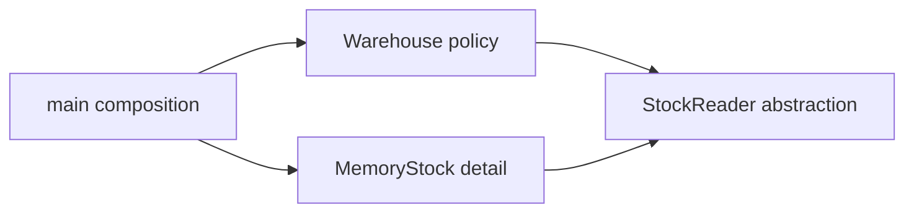

# SOLID: Design Around Responsibilities, Contracts, and Change

## Concept-First Lessons

Start with these standalone definitions and deeper explanations. Each lesson gives
a practical scenario before walking through the before-and-after C++ design.

Each diagram link opens the **flow diagram**, followed immediately by the **class**
and **sequence diagrams**, with explanations tied to that C++ program.

| Topic | Standalone lesson | C++ diagrams |
| --- | --- | --- |
| Single Responsibility | [Lesson](../lessons/solid/srp.md) | [Flow, class, sequence](../lessons/solid/srp.md#c-flow-diagram) |
| Open/Closed | [Lesson](../lessons/solid/ocp.md) | [Flow, class, sequence](../lessons/solid/ocp.md#c-flow-diagram) |
| Liskov Substitution | [Lesson](../lessons/solid/lsp.md) | [Flow, class, sequence](../lessons/solid/lsp.md#c-flow-diagram) |
| Interface Segregation | [Lesson](../lessons/solid/isp.md) | [Flow, class, sequence](../lessons/solid/isp.md#c-flow-diagram) |
| Dependency Inversion | [Lesson](../lessons/solid/dip.md) | [Flow, class, sequence](../lessons/solid/dip.md#c-flow-diagram) |

See the [complete lesson index](../lessons/README.md) for patterns and other principles.
The sections below preserve additional contract discussions and implementation notes.

## Technical Notes and Comparisons

SOLID is five related object-oriented design principles, not five mandatory class
templates. A design can use C++ templates, free functions, values, or virtual
interfaces while respecting the same underlying ideas. The purpose is to make
changes safer and dependencies clearer, not to maximize abstraction count.

Each source contains `before` and `after` namespaces. The before version is a small
design smell or deliberate contract violation; the after version demonstrates the
correction. Both compile, because many design failures are invisible to a compiler.

| Principle | Core question | Source |
| --- | --- | --- |
| SRP: Single Responsibility | Which stakeholder's changes belong together? | [srp.cpp](srp.cpp) |
| OCP: Open/Closed | Which expected variation can be added without rewriting stable policy? | [ocp.cpp](ocp.cpp) |
| LSP: Liskov Substitution | Can a subtype honor every promise of the base contract? | [lsp.cpp](lsp.cpp) |
| ISP: Interface Segregation | Does a client depend only on capabilities it needs? | [isp.cpp](isp.cpp) |
| DIP: Dependency Inversion | Does policy depend on an abstraction rather than a low-level detail? | [dip.cpp](dip.cpp) |

## 1. Single Responsibility Principle

**Target:** `srp`.

### Understand Responsibility

“One reason to change” does not mean one method, one field, or one line per class.
A responsibility groups behavior that changes for the same business reason or
stakeholder. A class can have several methods that collectively maintain one
coherent domain concept.

In the before example, `Invoice` both calculates a total and formats CSV. A pricing
change and a reporting-format change have different causes, yet both require
editing the same class. In the after example, `Invoice` calculates, while
`CsvInvoiceFormatter` converts an invoice into a presentation format.

### Worked Trace

For line amounts 100 and 250 cents:

```text
Invoice.total() -> 350
CsvInvoiceFormatter.format(invoice) -> "total_cents\n350"
```

The checks compare the before and after output, verify the total, and verify that
an empty invoice totals zero. This is a behavior-preserving responsibility split,
not a change to the pricing rules. Both objects use ordinary value members; the
formatter only borrows the invoice during a call.

### Benefits

- Unrelated changes are less likely to conflict in one file or class.
- Tests can target calculations without checking presentation, and vice versa.
- Responsibilities become easier to name, reuse, and assign ownership to.
- Separating I/O often makes domain logic deterministic.

### Drawbacks and Overuse

- Over-splitting creates trivial forwarding classes and navigation overhead.
- A use case still needs coordination among the separated pieces.
- The correct boundary may be unclear until real change patterns appear.
- Splitting tightly related invariant-maintaining behavior can make correctness worse.

### C++ Design Choices and Edge Cases

The formatter need not be a polymorphic interface if CSV is the only required
format. It could be a free function. SRP concerns reasons for change, not whether
every responsibility has a virtual destructor.

The sample accepts small nonnegative line amounts. It deliberately does not model
tax, currency, discounts, rounding, or checked large-total accumulation. Production
money logic should use a defined representation and overflow policy. Splitting
classes does not fix numeric correctness by itself.

Do not move every method into a separate class while leaving shared mutable data
public. That distributes a responsibility rather than separating it. Keep the
domain's invariants with the domain object; separate formatting and persistence
when they change independently.

**Exercise with answer:** Add JSON invoice output. Add a formatter that consumes
the invoice's stable read API. Do not put JSON syntax in the calculation class.
If the new output genuinely requires a new domain fact, adding that domain query
can still be appropriate; SRP does not freeze the invoice forever.

## 2. Open/Closed Principle

**Target:** `ocp`.

### Understand the Extension Boundary

Software should be open to extension and closed to modification with respect to
an identified kind of change. No design is closed against every future requirement.
The engineering question is: which policy is stable, and which variation is likely?

Before, `price(cents, Customer)` switches on an enum. Every new pricing category
adds another branch. After, `price(cents, PricingRule&)` validates the common input
and delegates the varying calculation. `Regular`, `Member`, and `Festival` are
independent rules.

### Worked Trace

For 1000 cents, regular pricing returns 1000, member pricing returns 900, and the
new festival rule returns 800. The same `price()` algorithm handles all three.
Checks confirm old behavior is preserved and the new rule works; output is
`Festival price: 800`.

The temporary rules are borrowed only for the duration of each call, so these
calls do not retain dangling references. A context that stored the reference would
need a longer-lived rule or explicit ownership.

### Benefits

- A new supported variation need not risk unrelated existing algorithm branches.
- Independent extensions can be tested separately.
- The stable operation can retain common validation and orchestration.
- Useful for plugins, policies, exporters, and algorithms that genuinely vary.

### Drawbacks and Overuse

- The abstraction must anticipate the right axis of change.
- Extra classes and virtual calls can obscure a tiny closed decision table.
- An overly broad interface becomes hard to implement correctly.
- Incorrect abstractions may make later requirements harder, not easier.

### What OCP Does Not Promise

Adding a rule still changes composition code, configuration, or registration so
the application can select it. Bug fixes and changed requirements still require
editing existing code. OCP does not forbid edits; it protects a deliberate stable
boundary from routine variation.

For a small known enum whose cases must be exhaustively handled together, a switch
can be the best design. Templates and callable policies offer compile-time or
function-based extension without an inheritance hierarchy. Adding Visitor makes
operations easy to extend but makes element types harder to extend; every design
chooses what remains open.

The sample subtracts integer fractions and therefore has an explicit rounding
behavior: for 999 cents, a member pays `999 - 99 = 900`. Multiplying by 0.9 and
truncating would instead produce a different rule in some cases. A production
extension contract should specify rounding, allowed ranges, and whether outputs
may exceed the input or become negative.

**Exercise with answer:** A new policy needs customer location, but `apply(int)`
does not provide it. Is adding a global lookup the correct OCP fix? No. Reassess
the contract and pass the genuinely needed context explicitly. Preserving a bad
interface at all costs is not the principle's purpose.

## 3. Liskov Substitution Principle

**Target:** `lsp`.

### Understand Behavioral Subtyping

If code is correct for a base type's documented contract, replacing the object
with a subtype should not make that code incorrect. Matching signatures and
compiling `override` are necessary but not sufficient.

A subtype must not require stronger preconditions, promise weaker postconditions,
or break the base type's invariants and allowed histories. Observable failure
behavior also matters. If the base promises an operation for all valid inputs, a
subtype cannot simply throw “unsupported” for part of that promised domain.

### The Deliberate Failure

The before `Rectangle` promises independently settable width and height. The test
sets width to 4, then height to 5, and expects area 20. A derived `Square` changes
both dimensions in either setter, so the second operation makes area 25.

```text
Rectangle: width(4), height(5) -> 4 * 5 = 20 -> contract holds
Square:    width(4), height(5) -> 5 * 5 = 25 -> contract fails
```

The example deliberately checks that the square fails this rectangle contract.
The overall executable passes because it successfully detects the violation.

The after design gives both classes a smaller read-only `Shape::area()` contract.
There is no promise of independent dimension mutation. Rectangle and square are
siblings under that abstraction, and both satisfy its area operation for the
small positive dimensions used in the example.

### Benefits

- Polymorphic clients do not need type checks to work around special subtypes.
- Interfaces become semantic contracts rather than bags of method names.
- Contract tests can be reused across implementations.
- Failures reveal when an “is-a” relationship is only taxonomic, not behavioral.

### Drawbacks and Design Costs

- Contracts must be stated clearly enough to test and reason about.
- A weaker common interface may expose less convenience than a concrete type.
- Some natural-world hierarchies do not make good mutable software hierarchies.
- Exhaustive behavioral verification is difficult for complex stateful interfaces.

### C++ Details and Broader Examples

A read-only subtype returning cached data can violate freshness guarantees even
when its return type is correct. A network implementation of a local interface can
violate latency or failure assumptions. A derived container that rejects elements
accepted by the base strengthens preconditions.

Virtual destructors protect correct polymorphic destruction, but they do not prove
LSP. Returning a derived object by base value slices it; prefer references or
appropriate owning pointers for runtime polymorphism. `const` is not an automatic
immutability guarantee for the entire reachable object graph.

The sample limits itself to positive small dimensions. If constructors are exposed
to arbitrary input, define handling for negative dimensions and multiplication
overflow consistently across shapes. Strengthening only one subtype's input
restrictions after construction can change substitutability.

**Exercise with answer:** Can `Square` ever be a valid subtype of `Rectangle`?
Possibly, under a different contract: for example, a read-only rectangle abstraction
with no independent mutation promise. The failure is about the chosen operations
and guarantees, not a claim that mathematical squares stop being rectangles.

## 4. Interface Segregation Principle

**Target:** `isp`.

### Understand Client-Specific Capabilities

Clients should not depend on methods they do not use. A large interface often
forces implementations to supply meaningless operations and forces clients to
recompile or change when unrelated capabilities evolve.

Before, every `Machine` must both print and scan. `BasicPrinter::scan()` throws
because no scanner exists. The problem is not the syntax of an exception; it is
that the type advertises a capability it cannot honor.

After, `Printer` and `Scanner` are separate interfaces. A basic printer implements
only `Printer`. An office machine implements both. The `print_job()` client accepts
only `Printer&`, expressing exactly what it needs.

### Worked Trace

Calling the before basic printer's `scan()` is caught as an unsupported operation.
After refactoring, both concrete devices can be passed to `print_job()`, while
scanning is available only on the office machine's scanner capability. Checks
verify these behaviors; output is `Print and scan capabilities separated`.

This sample uses multiple inheritance only for small abstract interfaces. The
interfaces do not share mutable implementation state or create a diamond.

### Benefits

- Interfaces communicate actual capabilities.
- Fakes and test doubles implement fewer irrelevant methods.
- Clients are insulated from changes in unrelated operations.
- Narrow contracts often make LSP easier to satisfy.

### Drawbacks and Overuse

- Too many tiny interfaces can fragment a coherent API.
- Composition code must know which capabilities to provide to which clients.
- Repeated capability discovery through casts can obscure architecture.
- Splitting methods that must be used together may weaken invariant boundaries.

### Variants and Contract Choices

Interfaces should be segregated around client needs, not automatically one method
per interface. A transaction interface may need begin/commit/rollback together.
A printer client may reasonably need print/status/cancel as one coherent capability.

Templates and C++20 concepts can express capability requirements without runtime
inheritance. This project uses C++17, but the design idea is the same. A combined
interface can inherit smaller interfaces when some clients truly need both.

Optional capabilities can be represented explicitly with a query or nullable
handle when runtime discovery is necessary. Repeated `dynamic_cast` checks in
every client may indicate that dependencies were not wired at the right boundary.
If a base contract explicitly allows unsupported operations, the before example
may not violate that weakened contract, but clients still pay for the fat API.

**Exercise with answer:** Does a multifunction machine violate ISP because it
implements two interfaces? No. ISP limits what a client must depend on, not how
many capabilities a concrete object may provide.

## 5. Dependency Inversion Principle

**Target:** `dip`.

### Understand Dependency Direction

High-level business policy should not depend directly on low-level implementation
details. Both should depend on abstractions, and those abstractions should describe
the needs of the policy rather than leak details of a particular database or SDK.

Before, `Warehouse` directly contains `SqlStock`. The policy deciding whether an
item can ship is tied to that concrete dependency. `SqlStock` here is a simulated
lookup, not an actual database connection.

After, `Warehouse` borrows a `StockReader`. `MemoryStock` implements that contract.
The composition point constructs the concrete reader and injects it. The warehouse
asks only for available quantity; it does not know SQL rows, connection strings,
or storage containers.



### Worked Trace

The ready reader contains three books, and the empty reader contains none.
`Warehouse::can_ship("book")` is true with the first and false with the second.
An unknown item is also false. The program tests both policy paths without a
database and prints `Warehouse policy tested through an abstraction`.

Readers are declared before warehouses and outlive their borrowed references.
The check is a query, not an atomic reservation; it does not guarantee that stock
will remain available until a later shipment.

### Benefits

- Core policy can be tested without slow or nondeterministic infrastructure.
- Storage and transport technologies can change behind a stable business API.
- Dependencies are visible in construction rather than hidden in global access.
- Business-facing abstractions can keep low-level concepts out of domain code.

### Drawbacks and Overuse

- Interfaces and adapters add maintenance and wiring.
- A one-to-one interface mechanically mirroring an SDK may not meaningfully invert
  the dependency; it can still leak the low-level model.
- Introducing an abstraction for every stable standard-library value is unnecessary.
- Contract drift between fakes and real implementations can make tests misleading.

### DIP, DI, and IoC Are Related but Different

**Dependency injection (DI)** supplies dependencies from outside. Injecting a
concrete `SqlStock&` is DI, but policy still depends on that concrete detail.
**DIP** addresses dependency direction and abstraction ownership. **Inversion of
control (IoC)** is broader: a framework or coordinator may control when application
code runs. A DI container is optional; manual constructor wiring is enough here.

In a multi-file project, place `StockReader` with the application/domain contract,
and let infrastructure depend on it. Do not make the policy import a storage
package just to access a nominal interface defined deep inside that package.
Templates can also express inverted dependencies without virtual dispatch.

Production stock readers must define missing items, negative quantities, stale
data, timeouts, and errors. Returning zero for “database unavailable” would confuse
an outage with genuine absence. Test real adapters against the same contract as
fakes, and use an atomic reservation operation when the use case needs one.

**Exercise with answer:** Replace memory stock with a remote stock service. Which
code should change? Add a `StockReader` implementation and wire it at composition.
If the remote service cannot honor the existing contract, revise the contract
explicitly rather than hiding timeouts or stale data as ordinary zero stock.

## Apply SOLID Together Without Overengineering

SRP identifies coherent responsibilities. ISP shapes the client-facing capabilities.
DIP places policy behind appropriate abstractions. OCP makes selected variations
extensible through those abstractions. LSP checks that the implementations really
honor the contract.

For a one-off calculation, a pure function may satisfy the underlying goals better
than five interfaces. For a changing application with multiple providers, explicit
ports and adapters may pay for themselves. Use evidence: repeated edits, difficult
tests, unsupported methods, type-check workarounds, and infrastructure leakage.

### Explained Design Review

Suppose a `ReportManager` calculates totals, sends SQL, renders HTML, and emails it.
Do not begin by creating one class per method. Identify changes: accounting rules,
storage schema, visual output, and message delivery are distinct concerns. Keep
calculation pure, expose a storage contract only where needed, isolate formatting,
and inject a sender. An application service can still coordinate the complete use
case. That coordinator is not automatically an SRP violation: orchestrating one
use case can itself be one coherent responsibility.

Then check contracts. Does every sender report failures consistently? Can a fake
storage implementation hide consistency issues? Does a new formatter require
editing domain calculations? Those questions test the actual design rather than
counting classes or pattern names.