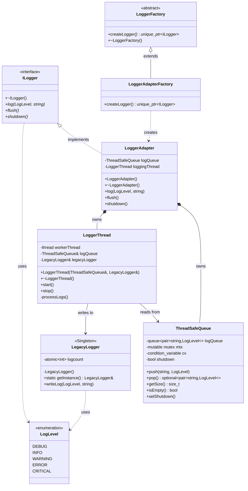
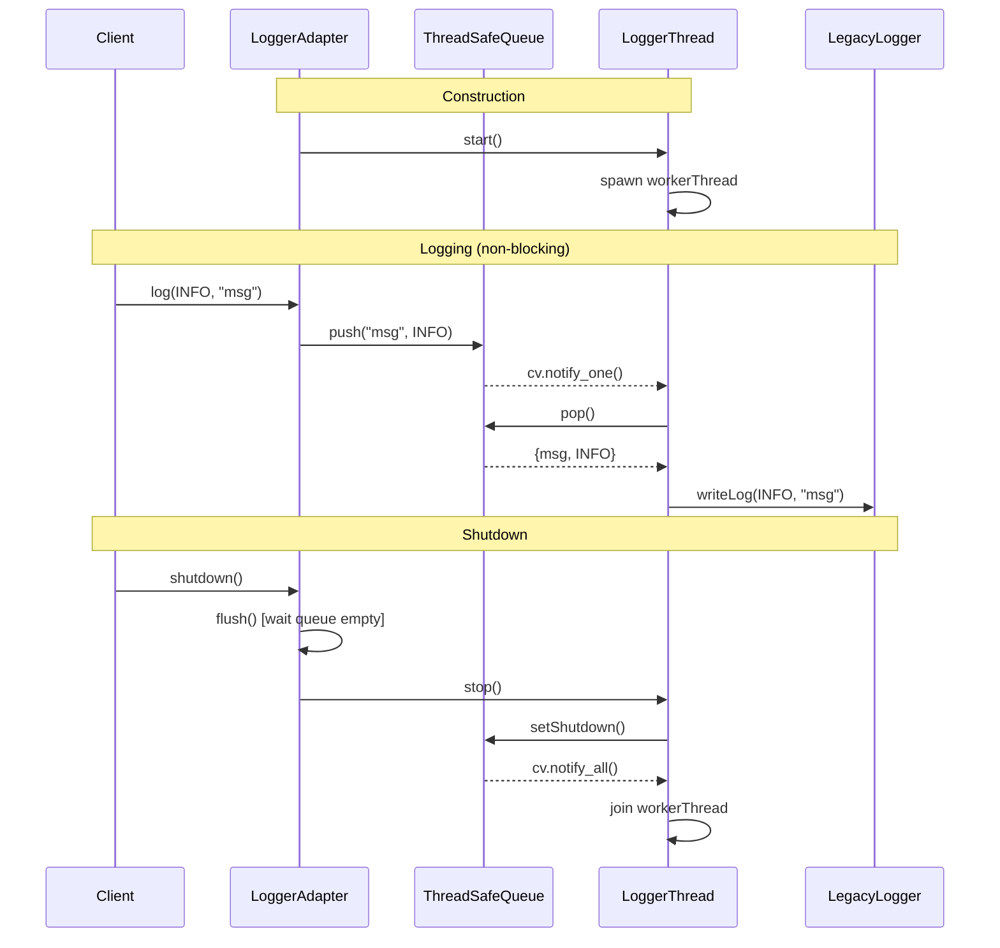

# Thread-Safe Async Logger - Design Document

## Overview

An asynchronous, thread-safe logging system that decouples log message production from consumption using a producer-consumer pattern with a background worker thread.

## Architecture

```
┌────────────┐       ┌────────────────┐       ┌─────────────────┐       ┌──────────────┐       ┌──────────────┐
│   Client   │──────▶│  LoggerAdapter │──────▶│ ThreadSafeQueue │──────▶│ LoggerThread │──────▶│ LegacyLogger │
│  (Threads) │ log() │  (ILogger)     │ push()│  (bounded:100)  │ pop() │  (worker)    │write()│  (Singleton) │
└────────────┘       └────────────────┘       └─────────────────┘       └──────────────┘       └──────────────┘
```

## Class Diagram



## Design Patterns Used

| Pattern | Component | Purpose |
|---------|-----------|---------|
| **Adapter** | `LoggerAdapter` | Adapts `LegacyLogger` behind `ILogger` interface, adding async behavior |
| **Singleton** | `LegacyLogger` | Single shared logging instance (thread-safe via Meyers' singleton) |
| **Factory Method** | `LoggerFactory` / `LoggerAdapterFactory` | Decouples logger creation from usage |
| **Producer-Consumer** | `ThreadSafeQueue` + `LoggerThread` | Async decoupling of log producers from the log writer |

## Sequence Diagram



## Thread Safety Mechanisms

| Component | Mechanism | Details |
|-----------|-----------|---------|
| `ThreadSafeQueue` | `std::mutex` + `std::condition_variable` | Guards all queue operations; `cv.wait()` blocks consumer when queue is empty |
| `LegacyLogger` | `std::atomic<int>` for logcount | Meyers' Singleton guarantees thread-safe initialization |
| `LoggerAdapter` | Single consumer thread | Only one thread reads from the queue, avoiding contention on output |
| Queue bounded size | Max 100 entries | Drops oldest entry when full (prevents memory exhaustion) |

## Shutdown Protocol

1. `LoggerAdapter::shutdown()` calls `flush()` — spins until queue is empty
2. `LoggerThread::stop()` calls `logQueue.setShutdown()` — sets shutdown flag and notifies all waiters
3. `LoggerThread::processLogs()` loop exits when `pop()` returns `std::nullopt`
4. Worker thread is joined via `workerThread.join()`

## File Structure

```
Design_pattern_project/
├── CMakeLists.txt
├── inc/
│   ├── log_levels.hpp          # LogLevel enum
│   ├── logger_interface.hpp    # ILogger abstract class
│   ├── Logger_adapter.hpp      # LoggerAdapter declaration
│   ├── Logger_thread.hpp       # LoggerThread declaration
│   ├── Thread_safe_queue.hpp   # ThreadSafeQueue declaration
│   ├── legacy_logger.hpp       # LegacyLogger (Singleton) declaration
│   └── Logger_factory.hpp      # Factory classes
└── src/
    ├── main.cpp                # Entry point + stress test
    ├── Logger_adapter.cpp      # LoggerAdapter implementation
    ├── Logger_thread.cpp       # LoggerThread implementation
    ├── Thread_safe_queue.cpp   # ThreadSafeQueue implementation
    └── legacy_logger.cpp       # LegacyLogger implementation
```

## Build & Run

```bash
cd Design_patterns/Design_pattern_project
cmake -B build && cmake --build build
./build/threading
```
