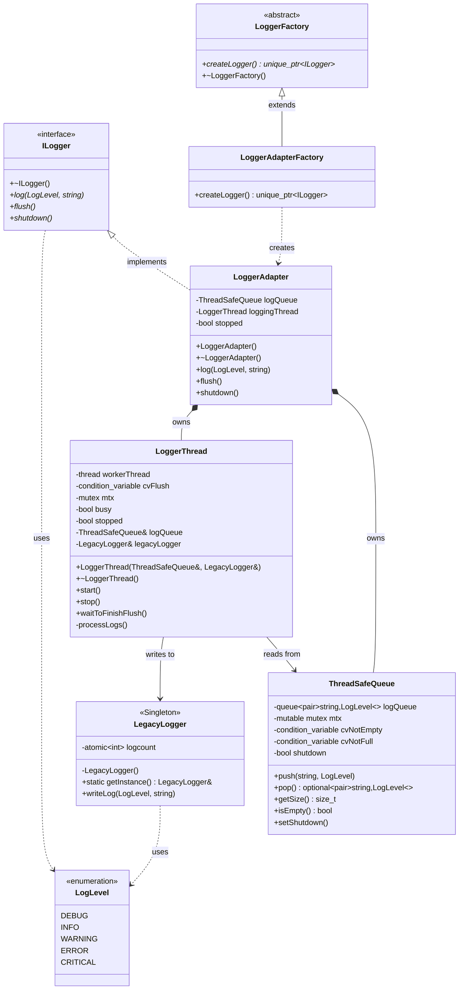
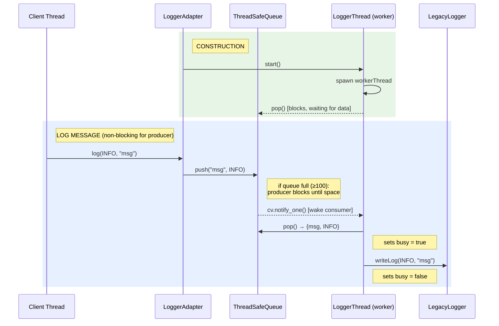
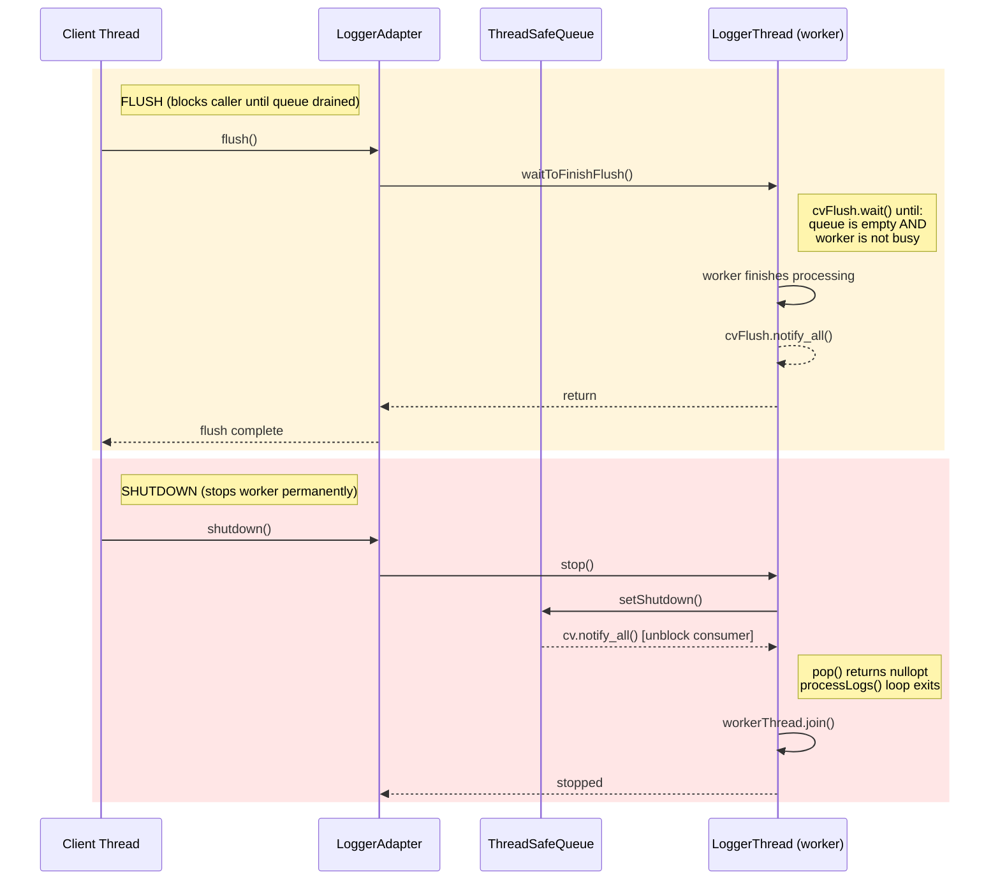

# Thread-Safe Async Logger - Design Document

## Overview

An asynchronous, thread-safe logging system that decouples log message production from consumption using a producer-consumer pattern with a background worker thread.

## Architecture

### Data Flow

```
Producer Threads                     Consumer Thread
─────────────────                    ───────────────
                                    
  Thread 1 ─┐                       ┌─── LoggerThread ──── LegacyLogger
  Thread 2 ──┼── LoggerAdapter ──── ThreadSafeQueue ───┘      (Singleton)
  Thread N ─┘     (ILogger)         (bounded: 100)
                     │                     │
                  push(msg)             pop(msg)
                     │                     │
              ┌──────┴──────┐       ┌──────┴──────┐
              │ If queue is │       │ If queue is │
              │ full: BLOCK │       │ empty: WAIT │
              └─────────────┘       └─────────────┘
```

### Component Responsibilities

| Component | Role |
|-----------|------|
| **LoggerAdapter** | Public API (`log`, `flush`, `shutdown`). Pushes messages into the queue |
| **ThreadSafeQueue** | Bounded thread-safe buffer (max 100). Blocks producers when full, blocks consumer when empty |
| **LoggerThread** | Background worker. Pops messages and forwards to LegacyLogger |
| **LegacyLogger** | Singleton. Performs the actual log write with a thread-safe counter |

## Class Diagram



## Design Patterns Used

| Pattern | Component | Purpose |
|---------|-----------|---------|
| **Adapter** | `LoggerAdapter` | Adapts `LegacyLogger` behind `ILogger` interface, adding async behavior |
| **Singleton** | `LegacyLogger` | Single shared logging instance (thread-safe via Meyers' singleton) |
| **Factory Method** | `LoggerFactory` / `LoggerAdapterFactory` | Decouples logger creation from usage |
| **Producer-Consumer** | `ThreadSafeQueue` + `LoggerThread` | Async decoupling of log producers from the log writer |

## Sequence Diagram

### 1. Construction & Logging



### 2. Flush & Shutdown



## Thread Safety Mechanisms

| Component | Mechanism | Details |
|-----------|-----------|---------|
| `ThreadSafeQueue` | `std::mutex` + two `std::condition_variable`s | `cvNotEmpty` blocks consumer when empty; `cvNotFull` blocks producers when full |
| `LegacyLogger` | `std::atomic<int>` for logcount | Meyers' Singleton guarantees thread-safe initialization |
| `LoggerAdapter` | Single consumer thread | Only one thread reads from the queue, avoiding contention on output |
| Queue bounded size | Max 100 entries | Blocks producers via `cv.wait()` when full (back-pressure) |
| `LoggerThread` | `std::mutex` + `std::condition_variable` | `cvFlush` + `busy` flag allows flush to wait until worker is idle and queue is empty. `stopped` flag prevents double-stop |

## Flush Protocol

1. `LoggerAdapter::flush()` returns immediately if `stopped` is true
2. Otherwise calls `LoggerThread::waitToFinishFlush()`
3. `waitToFinishFlush()` waits on `cvFlush` until `logQueue.isEmpty() && !busy`
4. `processLogs()` sets `busy = true` before writing, `busy = false` after, and calls `cvFlush.notify_all()` when queue is empty
5. `flush()` returns once all queued messages have been written

## Shutdown Protocol

1. `LoggerAdapter::shutdown()` returns immediately if `stopped` is true (idempotent)
2. Sets `stopped = true`, then calls `LoggerThread::stop()`
3. `stop()` returns immediately if its own `stopped` flag is true (idempotent)
4. Sets `stopped = true`, calls `logQueue.setShutdown()` — sets shutdown flag and notifies all waiters
5. `processLogs()` loop exits when `pop()` returns `std::nullopt`
6. Worker thread is joined via `workerThread.join()`
7. Destructor `~LoggerAdapter()` also calls `shutdown()` as a safety net

## File Structure

```
Design_pattern_project/
├── CMakeLists.txt
├── inc/
│   ├── log_levels.hpp          # LogLevel enum
│   ├── logger_interface.hpp    # ILogger abstract class
│   ├── Logger_adapter.hpp      # LoggerAdapter declaration
│   ├── Logger_thread.hpp       # LoggerThread declaration
│   ├── Thread_safe_queue.hpp   # ThreadSafeQueue declaration
│   ├── legacy_logger.hpp       # LegacyLogger (Singleton) declaration
│   └── Logger_factory.hpp      # Factory classes
├── src/
│   ├── main.cpp                # Entry point + stress test
│   ├── Logger_adapter.cpp      # LoggerAdapter implementation
│   ├── Logger_thread.cpp       # LoggerThread implementation
│   ├── Thread_safe_queue.cpp   # ThreadSafeQueue implementation
│   └── legacy_logger.cpp       # LegacyLogger implementation
└── test/
    ├── test_thread_safe_queue.cpp  # Queue unit tests (16 tests)
    ├── test_logger_thread.cpp      # LoggerThread tests (2 tests)
    └── test_logger_adapter.cpp     # Adapter + integration tests (9 tests)
```

## Build & Run

```bash
cd Design_patterns/Design_pattern_project
cmake -B build && cmake --build build

# Run the application
./build/threading

# Run all tests
cd build && ctest --output-on-failure

# Run individual test suites
./build/test_thread_safe_queue
./build/test_logger_thread
./build/test_logger_adapter
```
