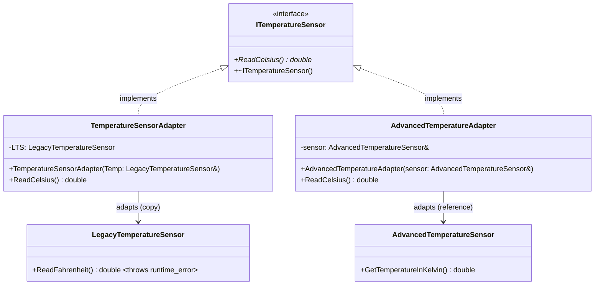
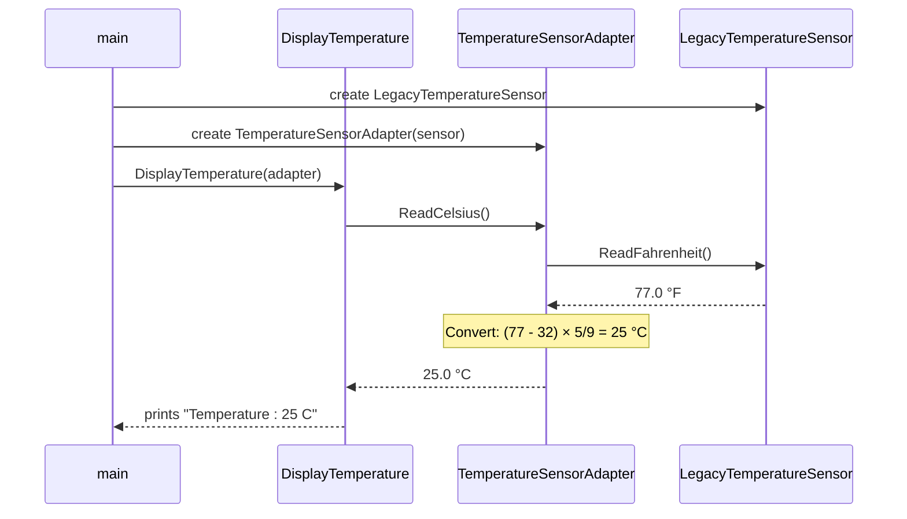
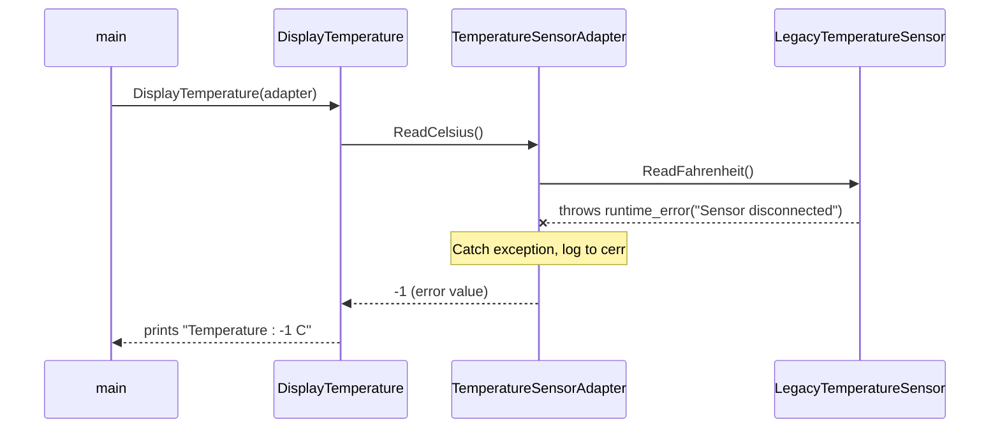
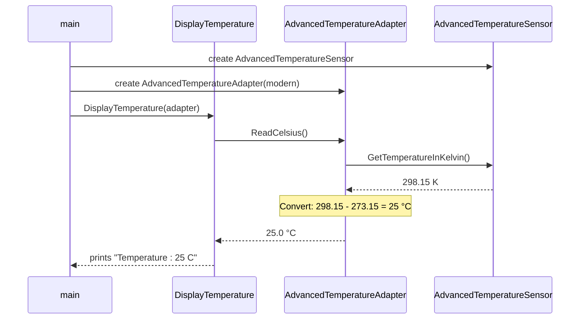

# Adapter Design Pattern — Temperature Sensor Example

## Intent

Convert the interface of a class into another interface that clients expect. The Adapter pattern lets classes work together that couldn't otherwise because of incompatible interfaces.

## Problem

We have two existing temperature sensors with different interfaces:
- **LegacyTemperatureSensor** — returns temperature in **Fahrenheit**, but may throw `std::runtime_error` if the sensor is disconnected.
- **AdvancedTemperatureSensor** — returns temperature in **Kelvin**

The client code (`DisplayTemperature`) expects all sensors to provide temperature in **Celsius** via a unified `ITemperatureSensor` interface. We need adapters to bridge the gap without modifying the existing sensor classes, while also handling potential sensor failures gracefully.

## Class Diagram

## Sequence Diagram

### Success Case

### Error Case (Sensor Disconnected)

## Key Participants

| Role | Class | Description |
|------|-------|-------------|
| **Target** | `ITemperatureSensor` | The interface the client expects (`ReadCelsius`) |
| **Adaptee** | `LegacyTemperatureSensor` | Existing class with an incompatible interface (`ReadFahrenheit`) |
| **Adaptee** | `AdvancedTemperatureSensor` | Another existing class with a different incompatible interface (`GetTemperatureInKelvin`) |
| **Adapter** | `TemperatureSensorAdapter` | Wraps the legacy sensor, converts Fahrenheit → Celsius, and handles sensor errors |
| **Adapter** | `AdvancedTemperatureAdapter` | Wraps the advanced sensor and converts Kelvin → Celsius |
| **Client** | `DisplayTemperature()` | Works with any `ITemperatureSensor` without knowing the underlying implementation |

## Adapter Variants Used

- **Object Adapter (Composition):** Both adapters use composition — they hold a reference or copy of the adaptee rather than inheriting from it.
  - `TemperatureSensorAdapter` stores a **copy** of `LegacyTemperatureSensor`.
  - `AdvancedTemperatureAdapter` stores a **const reference** to `AdvancedTemperatureSensor`.

## Error Handling Strategy

- `LegacyTemperatureSensor::ReadFahrenheit()` may throw `std::runtime_error` when the sensor is disconnected.
- `TemperatureSensorAdapter::ReadCelsius()` catches the exception internally using a try-catch block.
- On failure, the adapter logs the error to `std::cerr` and returns `-1` as a sentinel error value.
- This shields the client (`DisplayTemperature`) from needing to handle exceptions — the adapter absorbs the instability of the legacy sensor.

## Conversion Formulas

| Adapter | Formula |
|---------|---------|
| Fahrenheit → Celsius | $C = \frac{(F - 32) \times 5}{9}$ |
| Kelvin → Celsius | $C = K - 273.15$ |

## Advantages

- **Single Responsibility Principle** — Separates interface conversion logic from the primary business logic of the program.
- **Open/Closed Principle** — New adapters can be introduced without modifying existing client code or adaptee classes.
- **Reusability** — Existing classes can be reused even if their interfaces are incompatible with the rest of the system.
- **Decoupling** — The client code depends only on the target interface (`ITemperatureSensor`), not on concrete sensor implementations.
- **Flexibility** — Multiple incompatible classes (Fahrenheit, Kelvin) can be unified under a single interface.

## Disadvantages

- **Increased Complexity** — Introduces additional classes and indirection, which can make the codebase harder to follow.
- **Performance Overhead** — Each call goes through an extra layer of delegation and possibly data conversion.
- **Too Many Adapters** — In large systems, the number of adapter classes can grow quickly, leading to class proliferation.
- **Not Always Transparent** — If the adaptee's behavior doesn't map cleanly to the target interface, the adapter may need to make compromises or lose information.
- **Maintenance Burden** — Changes to the adaptee's interface require corresponding updates in the adapter.

## When to Use the Adapter Pattern

- You want to use an existing class but its interface doesn't match what you need.
- You want to create a reusable class that cooperates with unrelated or unforeseen classes.
- You need to integrate third-party or legacy code without modifying its source.
