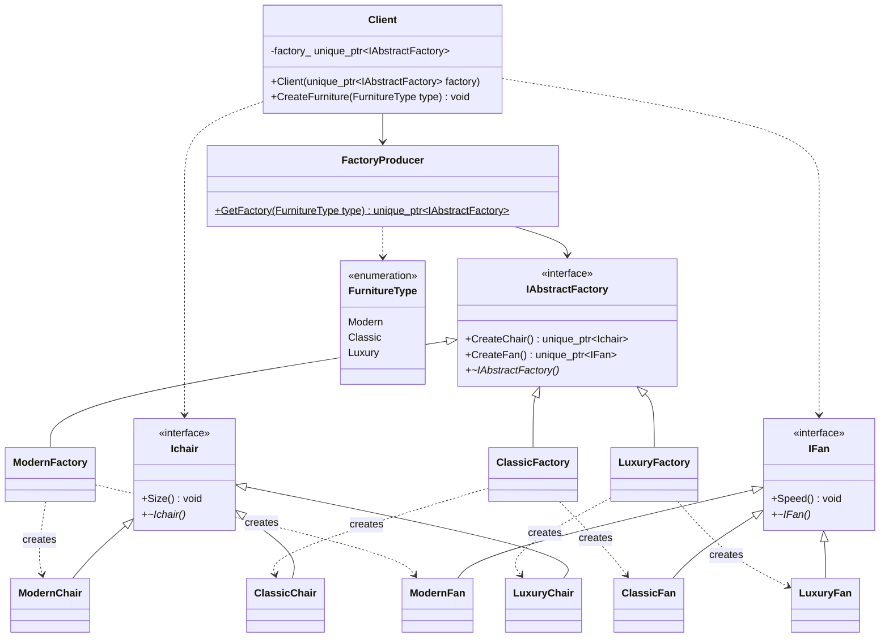
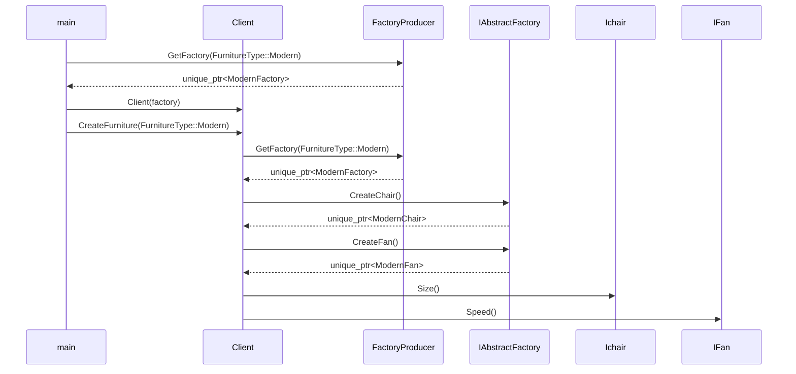

# Abstract Factory Pattern - Furniture Example

## Intent

Provide an interface for creating families of related objects (Chair, Fan) without specifying their concrete classes. Each family represents a style: Modern, Classic, or Luxury.

## Class Diagram



## Participants

| Role | Class | Responsibility |
|------|-------|----------------|
| Abstract Factory | `IAbstractFactory` | Declares creation methods for each product type |
| Concrete Factory | `ModernFactory`, `ClassicFactory`, `LuxuryFactory` | Implements creation of products for a specific style family |
| Abstract Product | `Ichair`, `IFan` | Declares interface for a product type |
| Concrete Product | `ModernChair`, `ClassicChair`, `LuxuryChair`, `ModernFan`, `ClassicFan`, `LuxuryFan` | Implements the product interface for a specific style |
| Factory Producer | `FactoryProducer` | Maps a `FurnitureType` enum to the corresponding concrete factory |
| Client | `Client` | Stateful object initialized with a factory; can switch families at runtime via `CreateFurniture(FurnitureType)` |

## How It Works

1. A `Client` is constructed with an initial factory obtained from `FactoryProducer::GetFactory()`.
2. When `CreateFurniture(FurnitureType)` is called, the client replaces its internal factory via `FactoryProducer` and creates products.
3. The same `Client` instance can be reused across different furniture types without reconstruction.
4. The client never knows which concrete products it receives — it only uses `Ichair::Size()` and `IFan::Speed()`.
5. All products from a single factory belong to the same style family, guaranteeing consistency.

## Sequence Diagram



## Key Design Decisions

- **Ownership via `std::unique_ptr`**: Factory methods return unique pointers, making ownership transfer explicit and preventing memory leaks.
- **Virtual destructors on interfaces**: `Ichair`, `IFan`, and `IAbstractFactory` declare `virtual ~Dtor() = default` to ensure proper cleanup when deleting through base pointers.
- **`FurnitureType` enum class**: Provides type-safe selection of product families instead of raw strings or integers.
- **`FactoryProducer` (static factory of factories)**: Centralizes the mapping from enum to concrete factory, keeping the `Client` decoupled from concrete factory classes.
- **Stateful, reusable `Client`**: Constructed with an initial factory and can switch product families at runtime by calling `CreateFurniture()` with a different `FurnitureType`.
- **Open/Closed Principle**: Adding a new style (e.g., `IndustrialFactory`) requires adding a new enum value and concrete classes, plus one case in `FactoryProducer`.

## Adding a New Product Family

To add a new style (e.g., Industrial):

1. Add `Industrial` to the `FurnitureType` enum
2. Create `IndustrialChair` inheriting `Ichair`
3. Create `IndustrialFan` inheriting `IFan`
4. Create `IndustrialFactory` inheriting `IAbstractFactory`
5. Add `case FurnitureType::Industrial` in `FactoryProducer::GetFactory()`

## Adding a New Product Type

To add a new product (e.g., Table):

1. Create `ITable` abstract interface
2. Add `CreateTable()` to `IAbstractFactory`
3. Implement `CreateTable()` in each concrete factory
4. Update `Client::CreateFurniture()` to use the new product

> **Trade-off**: Adding a new product type requires modifying all existing factories — this is the main drawback of the Abstract Factory pattern.

## Output

```
Modern Chair Size is 5 feet
Modern Fan Speed is 3
Classic Chair Size is 4 feet
Classic Fan Speed is 2
Luxury Chair Size is 6 feet
Luxury Fan Speed is 4
```
