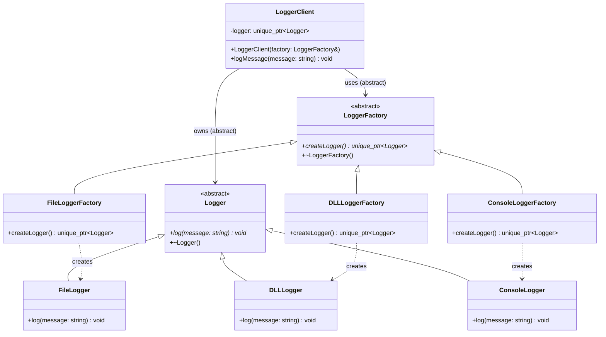
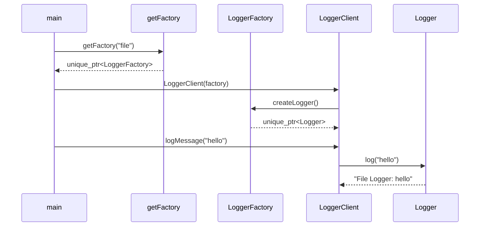

# Factory Method Design Pattern — Logger Example

## Class Diagram

```mermaid
classDiagram
    class Logger {
        <<abstract>>
        +log(message: string)* void
        +~Logger()
    }

    class ConsoleLogger {
        +log(message: string) void
    }

    class FileLogger {
        +log(message: string) void
    }

    class DLLLogger {
        +log(message: string) void
    }

    class LoggerFactory {
        <<abstract>>
        +createLogger()* unique_ptr~Logger~
        +~LoggerFactory()
    }

    class FileLoggerFactory {
        +createLogger() unique_ptr~Logger~
    }

    class DLLLoggerFactory {
        +createLogger() unique_ptr~Logger~
    }

    class ConsoleLoggerFactory {
        +createLogger() unique_ptr~Logger~
    }

    class LoggerClient {
        -logger: unique_ptr~Logger~
        +LoggerClient(factory: LoggerFactory&)
        +logMessage(message: string) void
    }

    Logger <|-- ConsoleLogger
    Logger <|-- FileLogger
    Logger <|-- DLLLogger

    LoggerFactory <|-- FileLoggerFactory
    LoggerFactory <|-- DLLLoggerFactory
    LoggerFactory <|-- ConsoleLoggerFactory

    FileLoggerFactory ..> FileLogger : creates
    DLLLoggerFactory ..> DLLLogger : creates
    ConsoleLoggerFactory ..> ConsoleLogger : creates

    LoggerClient --> LoggerFactory : uses (abstract)
    LoggerClient --> Logger : owns (abstract)
```

## Sequence Diagram

```mermaid
sequenceDiagram
    participant main
    participant getFactory
    participant Factory as LoggerFactory
    participant Client as LoggerClient
    participant Logger

    main->>getFactory: getFactory("file")
    getFactory-->>main: unique_ptr<LoggerFactory>
    main->>Client: LoggerClient(factory)
    Client->>Factory: createLogger()
    Factory-->>Client: unique_ptr<Logger>
    main->>Client: logMessage("hello")
    Client->>Logger: log("hello")
    Logger-->>Client: "File Logger: hello"
```
