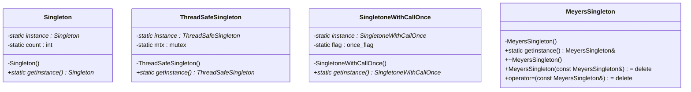
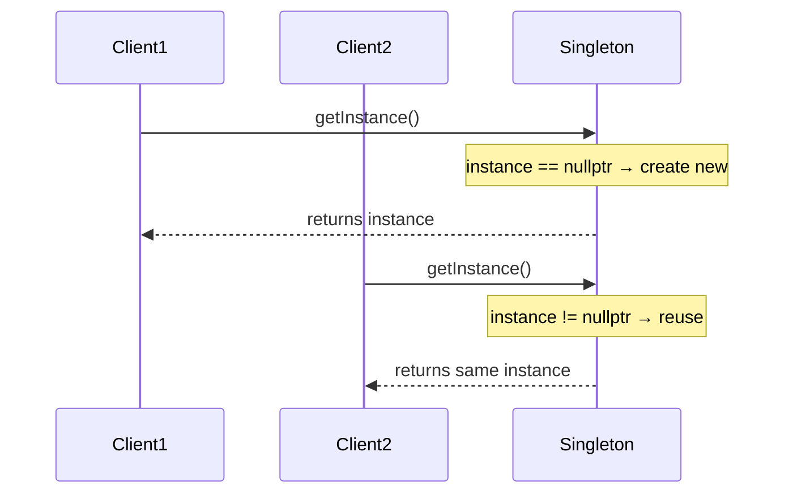
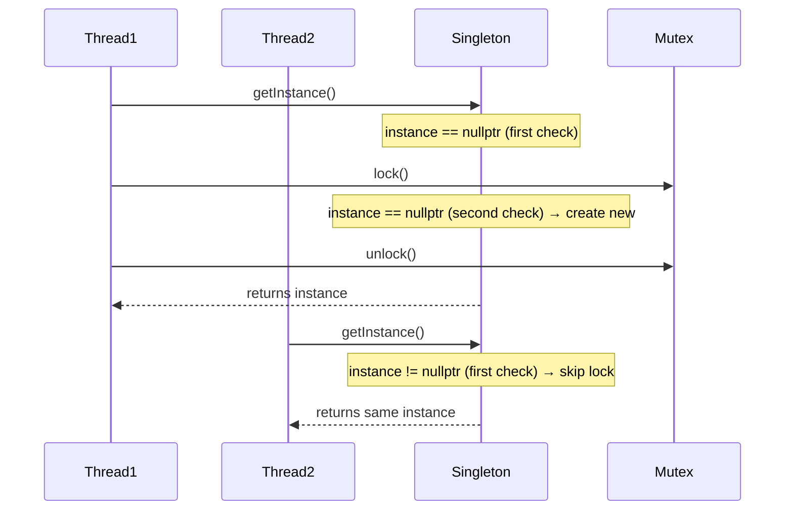
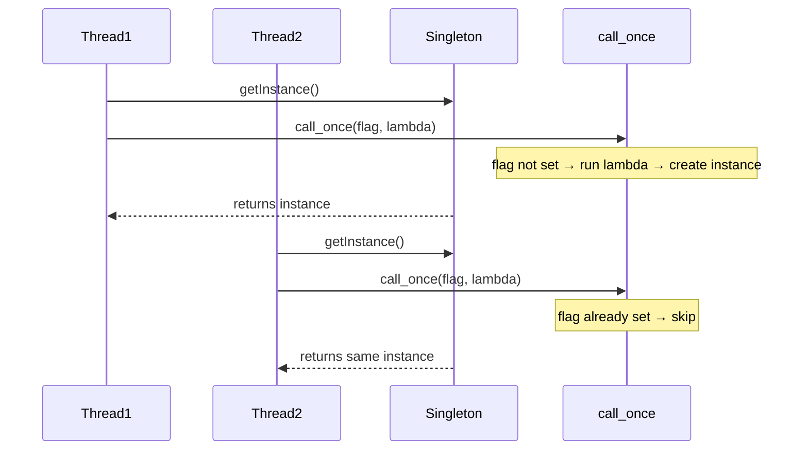
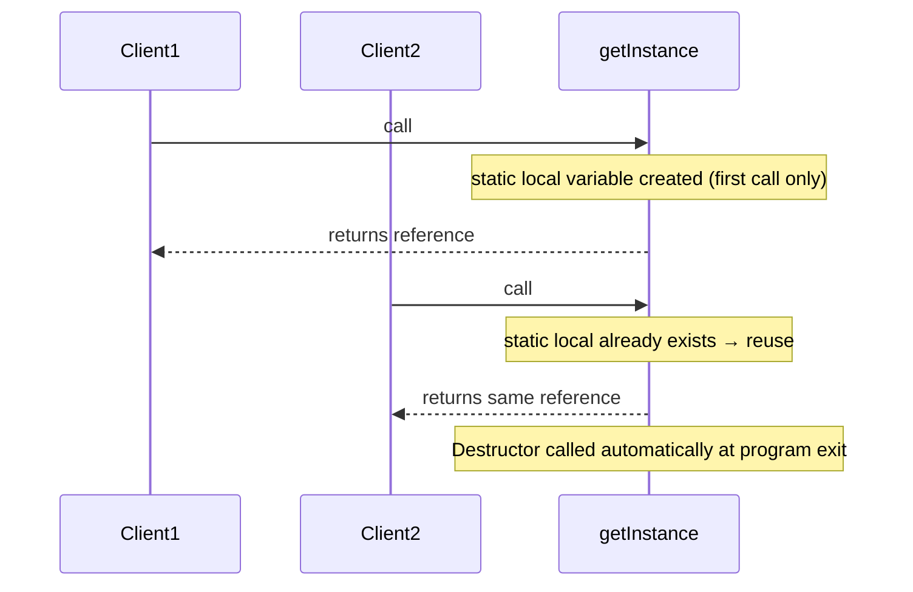
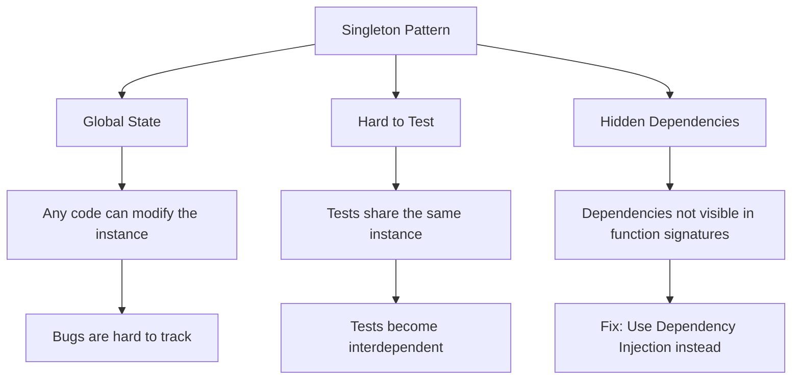

# Singleton Design Pattern

## Overview

Singleton ensures a class has **only one instance** and provides a **global point of access** to it.

## Class Diagram

## Implementations

### 1. Basic Singleton (Not Thread-Safe)

- Uses `static Singleton* instance` and checks for `nullptr`
- Simple but **NOT safe** when multiple threads call `getInstance()` at the same time

### 2. Thread-Safe Singleton (Double-Checked Locking)

- First `if` avoids locking every time (fast path)
- Second `if` inside the lock prevents double creation
- Uses `std::mutex` + `std::lock_guard`

### 3. Singleton with `std::call_once`

- `std::call_once` guarantees the lambda runs exactly once
- Thread-safe, simpler than manual mutex locking
- Requires C++11

### 4. Meyers' Singleton (Recommended)

- Uses a **local static variable** — no `new`, no pointers
- Thread-safe by C++11 standard
- Automatic cleanup (destructor runs at exit)
- Copy and assignment are deleted

## Comparison

| Feature | Basic | Thread-Safe (Mutex) | call_once | Meyers' |
|---|---|---|---|---|
| Thread-safe | No | Yes | Yes | Yes |
| Uses `new` | Yes | Yes | Yes | **No** |
| Auto cleanup | No (leak) | No (leak) | No (leak) | **Yes** |
| Complexity | Simple | Medium | Medium | **Simple** |
| C++ version | Any | C++11 | C++11 | C++11 |

## Drawbacks

### Drawback 1: Global State
`GlobalCounter` — multiple functions modify the same counter without knowing about each other.

### Drawback 2: Hard to Test
`Logger` — `test1()` and `test2()` share the same logger, so log counts leak between tests.

### Drawback 3: Hidden Dependencies
`OrderProcessor` — calls `Logger::getInstance()` internally, but the constructor doesn't reveal this. Better approach: pass `Logger&` as a parameter (Dependency Injection).

## When to Use Singleton
- Database connection pools
- Configuration managers
- Hardware interface access (e.g., printer spooler)
- Logging systems (when DI is not practical)
