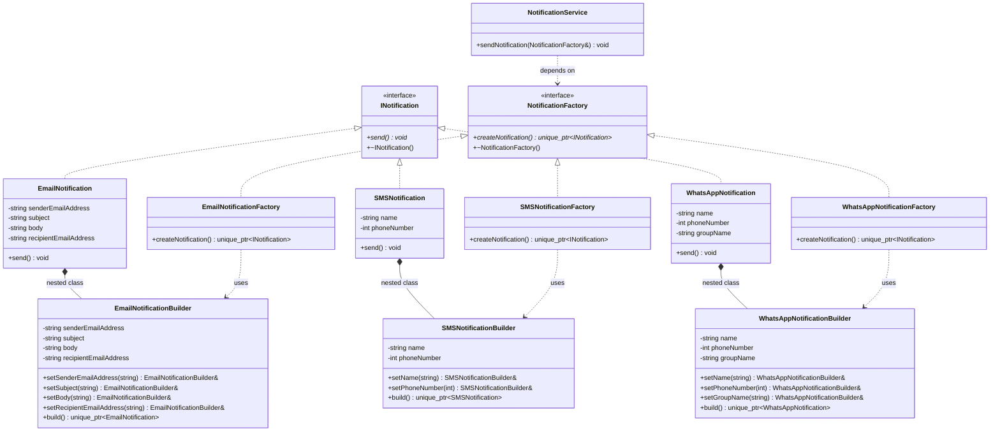
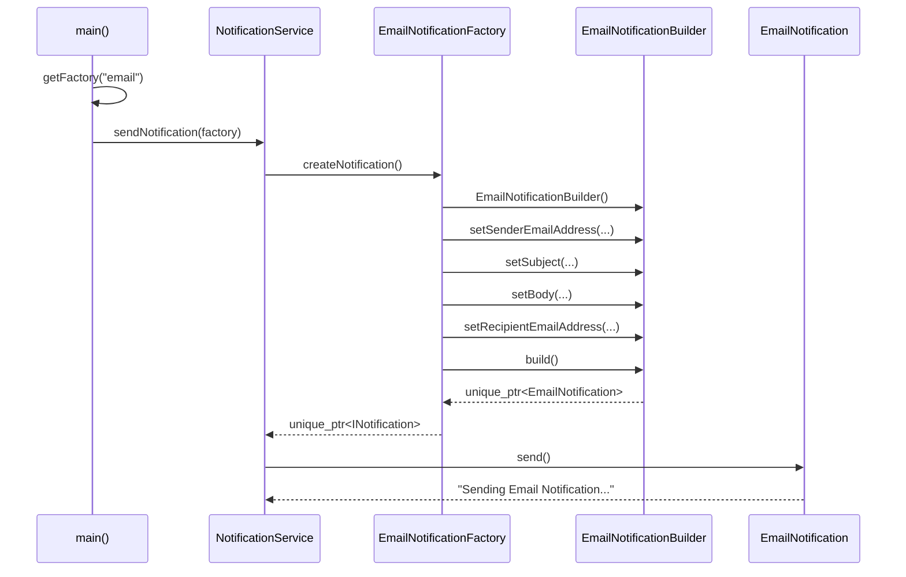

# Factory Method + Builder Design Pattern — Notification Example

## Purpose

- **Factory Method**: Delegates object creation to subclasses — decides *which* notification to create.
- **Builder**: Constructs complex objects step-by-step — decides *how* to configure the notification.

---

## Class Diagram

---

## Sequence Diagram

---

## Key Design Decisions

| Aspect | Decision | Reason |
|--------|----------|--------|
| Object creation | Factory Method | Different notification types need different construction logic |
| Object configuration | Builder (nested class) | Notifications have multiple optional parameters |
| Constructor access | Private | Forces use of Builder, prevents invalid objects |
| Memory management | `unique_ptr` | Clear ownership, no memory leaks |
| Builder location | Nested inside product class | Can access private constructor |
