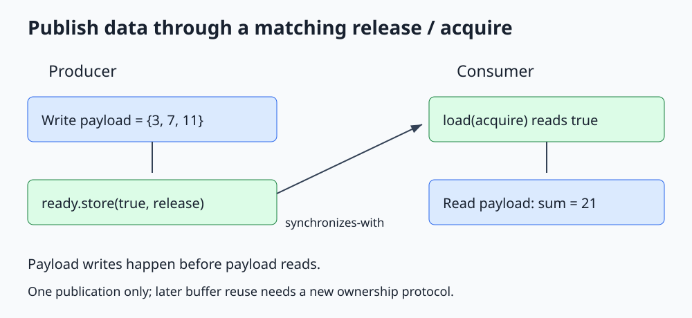

# C++ Atomic Memory Ordering

**Atomicity protects the flag; release/acquire can publish the ordinary data announced by that flag.**



Open [the diagram](../images/memory_order.svg). The complete runnable program is [memory_order.cpp](../cpp_examples/memory_order.cpp).

## 1. The problem an atomic counter did not solve

Suppose a producer fills an ordinary array and sets an atomic `ready` flag. A consumer waits for the flag before reading the array. The flag must do more than avoid a race on itself: the protocol must order the array writes before the reads.

An atomic operation with `memory_order_relaxed` is still indivisible, but it does not by itself publish unrelated ordinary memory. Apparent success on one CPU is not a portable correctness argument.

## 2. The complete publication protocol

Producer:

```cpp
payload = {3, 7, 11};
ready.store(true, std::memory_order_release);
```

Consumer:

```cpp
while (!ready.load(std::memory_order_acquire))
{
    std::this_thread::yield();
}
const int total = payload[0] + payload[1] + payload[2];
```

There is exactly one producer, one publication, and no later payload mutation. Those restrictions are part of the algorithm, not incidental details.

## 3. Follow the happens-before chain

1. The producer's payload writes are sequenced before its release store.
2. The consumer's successful acquire load reads `true` from that release store.
3. That release synchronizes with the acquire.
4. The consumer's payload reads are sequenced after the acquire.
5. Therefore, the payload writes happen before the payload reads.

This transitive **happens-before** relationship is the reason the ordinary array can be read safely. Earlier acquire loads that see `false` do not establish this publication relationship.

Main reads the payload before calling `producer.get()`, deliberately making release/acquire the synchronization that authorizes the read. The later `get()` handles the producer's execution lifetime.

## 4. Memory orders at a glance

| Order | Common use | What it does not imply |
|---|---|---|
| `relaxed` | Independent counters, numeric state | No publication of unrelated data by itself |
| `release` | Store publishing preceding writes | Does not make later producer mutations safe |
| `acquire` | Load observing a matching publication | Does not synchronize with an unrelated store |
| `acq_rel` | Read-modify-write that both observes and publishes | Not valid as the order for a plain load or store |
| `seq_cst` | Default, stronger globally ordered atomic protocol | Does not combine several operations into a transaction |

Sequentially consistent operations participate in a single total order with the required consistency rules. Starting with the default ordering is often clearer; weaken it only with a specific proof and a demonstrated need.

`memory_order_consume` is a specialized dependency-ordering facility, commonly implemented as acquire. It is not needed in these lessons; use acquire for ordinary publication code.

## 5. Ordering is not cache-flush storytelling

It is misleading to explain release as "flush all caches" and acquire as "reload everything." The C++ rules describe observable ordering and synchronization. A compiler and CPU can implement those rules differently on different architectures.

`yield()` is just a scheduling hint. It supplies no memory-order relationship and does not guarantee another thread will run. The acquire load remains necessary even with the yield.

Spinning may consume CPU. This short example isolates publication semantics, not a recommended long-wait mechanism. The C++20 [atomic wait lesson](Std_Atomic_Wait_Guide.md) demonstrates a value-based blocking alternative.

## 6. What would break this example?

Making both flag operations relaxed would remove the synchronizes-with edge; the ordinary array write and read would lack the required ordering. Replacing the atomic flag with `volatile bool` would also race on the flag itself.

Writing to the array again after publishing it would require a new protocol. A consumer seeing the old `true` could read while those later writes occur.

Resetting `ready` to false and reusing the buffer is not automatically safe. Repeated producer/consumer exchanges require acknowledgment, a generation protocol, a protected queue, or another design that prevents overwrite during a read.

## 7. Compare-exchange and fences

A compare-exchange has a success order for its read-modify-write and a failure order for its load. The failure order must be a valid load order, never release or acq_rel. A common explicit pair is `acq_rel` on success and `acquire` on failure. Use an ordering pair justified by the algorithm, not one selected by trial and error.

`atomic_thread_fence` can participate in synchronization only through the required associated atomic operations and read-from relationships. A standalone fence is not a universal repair for racing ordinary memory. Prefer directly expressed release/acquire operations until the full fence protocol is justified.

## 8. Build and expected output

From the repository root:

```sh
mkdir -p /tmp/cpp-threading
g++ -std=c++17 -Wall -Wextra -Wpedantic -pthread threading/cpp_examples/memory_order.cpp -o /tmp/cpp-threading/memory_order
/tmp/cpp-threading/memory_order
```

```text
Published sum: 21
```

The worker publishes `3 + 7 + 11 = 21`. Exit code `0` checks the result. Repeated successful runs are useful regression checks but cannot prove a memory-order argument; the happens-before explanation is essential.

## 9. Check your understanding

**Why can payload remain non-atomic?** It is written once, read only after the publishing acquire, and never modified afterward. Its conflicting accesses are ordered.

**Would seq_cst make reusing the array automatically safe?** No. Stronger flag ordering does not stop the producer from overwriting data while a consumer reads it.

**Does release synchronize with every acquire anywhere?** No. The required read-from relationship must exist on the atomic used for the protocol, including the applicable release-sequence rules in more advanced cases.