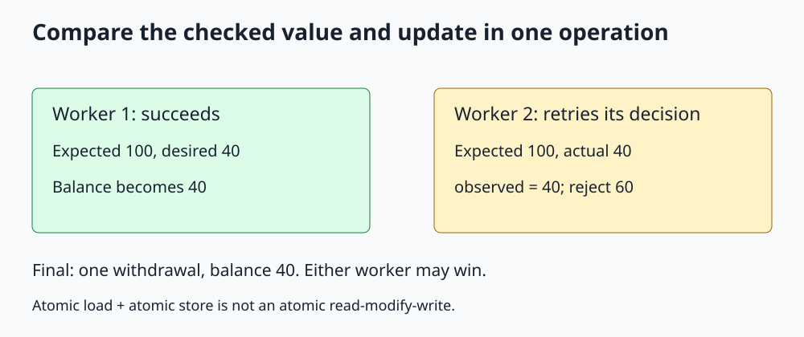

# C++ std::atomic

**Make single-object operations indivisible, and use compare-exchange for conditional updates.**



Open [the diagram](../images/std_atomic.svg). The complete runnable example is [std_atomic.cpp](../cpp_examples/std_atomic.cpp).

## 1. Why use an atomic?

A mutex can protect a shared counter, but sometimes the entire shared state is just one value. `std::atomic<int>`, from `<atomic>`, supports concurrent operations on that value without introducing an ordinary non-atomic data race.

Atomic does not mean every surrounding statement becomes one transaction. It also does not mean the implementation is necessarily lock-free or faster than a mutex.

## 2. Read-modify-write versus separate load and store

The counter task performs:

```cpp
counter.fetch_add(1, std::memory_order_relaxed);
```

This is one atomic read-modify-write operation. It returns the previous value and increments the atomic object. With two workers each doing 10000 increments, the final count is 20000.

By contrast, this expression is logically incorrect for a concurrent increment:

```cpp
counter.store(counter.load() + 1);
```

The load and store are individually atomic, but two workers can load the same old value and then store the same new value. No data race is required for an update to be lost. This is a logical race between separate operations.

## 3. A conditional withdrawal needs more than fetch_sub

Both workers try to withdraw 60 from an initial atomic balance of 100. Exactly one should succeed. An unconditional `fetch_sub(60)` would allow both and produce -20.

Checking with `load()` and then subtracting is also insufficient: another worker can change the balance between the check and update. We need to update only if the checked value is still current.

## 4. Walk through compare_exchange_weak

```cpp
int observed = balance.load(std::memory_order_relaxed);
while (observed >= amount)
{
    if (balance.compare_exchange_weak(observed, observed - amount,
                                     std::memory_order_relaxed))
    {
        return true;
    }
}
return false;
```

The first argument is an in/out expected value, not just a comparison input.

| Outcome | Atomic balance | Local observed | Return |
|---|---|---|---|
| Comparison succeeds | Replaced by desired value | Remains the successful expected value | true |
| Comparison fails | Unchanged by this operation | Updated with the value read from the atomic | false |

Suppose both workers initially observe 100. One changes it to 40. The other's comparison with 100 then fails and updates its `observed` to 40. The loop condition rejects the second withdrawal.

The example accepts only the known positive amount 60. A general public API should reject zero or negative amounts and address its numeric range requirements.

## 5. Weak versus strong, and ABA

`compare_exchange_weak` may fail spuriously even when values compare equal. A retry loop handles this and is often the intended use. `compare_exchange_strong` does not have that spurious-failure permission, but can still fail because another thread changed the value.

Neither operation detects all history. A value can change from A to B and back to A, making a later comparison with A succeed. This **ABA problem** matters in pointer-based lock-free structures where an address can be reused. A successful compare-exchange does not by itself solve object lifetime or safe memory reclamation.

Do not build a lock-free linked container by replacing its pointer fields with atomics and assuming the rest is solved.

## 6. Why relaxed ordering is enough here

The counter and balance are independent numeric values. They do not publish another ordinary object. Relaxed operations provide atomicity and a modification order for each atomic, which is enough for this example's updates.

Main waits for both futures before checking the final values. That completion synchronization, not the relaxed counter, establishes the workers' completion.

If an atomic flag announces that a separate buffer is ready, additional ordering is required. The [memory-order lesson](Memory_Order_Guide.md) explains that different problem.

## 7. Progress and performance limitations

`is_lock_free()` can report whether a particular atomic object uses a lock-free implementation; `is_always_lock_free` is a compile-time property of the type. Do not infer either from the spelling `atomic`.

Even lock-free does not mean wait-free: an individual operation in a retrying algorithm may repeatedly lose to competing threads. A heavily contended atomic counter can cause cache-coherence traffic and scale poorly. Per-thread accumulation followed by a reduction is often better for bulk counting.

`volatile` is not a threading alternative. It does not make compound updates atomic or establish cross-thread synchronization. C++20 `atomic_ref` enables atomic operations on suitably aligned existing objects, but its lifetime and concurrent-access restrictions must be followed; it is not permission to mix ordinary and atomic access arbitrarily.

## 8. Build and expected output

From the repository root:

```sh
mkdir -p /tmp/cpp-threading
g++ -std=c++17 -Wall -Wextra -Wpedantic -pthread threading/cpp_examples/std_atomic.cpp -o /tmp/cpp-threading/std_atomic
/tmp/cpp-threading/std_atomic
```

```text
Counter: 20000
Successful withdrawals: 1
Remaining balance: 40
```

Either worker can win. Exit code `0` checks the invariant without requiring a particular winner.

## 9. Check your understanding

**Can two atomic account balances represent one atomic transfer?** Not by themselves. Updating each separately can expose a half-completed transfer. Use a mutex protocol or a more carefully designed transaction representation.

**Why not reload manually after every failed compare-exchange?** Failure already updates `observed`. The loop uses that value to recheck the condition and compute the next desired value.

**Does relaxed mean the increment can be lost?** No. The read-modify-write is still atomic. Relaxed concerns ordering of other operations, not whether this increment is indivisible.