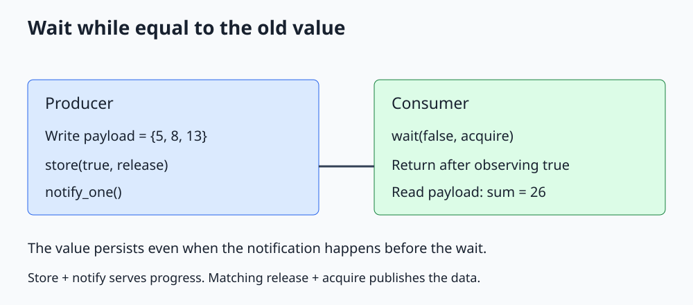

# C++ Atomic wait and notify

**Wait for an atomic value to differ from an expected old value without writing a polling loop.**



Open [the diagram](../images/std_atomic_wait.svg). The complete C++20 program is [std_atomic_wait.cpp](../cpp_examples/std_atomic_wait.cpp).

## 1. Why add waiting to atomics?

The [memory-order example](Memory_Order_Guide.md) repeatedly loads an atomic flag and yields while it is false. That demonstrates publication, but prolonged spinning can waste CPU.

C++20 atomic `wait()`, `notify_one()`, and `notify_all()` support value-based waiting. The library may spin briefly and then use an operating-system wait mechanism; portable code does not depend on its implementation strategy.

The API waits on the atomic object's value. It does not replace a condition variable for arbitrary predicates involving several protected objects.

## 2. Publish first, then notify

The producer performs:

```cpp
payload = {5, 8, 13};
ready.store(true, std::memory_order_release);
ready.notify_one();
```

The store changes the condition being waited on. The notification makes an eligible blocked waiter recheck that condition.

Calling only `notify_one()` without changing `ready` would not make `wait(false)` return while the value remains false. Changing the value without notifying is also insufficient to reliably wake a thread that is already blocked waiting for it.

## 3. Read wait's argument carefully

```cpp
ready.wait(false, std::memory_order_acquire);
const int total = payload[0] + payload[1] + payload[2];
```

The argument is the **old value to wait while equal to**, not the new value the caller wants to receive. Here it means "wait while ready is false."

The call returns only after observing a value different from that old value. Internal wait mechanisms may wake spuriously, but the API rechecks and does not return merely because of a spurious wakeup.

For this Boolean flag, differing from false means true. For an integer state machine, differing from one particular old value could mean several possible states, so the caller may need a loop to implement its actual predicate.

## 4. Visibility comes from ordering, not notification

The acquire observation that sees the producer's release store synchronizes with it. Payload writes before the store therefore happen before payload reads after the wait.

`notify_one()` itself is not the operation that publishes the ordinary array. Replacing release/acquire with relaxed operations would lose the ordering required for those ordinary accesses.

The example sums the payload before joining the producer, intentionally relying on the wait's acquire semantics for that read. The later join handles thread lifetime.

## 5. What if the producer finishes early?

If `ready` is already true before the consumer calls `wait(false)`, the initial comparison sees a different value and the call returns without needing a remembered notification.

If the consumer is already blocked, the producer's store and notify let it recheck. This persistent value is why a notification arriving before the waiter does not lose the one-time ready state.

Both the atomic object and payload must remain alive while either thread can access them. The example joins before leaving their scope.

## 6. ABA and repeated events

Suppose an atomic integer changes from 0 to 1 and then back to 0 before a waiter observes the intermediate value. A `wait(0)` can miss that transient change. Atomic waiting does not record every event.

A monotonically increasing generation counter can help distinguish successive changes, but a complete protocol must still handle wraparound, ownership, and the consumer's ability to keep up. If every individual event must be retained, use a queue or an appropriately counted signal instead.

The example has a single false-to-true transition and never reuses the buffer. Repeated buffer reuse requires acknowledgment or another protocol preventing overwrite during a read.

## 7. notify_one, notify_all, and cancellation

Use `notify_one()` when one waiting observer needs progress, as here. If a ready state should release many waiting readers, use `notify_all()` and ensure the payload remains valid for all of them.

Atomic wait has no standard C++20 timed or stop-token overload. A jthread stop request alone does not wake an unrelated atomic wait. Cancellation must change and notify the waited-on state through a designed protocol, or use another wait primitive.

Wait's memory order must be appropriate for a load; release and acq_rel are not valid wait orders. Acquire is sufficient for this publication; the default sequentially consistent order would also be valid.

## 8. Build and expected output

From the repository root:

```sh
mkdir -p /tmp/cpp-threading
g++ -std=c++20 -Wall -Wextra -Wpedantic -pthread threading/cpp_examples/std_atomic_wait.cpp -o /tmp/cpp-threading/std_atomic_wait
/tmp/cpp-threading/std_atomic_wait
```

```text
Published sum: 26
```

Exit code `0` checks `5 + 8 + 13 = 26`. No artificial sleeps or polling loop are required.

## 9. Check your understanding

**Does wait(true) mean wait until true?** No. It means wait while the value equals true. With an initially false flag, it could return immediately.

**Is notify_one enough to publish a non-atomic buffer?** No. The release store and matching acquire observation provide the required synchronization.

**Would notify_all make a false-to-true-to-false pulse reliably visible?** No. Notifications do not retain historical values; a waiter can miss a transient change.