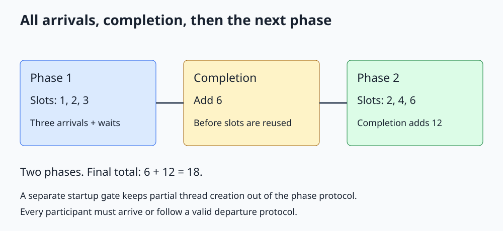

# C++ std::barrier

**Coordinate a participant group at repeated phase boundaries, with a completion step between phases.**



Open [the diagram](../images/std_barrier.svg). The complete C++20 program is [std_barrier.cpp](../cpp_examples/std_barrier.cpp).

## 1. Why isn't a latch enough?

A simulation might calculate partial results, combine them, and repeat for many iterations. A latch opens once and cannot be reset. A barrier is designed for repeated rounds of arrivals.

`std::barrier`, declared in `<barrier>`, counts arrivals for the current phase. When the expected arrivals are complete, it runs the phase completion step and enables waiting participants to continue into the next phase.

The example has three workers and two phases. Each worker writes one independent slot. A completion function sums all three slots before any worker overwrites a slot for the next phase.

## 2. Construct a barrier with a completion function

```cpp
std::barrier phase_done(3, [&]() noexcept
{
    for (int value : partials)
    {
        grand_total += value;
    }
    ++completed_phases;
});
```

The count is three because three participants arrive each round. The completion function must satisfy the nonthrowing requirements of the barrier interface; declaring this small arithmetic callback `noexcept` makes that intent explicit.

Do not depend on one named worker always executing the completion function. Keep it short and avoid waiting for work that cannot happen until this barrier opens.

## 3. Each worker repeats the same phase protocol

```cpp
for (int phase = 1; phase <= 2; ++phase)
{
    partials[index] = (static_cast<int>(index) + 1) * phase;
    phase_done.arrive_and_wait();
}
```

`arrive_and_wait()` both reports this participant's arrival and blocks until the phase completes. It is not just a notification.

| Phase | Slot 0 | Slot 1 | Slot 2 | Completion adds |
|---|---|---|---|---|
| 1 | 1 | 2 | 3 | 6 |
| 2 | 2 | 4 | 6 | 12 |

The final combined total is `6 + 12 = 18`.

## 4. Why ordinary slots are safe

During a phase, each worker modifies only its own `int` array element. The barrier orders those pre-arrival writes before the completion step. The end of completion strongly happens before the returns of the calls it unblocks.

Thus the completion reads the finished phase's values, and no worker begins overwriting its slot for the next phase until completion is done. The total and phase counter are modified only by the ordered completion steps and read by main after joining all workers.

Moving the summation into a random worker immediately after `arrive_and_wait()` would need care: other workers could already be overwriting their next-phase slots. Completion is the intentionally protected between-phase point in this design.

## 5. Separate arrive and wait, and dropping participants

`arrive()` reports an arrival and returns an arrival token. A participant can do independent work before later passing that token to `wait()`. The token belongs to that barrier and must obey its phase-use rules; it is not a reusable ticket for arbitrary later rounds.

`arrive_and_drop()` reports arrival for the current phase and reduces the expected participant count for future phases. It is useful when a worker permanently leaves the algorithm.

Dropping a participant does not initialize missing output or repair application invariants. An algorithm that sums three slots must define what happens to a departed worker's slot. The companion program keeps all three workers for both phases instead.

## 6. Thread-start failure and early exit

A fixed-count barrier can hang if only two of its three workers are created. Automatic joining alone cannot fix workers already waiting for the missing participant.

The example therefore has a separate one-shot start latch. Workers wait there before touching the barrier. Main sets `all_started = true` and opens that gate only after all three launches succeed.

If a launch throws, main opens the gate with `all_started` still false. Started workers return without entering the barrier, and their jthread owners join during unwinding. The latch publishes the Boolean before workers read it.

Once the phase loop begins, every participant must keep its arrival obligation. General throwing work needs a coordinated failure protocol, valid participant dropping, or cancellation designed around the algorithm. Merely catching an exception and returning can strand the remaining workers.

## 7. What barrier does not provide

A barrier is not a mutex around arbitrary operations between phase boundaries. Threads can still race within a phase if they write the same ordinary object.

It also does not have a general stop-token wait overload or automatically reduce its count when a thread exits. Keep the barrier alive until every participant has stopped accessing it; main joins the workers before destroying shared state.

## 8. Build and expected output

From the repository root:

```sh
mkdir -p /tmp/cpp-threading
g++ -std=c++20 -Wall -Wextra -Wpedantic -pthread threading/cpp_examples/std_barrier.cpp -o /tmp/cpp-threading/std_barrier
/tmp/cpp-threading/std_barrier
```

```text
Completed phases: 2
Combined phase totals: 18
```

Exit code `0` checks both completed rounds and the combined arithmetic. No particular arrival order is required.

## 9. Check your understanding

**Can a fast worker begin its next phase before a slow worker arrives?** Not past this `arrive_and_wait()`. It must wait for phase completion.

**Why declare the completion callback noexcept?** The barrier requires a nonthrowing completion operation. This callback performs only bounded integer arithmetic on already allocated state.

**Why not use one latch and count it down again next phase?** A latch cannot reset. A barrier automatically manages repeated phase counts.