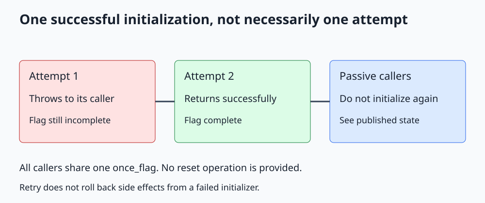

# C++ std::call_once and std::once_flag

**Publish one successful initialization, allowing retries when initialization throws.**



Open [the diagram](../images/std_call_once.svg). The complete program is [std_call_once.cpp](../cpp_examples/std_call_once.cpp).

## 1. Why isn't an initialized Boolean enough?

Several workers may request a configuration at the same time. An ordinary `if (!initialized)` check races if another thread writes the flag, and multiple callers can run the initialization concurrently.

An atomic Boolean alone does not make the whole check, initialization, publication, and failure-retry sequence correct. `std::call_once` expresses that protocol directly.

Both `call_once` and `once_flag` are declared in `<mutex>`. A flag identifies one initialization event and must be shared by all participating callers.

## 2. The runnable initialization example

```cpp
std::call_once(initialized, [&]
{
    ++attempts;
    configuration = "database=local";
});
return configuration;
```

Main launches two callers. One initializes successfully; the other observes the completed initialization. Only one callback increments `attempts`, so the checked final count is one.

Either caller can perform the initialization. The output does not depend on which thread wins.

## 3. Exactly once means one successful returning execution

| Call kind | Does it invoke the callable? | Effect on the flag |
|---|---|---|
| Exceptional active call | Yes; callable throws | Initialization remains incomplete |
| Returning active call | Yes; callable returns normally | Initialization completes |
| Passive call | No | Observes completed initialization |

Active executions for the same flag are ordered. An exception propagates to the caller whose active invocation threw. It is not automatically delivered to all other callers; another caller can retry.

For example, a callback that throws on its first invocation and returns on its second has **two attempts but one successful initialization**. The phrase "the function runs exactly once" is too imprecise when exceptions are possible. The diagram shows this retry scenario; the runnable example checks the successful path without injecting a failure.

**Local toolchain caveat:** In this Alpine/musl container with GCC/libstdc++ 13.2.1, testing an exception escaping the initializer terminated the process instead of reaching the surrounding catch. The installed `call_once` implementation delegates to `pthread_once` and notes exceptional-execution limitations. The runnable example therefore does not inject that exception. Retry after a thrown initializer is the C++ contract, but that path was not successfully verified on this toolchain. Validate it on your deployment library before depending on it; silently swallowing initialization failure inside the callback would incorrectly mark the flag complete.

## 4. Why readers see the configuration

The successful active call's return synchronizes with the returns of passive calls on the same flag. When `call_once` returns normally, initialization's writes are visible to the caller.

After successful publication, the configuration is never modified again. Concurrent callers copy the same read-only string. Later mutation would need another synchronization protocol; `call_once` is not a permanent lock around the object.

The attempt counter is modified only inside ordered active calls and inspected by main after all task results are received. It does not need to be atomic in this example.

## 5. Failure does not roll back side effects

`call_once` lets another attempt run, but it does not undo files written, memory modified, or external actions performed before an exception.

Build a complete temporary configuration and publish it only after successful construction when partial state would be dangerous. Retryable initialization should avoid irreversible side effects or explicitly account for them.

For the retry scenario in the diagram, imagine failing before assigning the configuration, so no partial value is exposed. A counter incremented before throwing would survive the failure; `call_once` would not undo it.

## 6. Function-local static initialization

For a single lazily constructed object, C++11 already provides thread-safe initialization of a function-local static:

```cpp
const std::string& configuration()
{
    static const std::string value = "database=local";
    return value;
}
```

Concurrent first callers wait for successful initialization. If initialization throws, a later call can retry. This is often simpler than a separate flag and object.

Use `call_once` when initialization is an explicit action involving existing state or multiple objects. Neither approach makes later object mutation thread-safe. Recursive initialization of the same object or flag is not a valid initialization strategy.

## 7. Flag lifetime and reset

A `once_flag` is non-copyable and not resettable through its public API. Its lifetime must cover every participating `call_once` invocation.

Do not use one flag for several unrelated configurations, or create a separate local flag for every call. The former incorrectly merges initialization events; the latter permits repeated initialization.

For reloadable configuration, use a mutex, an immutable snapshot publication design, or another explicitly repeatable protocol.

## 8. Build and expected output

From the repository root:

```sh
mkdir -p /tmp/cpp-threading
g++ -std=c++17 -Wall -Wextra -Wpedantic -pthread threading/cpp_examples/std_call_once.cpp -o /tmp/cpp-threading/std_call_once
/tmp/cpp-threading/std_call_once
```

```text
Initialization attempts: 1
Configuration: database=local
```

Exit code `0` checks that initialization ran once and that both concurrent readers received the initialized value. The exception-retry contract is explained above, not asserted by this executable.

## 9. Check your understanding

**Does a throwing initializer permanently poison the flag?** No. Initialization remains incomplete and can be retried.

**Can two different callables compete on the same flag?** Yes, but which callable performs the successful initialization is not a choice the application should leave accidental. Use a consistent initialization action.

**Can I use the configuration without calling the accessor?** Only if another valid synchronization relationship already guarantees completed initialization. Bypassing the protocol can race with its first write.